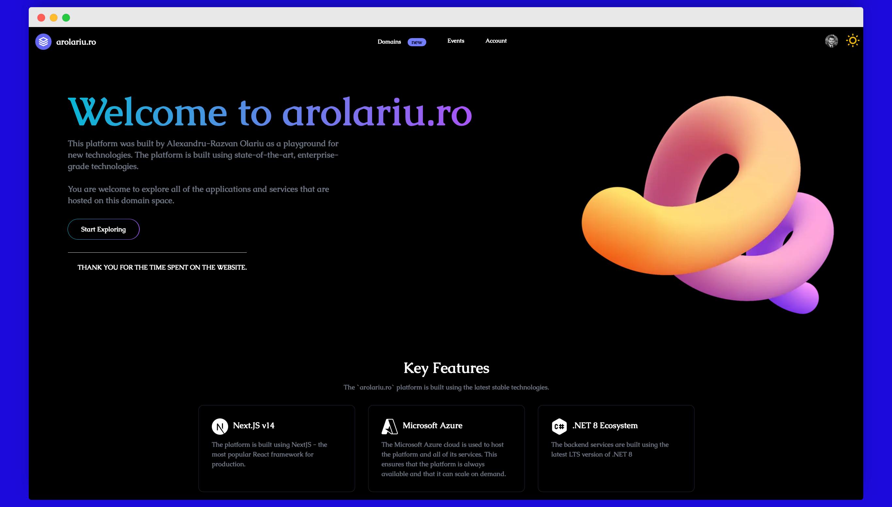
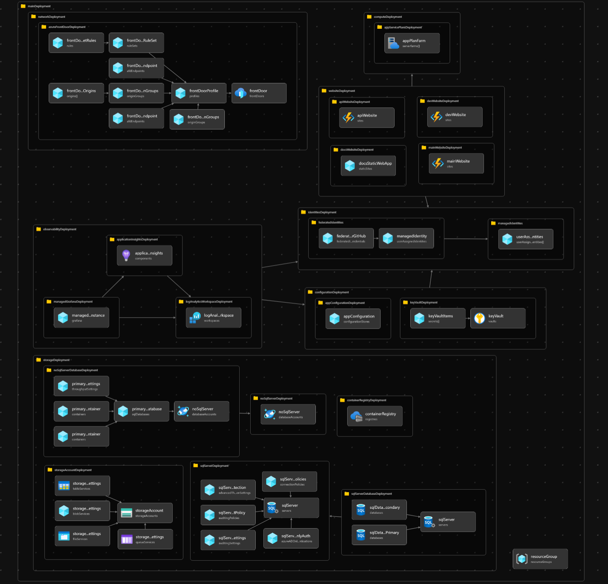

<div align="center">


# 🚀 AROLARIU.RO Monorepo

### A Modern, Production-Grade Full-Stack Platform

<br/>

<!-- Activity & Engagement Stats -->
<div align="center">


</div>

<!-- Code Quality & Size Stats -->
<div align="center">


</div>

<!-- Security & Performance Stats -->
<div align="center">


</div>

<!-- Technology Stack Badges -->
<div align="center">


</div>

<!-- Social & Community Stats -->
<div align="center">


</div>

<br/>

---

</div>

## 📸 Platform Preview

<div align="center">


*Production-ready platform with modern UI/UX*

</div>

---

## 📋 Table of Contents

- [🚀 AROLARIU.RO Monorepo](#-arolariuro-monorepo)
    - [A Modern, Production-Grade Full-Stack Platform](#a-modern-production-grade-full-stack-platform)
  - [📸 Platform Preview](#-platform-preview)
  - [📋 Table of Contents](#-table-of-contents)
  - [🎯 What is This Repository?](#-what-is-this-repository)
    - [🌐 Live Services](#-live-services)
    - [✨ Key Features](#-key-features)
  - [⚡ Setup Guide](#-setup-guide)
    - [Quick Start](#quick-start)
    - [Project Structure](#project-structure)
    - [Advanced Nx Commands](#advanced-nx-commands)
  - [🏗️ Infrastructure Overview](#️-infrastructure-overview)
    - [☁️ Azure Components](#️-azure-components)
    - [🎯 Key Infrastructure Features](#-key-infrastructure-features)
  - [🔄 CI/CD Pipeline Status](#-cicd-pipeline-status)
    - [🌐 Website Pipelines](#-website-pipelines)
    - [⚙️ API Pipelines](#️-api-pipelines)
    - [🎯 Pipeline Features](#-pipeline-features)
  - [📊 Repository Statistics](#-repository-statistics)
    - [Activity Metrics](#activity-metrics)
      - [📅 Commit Timeline](#-commit-timeline)
      - [🐛 Issue Activity](#-issue-activity)
      - [🔀 Pull Request Activity](#-pull-request-activity)
      - [💬 Trending Topics](#-trending-topics)
      - [👥 Recent Contributors](#-recent-contributors)
      - [🗺️ Development Heatmap](#️-development-heatmap)
    - [Top Contributors](#top-contributors)
    - [🌟 Star History](#-star-history)
    - [💖 Support This Project](#-support-this-project)

---

## 🎯 What is This Repository?

The **arolariu.ro** monorepo is a comprehensive full-stack platform built with modern technologies and best practices. It showcases enterprise-grade architecture, clean code principles, and production-ready deployment strategies.

### 🌐 Live Services

| Service | URL | Technology | Purpose |
|---------|-----|------------|---------|
| 🎨 **Production Platform** | [arolariu.ro](https://arolariu.ro) | Next.js 16 + React 19 | Main website and user interface |
| 🔧 **Development Platform** | [dev.arolariu.ro](https://dev.arolariu.ro) | Next.js 16 + React 19 | Development environment |
| 🚀 **Public API** | [api.arolariu.ro](https://api.arolariu.ro) | .NET 10 (LTS) | REST, GraphQL & gRPC backend |
| 📄 **CV/Resume** | [cv.arolariu.ro](https://cv.arolariu.ro) | SvelteKit 2 | Personal CV website |
| 📚 **Documentation** | [docs.arolariu.ro](https://docs.arolariu.ro) | DocFX | Technical documentation |

### ✨ Key Features

- 🏛️ **Domain-Driven Design** - Clean architecture with well-defined bounded contexts
- 📊 **OpenTelemetry Integration** - Full observability with distributed tracing
- 🔒 **Enterprise Security** - SSL/TLS A+ rating, comprehensive security headers
- ⚡ **High Performance** - Optimized for speed with CDN, caching, and SSR/SSG
- 🧪 **Comprehensive Testing** - Unit, integration, and E2E tests with high coverage
- 🔄 **CI/CD Automation** - Automated builds, tests, and deployments
- 📦 **Nx Monorepo** - Efficient workspace management and build optimization

## ⚡ Setup Guide

> 🚀 **Powered by [Nx](https://nx.dev)** - Enterprise-grade monorepo tooling for streamlined development workflows

### Quick Start

<details open>
<summary><b>📦 Installation & Build Commands</b></summary>

```bash
# 1️⃣ Install dependencies (root level)
npm install

# 2️⃣ Build all projects
npm run build

# 3️⃣ Build specific projects
npm run build:website      # 🌐 Main website (Next.js)
npm run build:components   # 🧩 React component library
npm run build:api         # ⚙️ Backend API (.NET)
npm run build:cv          # 📄 CV site (SvelteKit)
npm run build:docs        # 📚 Documentation (DocFX)
```

</details>

<details open>
<summary><b>🔥 Development Commands</b></summary>

```bash
# Start development servers
npm run dev:website       # 🌐 Website → http://localhost:3000
npm run dev:components    # 🧩 Storybook → http://localhost:6006
npm run dev:api          # ⚙️ API → http://localhost:5000
npm run dev:cv           # 📄 CV → http://localhost:4173
npm run dev:docs         # 📚 Docs → http://localhost:8080
```

</details>

<details>
<summary><b>🧪 Testing & Quality Commands</b></summary>

```bash
npm run test             # Run all tests
npm run test:watch       # Run tests in watch mode
npm run test:coverage    # Generate coverage reports
npm run lint             # Lint all projects
npm run format           # Format code with Prettier
```

</details>

### Project Structure

```plaintext
arolariu.ro/                    # 🏠 Monorepo root
├── 📦 packages/
│   └── components/            # 🧩 Shared React component library
│       ├── src/              # Component source code
│       ├── stories/          # Storybook stories
│       └── package.json
│
├── 🌐 sites/
│   ├── arolariu.ro/          # 🎨 Main Next.js website
│   │   ├── src/
│   │   │   ├── app/          # Next.js App Router
│   │   │   ├── components/   # UI components
│   │   │   ├── hooks/        # Custom React hooks
│   │   │   └── lib/          # Utilities
│   │   └── package.json
│   │
│   ├── api.arolariu.ro/      # ⚙️ .NET Backend API
│   │   ├── src/
│   │   │   └── Domain/       # DDD domains
│   │   │       ├── General/
│   │   │       ├── Invoices/
│   │   │       └── Auth/
│   │   └── tests/
│   │
│   ├── cv.arolariu.ro/       # 📄 SvelteKit CV
│   ├── docs.arolariu.ro/     # 📚 DocFX Documentation
│   └── ...
│
├── 🏗️ infra/
│   └── Azure/
│       └── Bicep/            # Infrastructure as Code
│
├── 📜 scripts/               # Build & utility scripts
├── 🔧 nx.json               # Nx workspace config
└── 📦 package.json          # Root dependencies

```

### Advanced Nx Commands

<details>
<summary><b>🎯 Optimization & Analysis</b></summary>

```bash
# 📊 Visualize project dependency graph
npx nx graph

# 🎯 Run tasks only on affected projects
npx nx affected --target=build
npx nx affected --target=test
npx nx affected --target=lint

# 🔍 Show project details
npx nx show project website
npx nx show projects --affected

# 🚀 Run specific project commands
npx nx run website:build
npx nx run components:storybook
npx nx run api:dev
```

</details>

## 🏗️ Infrastructure Overview

<div align="center">



*Azure Cloud Architecture - Deployed using Infrastructure as Code (Bicep)*

</div>

### ☁️ Azure Components

| Component | Purpose | Technology |
|-----------|---------|------------|
| 🌐 **Azure Front Door** | Global entry point & traffic routing | CDN + WAF |
| 🖥️ **Azure App Service** | Host website & API containers | Docker + Linux |
| 📦 **Azure CDN** | Static content delivery & caching | Edge locations |
| 🔐 **Azure Key Vault** | Secrets & certificate management | HSM-backed |
| 📊 **Application Insights** | APM & distributed tracing | OpenTelemetry |
| 🗄️ **Azure SQL Database** | Relational data storage | PaaS SQL |
| 🌍 **Azure Cosmos DB** | NoSQL document database | Multi-region |
| 💾 **Azure Storage** | Blob storage for static files | ZRS redundancy |
| 🎛️ **App Configuration** | Feature flags & settings | Managed service |
| 📈 **Azure Monitor** | Metrics, logs & alerting | Full observability |

### 🎯 Key Infrastructure Features

- ✅ **High Availability** - Multi-region deployment with automatic failover
- ✅ **Auto-scaling** - Dynamic resource allocation based on demand
- ✅ **Zero-downtime Deployments** - Blue-green deployment strategy
- ✅ **Infrastructure as Code** - Fully automated provisioning with Bicep
- ✅ **Security Hardening** - Private endpoints, managed identities, SSL/TLS A+
- ✅ **Observability** - Comprehensive logging, metrics, and distributed tracing

---

## 🔄 CI/CD Pipeline Status

<div align="center">

### 🌐 Website Pipelines

</div>

| Environment | Branch | Build | Release | Deployment |
|-------------|--------|-------|---------|------------|
| 🟢 **Production** | `main` | [](https://github.com/arolariu/arolariu.ro/actions/workflows/official-website-build.yml) | [](https://github.com/arolariu/arolariu.ro/actions/workflows/official-website-release.yml) | [arolariu.ro](https://arolariu.ro) |
| 🟡 **Development** | `preview` | [](https://github.com/arolariu/arolariu.ro/actions/workflows/official-website-build.yml) | [](https://github.com/arolariu/arolariu.ro/actions/workflows/official-website-release.yml) | [dev.arolariu.ro](https://dev.arolariu.ro) |

<div align="center">

### ⚙️ API Pipelines

</div>

| Environment | Branch | Build & Deploy | Endpoint |
|-------------|--------|----------------|----------|
| 🟢 **Production** | `main` | [](https://github.com/arolariu/arolariu.ro/actions/workflows/official-api-trigger.yml) | [api.arolariu.ro](https://api.arolariu.ro) |

### 🎯 Pipeline Features

- ✅ **Automated Testing** - Unit, integration & E2E tests on every commit
- ✅ **Code Quality Gates** - ESLint, Prettier, SonarQube analysis
- ✅ **Security Scanning** - Dependency vulnerability checks
- ✅ **Docker Containerization** - Multi-stage builds with layer caching
- ✅ **Blue-Green Deployments** - Zero-downtime releases
- ✅ **Automatic Rollbacks** - Health check failures trigger rollback
- ✅ **Environment Promotion** - Preview → Production workflow

---

## 📊 Repository Statistics

> 📈 **Powered by [Repography](https://repography.com)** - Advanced analytics updated every 24 hours from GitHub API

<div align="center">

[](https://repography.com)

</div>

### Activity Metrics

<div align="center">

#### 📅 Commit Timeline

[](https://github.com/arolariu/arolariu.ro/commits)

</div>

<div align="center">

#### 🐛 Issue Activity

[](https://github.com/arolariu/arolariu.ro/issues)

</div>

<div align="center">

#### 🔀 Pull Request Activity

[](https://github.com/arolariu/arolariu.ro/pulls)

</div>

<div align="center">

#### 💬 Trending Topics

[](https://github.com/arolariu/arolariu.ro/commits)

</div>

<div align="center">

#### 👥 Recent Contributors

[](https://github.com/arolariu/arolariu.ro/graphs/contributors)

</div>

<div align="center">

#### 🗺️ Development Heatmap

[](https://github.com/arolariu/arolariu.ro/commits)

</div>

---

### Top Contributors

<div align="center">

[](https://github.com/arolariu/arolariu.ro/graphs/contributors)

</div>

---

<div align="center">

### 🌟 Star History

[](https://star-history.com/#arolariu/arolariu.ro&Date)

</div>

---

<div align="center">

### 💖 Support This Project

If you find this project useful, please consider giving it a ⭐ star on GitHub!

[](https://github.com/arolariu/arolariu.ro/stargazers)
[](https://github.com/arolariu/arolariu.ro/network/members)
[](https://github.com/arolariu/arolariu.ro/watchers)

**[⬆ Back to Top](#-arolariuro-monorepo)**

</div>
