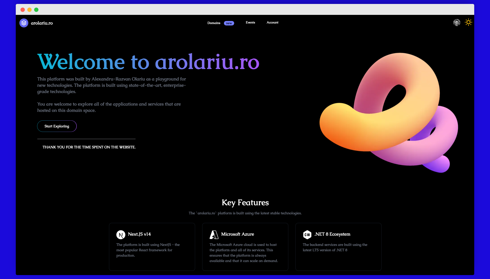
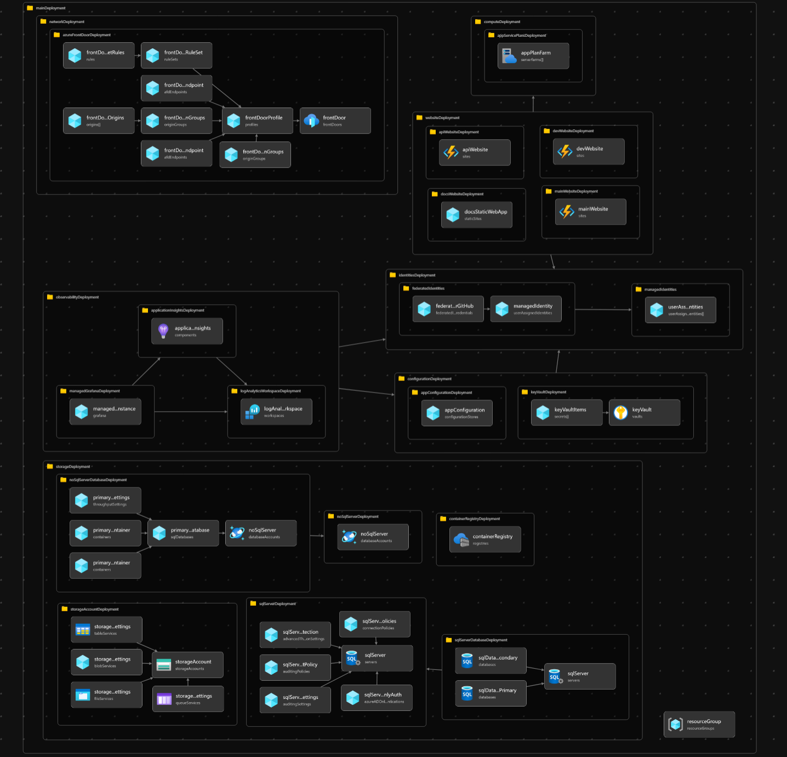
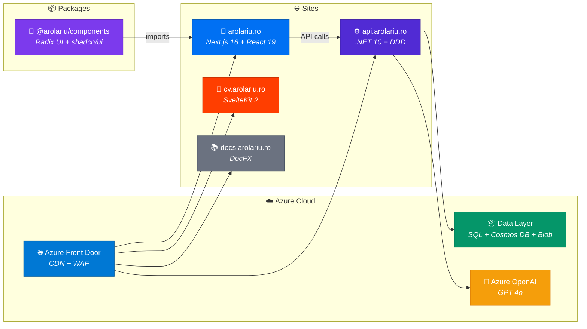
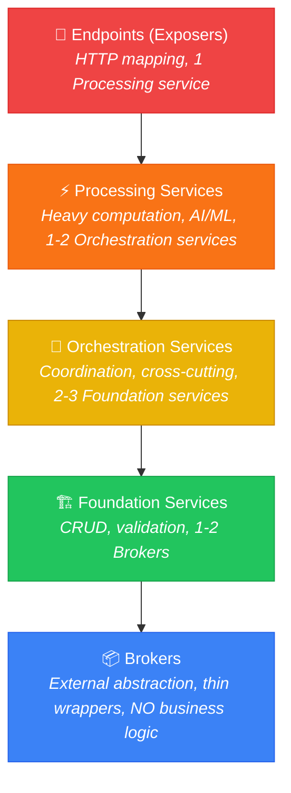
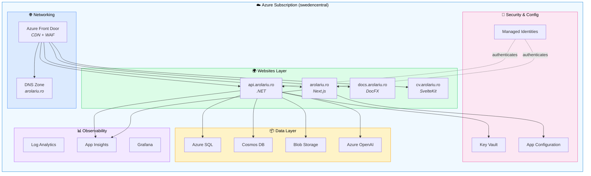
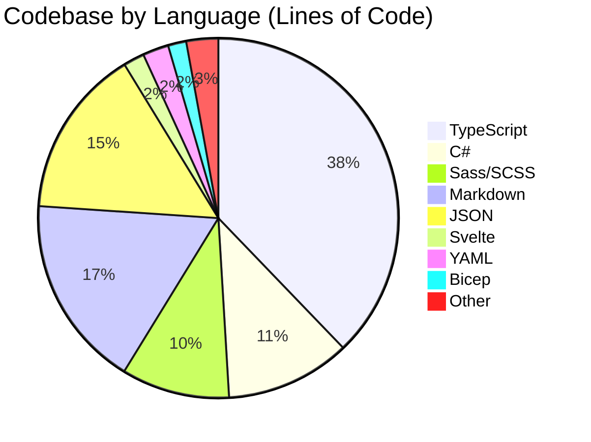

<!-- Back to top anchor -->
<a id="readme-top"></a>

<!-- PROJECT BANNER -->
<div align="center">

<!-- Animated header with gradient background simulation using table -->
<picture>
  <source media="(prefers-color-scheme: dark)" srcset="readme/logo.png">
  <source media="(prefers-color-scheme: light)" srcset="readme/logo.png">
  
</picture>

<br/>
<br/>

# ✨ AROLARIU.RO Monorepo

### 🏆 A Modern, Production-Grade Full-Stack Platform

<br/>

<!-- Quick action links -->
<p align="center">
  <a href="https://arolariu.ro"><strong>🌐 View Live Site »</strong></a>
  &nbsp;&nbsp;·&nbsp;&nbsp;
  <a href="https://api.arolariu.ro/swagger"><strong>📡 Explore API »</strong></a>
  &nbsp;&nbsp;·&nbsp;&nbsp;
  <a href="https://docs.arolariu.ro"><strong>📚 Read Docs »</strong></a>
</p>

<p align="center">
  <a href="https://github.com/arolariu/arolariu.ro/issues/new?labels=bug&template=bug_report.yml">🐛 Report Bug</a>
  &nbsp;·&nbsp;
  <a href="https://github.com/arolariu/arolariu.ro/issues/new?labels=enhancement&template=feature_request.yml">💡 Request Feature</a>
  &nbsp;·&nbsp;
  <a href="https://github.com/arolariu/arolariu.ro/discussions">💬 Discussions</a>
</p>

<br/>

<!-- Primary Status Badges -->
[![Build Status][build-shield]][build-url]
[![License][license-shield]][license-url]
[![Contributors][contributors-shield]][contributors-url]
[![Issues][issues-shield]][issues-url]
[![PRs Welcome][prs-shield]][prs-url]

<!-- Metrics Badges Row -->
<br/>


<!-- Quality & Security Badges -->
<br/>


<br/>

---

### 🛠️ Built With

<p align="center">
  <a href="https://nextjs.org"></a>
  <a href="https://react.dev"></a>
  <a href="https://www.typescriptlang.org"></a>
  <a href="https://dotnet.microsoft.com"></a>
</p>

<p align="center">
  <a href="https://tailwindcss.com"></a>
  <a href="https://azure.microsoft.com"></a>
  <a href="https://nx.dev"></a>
  <a href="https://storybook.js.org"></a>
</p>

---

</div>

<!-- PLATFORM PREVIEW -->
## 📸 Platform Preview

<div align="center">
<picture>
  <source media="(prefers-color-scheme: dark)" srcset="./readme/desktop-platform.png">
  <source media="(prefers-color-scheme: light)" srcset="./readme/desktop-platform.png">
  
</picture>

<br/>
<br/>

*🎨 Production-ready platform featuring modern UI/UX with dark mode support*

</div>

---

<!-- TABLE OF CONTENTS -->
## 📋 Table of Contents

<details open>
<summary><b>Click to expand/collapse</b></summary>

- [📸 Platform Preview](#-platform-preview)
- [📋 Table of Contents](#-table-of-contents)
- [🎯 About The Project](#-about-the-project)
  - [🌐 Live Services](#-live-services)
  - [✨ Key Features](#-key-features)
- [🚀 Getting Started](#-getting-started)
  - [Prerequisites](#prerequisites)
  - [Quick Start](#quick-start)
  - [Development Commands](#development-commands)
- [📂 Project Structure](#-project-structure)
  - [📖 Sub-Project Documentation](#-sub-project-documentation)
- [🏗️ Architecture](#️-architecture)
  - [High-Level Overview](#high-level-overview)
  - [Monorepo Dependency Flow](#monorepo-dependency-flow)
  - [Backend — The Standard (5 Layers)](#backend--the-standard-5-layers)
  - [Azure Infrastructure](#azure-infrastructure)
- [🔄 CI/CD Pipeline](#-cicd-pipeline)
- [🗺️ Roadmap](#️-roadmap)
- [🤖 AI-Powered Development](#-ai-powered-development)
- [📊 Repository Analytics](#-repository-analytics)
- [🤝 Contributing](#-contributing)
- [📜 License](#-license)
- [🔒 Security](#-security)
- [📞 Contact](#-contact)
- [🙏 Acknowledgments](#-acknowledgments)

</details>

<p align="right">(<a href="#readme-top">back to top</a>)</p>

---

<!-- ABOUT THE PROJECT -->
## 🎯 About The Project

The **arolariu.ro** monorepo is a comprehensive full-stack platform built with cutting-edge technologies and enterprise-grade best practices. It demonstrates modern software architecture patterns including:

- 🏛️ **Domain-Driven Design (DDD)** with well-defined bounded contexts
- 📦 **Modular Monolith** architecture for scalable backend services
- ⚡ **React Server Components** for optimal frontend performance
- 🔒 **Zero Trust Security** with managed identities and RBAC
- 📊 **Full Observability** with OpenTelemetry distributed tracing
- 📧 **Transactional Emails** with React Email and Resend

> [!TIP]
> **New to this project?** Start with the [Getting Started](#-getting-started) section, then explore the [Architecture](#️-architecture) to understand the system design.

### 🌐 Live Services

<div align="center">

| Service | Status | URL | Technology | Purpose |
|:-------:|:------:|:---:|:----------:|:-------:|
| 🎨 **Production** |  | [arolariu.ro](https://arolariu.ro) | Next.js 16 + React 19 | Main platform |
| 🔧 **Development** |  | [dev.arolariu.ro](https://dev.arolariu.ro) | Next.js 16 + React 19 | Preview environment |
| 🚀 **API** |  | [api.arolariu.ro](https://api.arolariu.ro) | .NET 10 (LTS) | REST, GraphQL & gRPC |
| 📄 **CV/Resume** |  | [cv.arolariu.ro](https://cv.arolariu.ro) | SvelteKit 2 | Personal CV |
| 📚 **Documentation** |  | [docs.arolariu.ro](https://docs.arolariu.ro) | DocFX | Technical docs |

</div>

### ✨ Key Features

<div align="center">

| Category | Features |
|:--------:|:---------|
| 🏛️ **Architecture** | Domain-Driven Design • Modular Monolith • SOLID Principles • The Standard |
| ⚡ **Performance** | React Server Components • Edge Caching • CDN Optimization • Lazy Loading |
| 🔒 **Security** | SSL/TLS A+ • CSP Headers • RBAC • Managed Identities • OIDC |
| 📊 **Observability** | OpenTelemetry • Distributed Tracing • Application Insights • Grafana |
| 🧪 **Quality** | 85%+ Test Coverage • ESLint (20+ plugins) • TypeScript Strict • Prettier |
| 🔄 **CI/CD** | GitHub Actions • Blue-Green Deploys • Auto-rollback • Container Registry |
| 🌍 **i18n** | Multi-language Support (EN/RO/FR) • Type-safe Translations • next-intl |
| 📧 **Email** | React Email Templates • Resend Integration • Transactional Emails |
| 📦 **Monorepo** | Nx Workspace • Shared Components • Incremental Builds • Affected Commands |

</div>

<p align="right">(<a href="#readme-top">back to top</a>)</p>

---

<!-- GETTING STARTED -->
## 🚀 Getting Started

> 💡 **Powered by [Nx](https://nx.dev)** — Enterprise-grade monorepo tooling for streamlined development workflows

### Prerequisites

Before you begin, ensure you have the following installed:

| Tool | Version | Purpose |
|:----:|:-------:|:--------|
|  | ≥24.x | JavaScript runtime |
|  | ≥11.x | Package manager |
|  | 10.0 | Backend runtime |
|  | Latest | Containerization (optional) |

### Quick Start

```bash
# 1️⃣ Clone the repository
git clone https://github.com/arolariu/arolariu.ro.git
cd arolariu.ro

# 2️⃣ Install dependencies
npm install

# 3️⃣ Run initial setup (generates env files, i18n, GraphQL)
npm run setup

# 4️⃣ Start development server
npm run dev:website
```

### Development Commands

<details open>
<summary><b>📦 Build Commands</b></summary>

```bash
npm run build              # Build all projects
npm run build:website      # 🌐 Main website (Next.js)
npm run build:components   # 🧩 React component library
npm run build:api          # ⚙️ Backend API (.NET)
npm run build:cv           # 📄 CV site (SvelteKit)
npm run build:docs         # 📚 Documentation (DocFX)
```

</details>

<details open>
<summary><b>🔥 Development Servers</b></summary>

```bash
npm run dev:website        # 🌐 Website → http://localhost:3000
npm run dev:components     # 🧩 Storybook → http://localhost:6006
npm run dev:api            # ⚙️ API → http://localhost:5000
npm run dev:cv             # 📄 CV → http://localhost:4173
npm run dev:docs           # 📚 Docs → http://localhost:8080
```

</details>

<details>
<summary><b>🧪 Testing & Quality</b></summary>

```bash
npm run test               # Run all tests
npm run test:unit          # Unit tests only
npm run test:e2e           # End-to-end tests
npm run lint               # ESLint (20+ plugins)
npm run format             # Prettier formatting
```

</details>

<details>
<summary><b>🎯 Advanced Nx Commands</b></summary>

```bash
npx nx graph               # 📊 Visualize project dependencies
npx nx affected --target=build   # 🎯 Build only affected projects
npx nx affected --target=test    # 🧪 Test only affected projects
npx nx show project website      # 🔍 Show project details
```

</details>

<p align="right">(<a href="#readme-top">back to top</a>)</p>

---

<!-- PROJECT STRUCTURE -->
## 📂 Project Structure

```plaintext
arolariu.ro/
├── 📦 packages/                    # Shared libraries
│   └── components/                 # 🧩 @arolariu/components (Radix UI + shadcn/ui)
│       ├── src/                    #    60+ component source files
│       └── stories/                #    Storybook stories
│
├── 🌐 sites/                       # Applications
│   ├── arolariu.ro/                # 🎨 Main Next.js 16 website
│   │   ├── src/
│   │   │   ├── app/                #    App Router pages (RSC by default)
│   │   │   ├── hooks/              #    Custom React hooks (useInvoice, etc.)
│   │   │   ├── stores/             #    Zustand stores with IndexedDB persistence
│   │   │   ├── lib/actions/        #    Server Actions
│   │   │   └── types/              #    TypeScript type definitions
│   │   ├── emails/                 #    📧 React Email templates (Resend)
│   │   └── messages/               #    🌍 i18n translations (en, ro, fr)
│   │
│   ├── api.arolariu.ro/            # ⚙️ .NET 10 Backend API
│   │   ├── src/
│   │   │   ├── Core/               #    Entry point, infrastructure, health
│   │   │   ├── Core.Auth/          #    Authentication bounded context
│   │   │   ├── Invoices/           #    Invoice management bounded context
│   │   │   └── Common/             #    Shared DDD base classes, telemetry
│   │   └── tests/                  #    xUnit + MSTest tests
│   │
│   ├── cv.arolariu.ro/             # 📄 SvelteKit 2 CV/Resume (standalone)
│   └── docs.arolariu.ro/           # 📚 DocFX documentation site
│
├── 🏗️ infra/                      # Infrastructure
│   ├── Azure/Bicep/                #    Azure IaC (main.bicep → facade → modules)
│   ├── containers/                 #    Container configurations
│   └── Local/                      #    Local development infrastructure
│
├── 📜 scripts/                     # Build & utility scripts
├── 📖 docs/                        # Architecture documentation & RFCs
│   └── rfc/                        #    13 Architecture Decision Records
│
├── 🤖 .github/                     # GitHub configuration
│   ├── workflows/                  #    8 CI/CD workflow files
│   ├── instructions/               #    9 Copilot instruction files
│   ├── agents/                     #    6 Copilot agent definitions
│   ├── prompts/                    #    6 reusable prompt templates
│   ├── skills/                     #    4 scaffolding skill templates
│   └── ISSUE_TEMPLATE/             #    8 issue templates (YAML)
│
└── 🔧 Configuration Files
    ├── nx.json                     # Nx workspace config
    ├── eslint.config.ts            # ESLint configuration
    └── tsconfig.json               # TypeScript configuration
```

### 📖 Sub-Project Documentation

Each sub-project has its own detailed documentation:

| Project | README | Description |
|:-------:|:------:|:------------|
| 🎨 **Website** | [`sites/arolariu.ro/README.md`](sites/arolariu.ro/README.md) | Next.js frontend architecture & patterns |
| ⚙️ **API** | [`sites/api.arolariu.ro/README.md`](sites/api.arolariu.ro/README.md) | .NET backend DDD architecture |
| 🧩 **Components** | [`packages/components/readme.md`](packages/components/readme.md) | Shared component library usage |
| 📄 **CV** | [`sites/cv.arolariu.ro/README.md`](sites/cv.arolariu.ro/README.md) | SvelteKit CV site |
| 🏗️ **Infrastructure** | [`infra/Azure/Bicep/DEPLOYMENT_GUIDE.md`](infra/Azure/Bicep/DEPLOYMENT_GUIDE.md) | Azure deployment guide |

<p align="right">(<a href="#readme-top">back to top</a>)</p>

---

<!-- ARCHITECTURE -->
## 🏗️ Architecture

### High-Level Overview

This platform follows a **modular monolith** architecture deployed on **Microsoft Azure**. The architecture emphasizes:

- **Separation of Concerns** — Clear boundaries between frontend, backend, and infrastructure
- **Domain-Driven Design** — Business logic organized by bounded contexts
- **Infrastructure as Code** — Fully reproducible Azure deployment via Bicep
- **Observability First** — OpenTelemetry integration from day one

<div align="center">



<br/>

*Azure Cloud Architecture — Deployed using Infrastructure as Code (Bicep)*

</div>

### Monorepo Dependency Flow


```mermaid
graph LR
    subgraph "📦 Packages"
        COMP["🧩 @arolariu/components<br/><i>Radix UI + shadcn/ui</i>"]
    end

    subgraph "🌐 Sites"
        WEB["🎨 arolariu.ro<br/><i>Next.js 16 + React 19</i>"]
        API["⚙️ api.arolariu.ro<br/><i>.NET 10 + DDD</i>"]
        CV["📄 cv.arolariu.ro<br/><i>SvelteKit 2</i>"]
        DOCS["📚 docs.arolariu.ro<br/><i>DocFX</i>"]
    end

    subgraph "☁️ Azure Cloud"
        AFD["🌐 Azure Front Door<br/><i>CDN + WAF</i>"]
        DATA["📦 Data Layer<br/><i>SQL + Cosmos DB + Blob</i>"]
        AI["🤖 Azure OpenAI<br/><i>GPT-4o</i>"]
    end

    COMP -->|imports| WEB
    WEB -->|API calls| API
    API --> DATA
    API --> AI
    AFD --> WEB
    AFD --> API
    AFD --> CV
    AFD --> DOCS

    style COMP fill:#7c3aed,stroke:#5b21b6,color:#fff
    style WEB fill:#0070f3,stroke:#0051a8,color:#fff
    style API fill:#512bd4,stroke:#3b1f9e,color:#fff
    style CV fill:#ff3e00,stroke:#cc3200,color:#fff
    style DOCS fill:#6b7280,stroke:#4b5563,color:#fff
    style AFD fill:#0078d4,stroke:#005a9e,color:#fff
    style DATA fill:#059669,stroke:#047857,color:#fff
    style AI fill:#f59e0b,stroke:#d97706,color:#fff
```

> **Note:** `cv.arolariu.ro` is fully standalone — no cross-dependencies with other packages.

### Backend — The Standard (5 Layers)

The .NET backend follows **[The Standard](https://github.com/hassanhabib/The-Standard)** architecture pattern:


```mermaid
graph TB
    EP["🔌 Endpoints (Exposers)<br/><i>HTTP mapping, 1 Processing service</i>"]
    PS["⚡ Processing Services<br/><i>Heavy computation, AI/ML, 1-2 Orchestration services</i>"]
    OS["🔄 Orchestration Services<br/><i>Coordination, cross-cutting, 2-3 Foundation services</i>"]
    FS["🏗️ Foundation Services<br/><i>CRUD, validation, 1-2 Brokers</i>"]
    BR["📦 Brokers<br/><i>External abstraction, thin wrappers, NO business logic</i>"]

    EP --> PS
    PS --> OS
    OS --> FS
    FS --> BR

    style EP fill:#ef4444,stroke:#dc2626,color:#fff
    style PS fill:#f97316,stroke:#ea580c,color:#fff
    style OS fill:#eab308,stroke:#ca8a04,color:#fff
    style FS fill:#22c55e,stroke:#16a34a,color:#fff
    style BR fill:#3b82f6,stroke:#2563eb,color:#fff
```

**Key constraints:** Max 2-3 dependencies per service (Florance Pattern). No sideways calls (Foundation→Foundation). Business logic never in Brokers.

### Azure Infrastructure

<details>
<summary><b>☁️ Azure Components (Click to expand)</b></summary>

<br/>

| Layer | Components | Purpose |
|:-----:|:-----------|:--------|
| 🌐 **Networking** | Azure Front Door, DNS Zone | Global CDN, WAF, traffic routing |
| 🖥️ **Compute** | App Service Plans (2x) | Production & Development hosting |
| 🌍 **Sites** | App Services (3x), Static Web Apps (2x) | Web applications |
| 🔐 **Identity** | User-Assigned Managed Identities (3x) | Zero-trust security |
| ⚙️ **Configuration** | Key Vault, App Configuration | Secrets & feature flags |
| 📦 **Storage** | Blob Storage, SQL Server, Cosmos DB, ACR | Data persistence |
| 📊 **Observability** | Log Analytics, App Insights, Grafana | Monitoring & alerting |
| 🤖 **AI** | Azure OpenAI, AI Foundry | GPT models & ML capabilities |

</details>

<details>
<summary><b>📐 Infrastructure Diagram (Mermaid)</b></summary>


```mermaid
graph TB
    subgraph SUB["☁️ Azure Subscription (swedencentral)"]
        direction TB

        subgraph NET["🌐 Networking"]
            AFD["Azure Front Door<br/><i>CDN + WAF</i>"]
            DNS["DNS Zone<br/><i>arolariu.ro</i>"]
        end

        subgraph WEB["🌍 Websites Layer"]
            S1["arolariu.ro<br/><i>Next.js</i>"]
            S2["api.arolariu.ro<br/><i>.NET</i>"]
            S3["docs.arolariu.ro<br/><i>DocFX</i>"]
            S4["cv.arolariu.ro<br/><i>SvelteKit</i>"]
        end

        subgraph DAT["📦 Data Layer"]
            SQL["Azure SQL"]
            CDB["Cosmos DB"]
            BLB["Blob Storage"]
            OAI["Azure OpenAI"]
        end

        subgraph SEC["🔐 Security & Config"]
            KV["Key Vault"]
            AC["App Configuration"]
            MI["Managed Identities"]
        end

        subgraph MON["📊 Observability"]
            LA["Log Analytics"]
            AI["App Insights"]
            GR["Grafana"]
        end
    end

    AFD --> DNS
    AFD --> S1
    AFD --> S2
    AFD --> S3
    AFD --> S4
    S2 --> SQL
    S2 --> CDB
    S2 --> BLB
    S2 --> OAI
    S2 --> KV
    S1 --> AC
    S1 --> AI
    S2 --> AI
    MI -.->|authenticates| S1
    MI -.->|authenticates| S2

    style SUB fill:#f0f9ff,stroke:#0078d4,color:#000
    style NET fill:#dbeafe,stroke:#3b82f6,color:#000
    style WEB fill:#dcfce7,stroke:#22c55e,color:#000
    style DAT fill:#fef3c7,stroke:#f59e0b,color:#000
    style SEC fill:#fce7f3,stroke:#ec4899,color:#000
    style MON fill:#f3e8ff,stroke:#a855f7,color:#000
```

</details>

<p align="right">(<a href="#readme-top">back to top</a>)</p>

---

<!-- CI/CD PIPELINE -->
## 🔄 CI/CD Pipeline

Automated deployment pipelines ensure code quality and zero-downtime releases.

<div align="center">

### 🌐 Website Pipelines

| Environment | Branch | Build | Release | Deployment |
|:-----------:|:------:|:-----:|:-------:|:----------:|
| 🟢 **Production** | `main` | [](https://github.com/arolariu/arolariu.ro/actions/workflows/official-website-build.yml) | [](https://github.com/arolariu/arolariu.ro/actions/workflows/official-website-release.yml) | [arolariu.ro](https://arolariu.ro) |
| 🟡 **Preview** | `preview` | [](https://github.com/arolariu/arolariu.ro/actions/workflows/official-website-build.yml) | [](https://github.com/arolariu/arolariu.ro/actions/workflows/official-website-release.yml) | [dev.arolariu.ro](https://dev.arolariu.ro) |

### ⚙️ API Pipeline

| Environment | Branch | Build & Deploy | Endpoint |
|:-----------:|:------:|:--------------:|:--------:|
| 🟢 **Production** | `main` | [](https://github.com/arolariu/arolariu.ro/actions/workflows/official-api-trigger.yml) | [api.arolariu.ro](https://api.arolariu.ro) |

### 📦 Additional Pipelines

| Pipeline | Status | Purpose |
|:--------:|:------:|:--------|
| **Components** | [](https://github.com/arolariu/arolariu.ro/actions/workflows/official-components-publish.yml) | Publish @arolariu/components |
| **CV Site** | [](https://github.com/arolariu/arolariu.ro/actions/workflows/official-cv-trigger.yml) | Deploy SvelteKit CV |
| **Docs** | [](https://github.com/arolariu/arolariu.ro/actions/workflows/official-docs-trigger.yml) | Deploy DocFX site |
| **E2E Tests** | [](https://github.com/arolariu/arolariu.ro/actions/workflows/official-e2e-action.yml) | Playwright + Newman |
| **Hygiene** | [](https://github.com/arolariu/arolariu.ro/actions/workflows/official-hygiene-check-v2.yml) | Lint, format, type-check |

</div>

<details>
<summary><b>🎯 Pipeline Features</b></summary>

| Feature | Description |
|:-------:|:------------|
| ✅ **Automated Testing** | Unit, integration & E2E tests on every commit |
| ✅ **Code Quality Gates** | ESLint, Prettier, TypeScript strict checks |
| ✅ **Security Scanning** | Dependency vulnerability analysis |
| ✅ **Docker Multi-stage** | Optimized container builds with layer caching |
| ✅ **Blue-Green Deploy** | Zero-downtime production releases |
| ✅ **Auto-rollback** | Automatic rollback on health check failures |
| ✅ **OIDC Authentication** | Secure Azure authentication without secrets |

</details>

<p align="right">(<a href="#readme-top">back to top</a>)</p>

---

<!-- ROADMAP -->
## 🗺️ Roadmap

Track the project's progress and upcoming features:

- [x] 🏗️ Nx Monorepo architecture setup
- [x] 🎨 Next.js 16 with React 19 and RSC
- [x] ⚙️ .NET 10 backend with DDD architecture
- [x] 📊 OpenTelemetry observability (frontend + backend)
- [x] 🔐 Azure OIDC authentication for CI/CD
- [x] 🌍 Internationalization with next-intl (EN/RO/FR)
- [x] 📦 Shared component library with Storybook
- [x] 🤖 Azure OpenAI integration
- [x] 📧 Transactional email system (React Email + Resend)
- [x] 🎨 SCSS architecture system
- [ ] 📱 Progressive Web App (PWA) support
- [ ] 🔔 Real-time notifications with SignalR
- [ ] 📈 Advanced analytics dashboard
- [ ] 🧪 Visual regression testing
- [ ] 🌐 Multi-region deployment

> **See the [open issues](https://github.com/arolariu/arolariu.ro/issues)** for a full list of proposed features and known issues.

<p align="right">(<a href="#readme-top">back to top</a>)</p>

---

<!-- AI-POWERED DEVELOPMENT -->
## 🤖 AI-Powered Development

This repository is fully configured with **GitHub Copilot** context-aware AI assistance — including instructions, agents, prompts, and scaffolding skills.

<details open>
<summary><b>📚 Instruction Files (9)</b></summary>

| File Pattern | Instruction File | Topics |
|:------------:|:----------------:|:-------|
| `.github/workflows/*.yml` | `workflows.instructions.md` | CI/CD patterns, caching, OIDC |
| `**/*.ts` | `typescript.instructions.md` | Strict typing, type guards, generics |
| `**/*.tsx, *.jsx` | `react.instructions.md` | RSC, hooks, state management |
| `**/*.cs` | `csharp.instructions.md` | C# 13 patterns, async/await |
| `sites/arolariu.ro/**` | `frontend.instructions.md` | Next.js App Router, observability |
| `sites/api.arolariu.ro/**` | `backend.instructions.md` | DDD, SOLID, The Standard |
| `**/*.bicep` | `bicep.instructions.md` | Azure IaC best practices |
| `packages/components/**` | `components.instructions.md` | Radix UI, shadcn/ui patterns |
| Pull Requests | `code-review.instructions.md` | Review standards & checklists |

</details>

<details>
<summary><b>🤖 Copilot Agents (6)</b></summary>

| Agent | Specialization |
|:-----:|:---------------|
| `backend-expert` | .NET DDD architecture, The Standard, service layers |
| `frontend-expert` | Next.js, React 19, RSC, state management |
| `code-reviewer` | Code quality, security, best practices |
| `infra-expert` | Azure Bicep, infrastructure as code |
| `docs-writer` | Technical documentation, JSDoc, XML docs |
| `full-stack-planner` | Cross-cutting architecture decisions |

</details>

<details>
<summary><b>🎯 Prompts & Skills</b></summary>

**Reusable Prompts (6):**

| Prompt | Purpose |
|:------:|:--------|
| `comment-standard` | Consistent JSDoc/XML documentation |
| `unit-test` | Test scaffolding (Vitest/xUnit) |
| `refactor` | Safe refactoring with patterns |
| `api-endpoint` | New .NET endpoint scaffold |
| `new-page` | Next.js page with i18n + metadata |
| `migration` | Database schema migration guide |

**Scaffolding Skills (4):**

| Skill | Template |
|:-----:|:---------|
| `ddd-service` | Full DDD service stack (Foundation → Broker) |
| `react-component` | RSC + Island pattern component |
| `zustand-store` | Zustand store with IndexedDB persistence |
| `i18n-page` | Internationalized page with all locales |

</details>

<details>
<summary><b>📖 Architecture RFCs (13)</b></summary>

| RFC # | Title | Status |
|:-----:|:------|:------:|
| **Infrastructure (0xxx)** | | |
| 0001 | GitHub Actions Workflows | ✅ Implemented |
| **Frontend (1xxx)** | | |
| 1001 | OpenTelemetry Observability System | ✅ Implemented |
| 1002 | JSDoc/TSDoc Documentation Standard | ✅ Implemented |
| 1003 | Internationalization System (next-intl) | ✅ Implemented |
| 1004 | Metadata and SEO System | ✅ Implemented |
| 1005 | State Management (Zustand) | ✅ Implemented |
| 1006 | Component Library Architecture | ✅ Implemented |
| 1007 | Advanced Frontend Patterns | ✅ Implemented |
| 1008 | SCSS System Architecture | ✅ Implemented |
| **Backend (2xxx)** | | |
| 2001 | Domain-Driven Design Architecture | ✅ Implemented |
| 2002 | Backend OpenTelemetry Observability | ✅ Implemented |
| 2003 | The Standard Implementation | ✅ Implemented |
| 2004 | XML Documentation Standard | ✅ Implemented |

> RFCs are located in [`docs/rfc/`](docs/rfc/). Use the [RFC template](docs/RFC_TEMPLATE.md) to propose new architecture decisions.

</details>

<p align="right">(<a href="#readme-top">back to top</a>)</p>

---

<!-- REPOSITORY ANALYTICS -->
## 📊 Repository Analytics

> 📈 **Powered by [Repography](https://repography.com)** — Real-time analytics from GitHub API

<div align="center">

[](https://repography.com)

</div>

<details>
<summary><b>📐 Static Code Statistics (scc)</b></summary>

> Last updated: 2026-02-10

> Repository size (excluding `node_modules`, build artifacts, and test results): **9.824 MB**

```text
───────────────────────────────────────────────────────────────────────────────
Language            Files       Lines    Blanks  Comments       Code Complexity
───────────────────────────────────────────────────────────────────────────────
TypeScript            591     109,452    12,437    24,927     72,088      3,375
Sass                  196      25,805     3,826     3,464     18,515          6
C#                    182      39,427     4,995    13,016     21,416        298
Markdown              105      42,513     9,526         0     32,987          0
JSON                   58      29,011        30         0     28,981          0
Bicep                  45       5,120       473     1,530      3,117         21
YAML                   32       5,417       411       555      4,451          0
Svelte                 28       4,187       263       328      3,596         90
SVG                    12         621         0         0        621          0
MSBuild                10         563        60        28        475          5
JavaScript              5         165        10        11        144         10
Plain Text              5         343        27         0        316          0
XML                     4       3,077         0        20      3,057          0
SQL                     3          81        12        48         21          0
CSS                     2         473        71        64        338          0
Batch                   2          60        18         0         42          4
Docker ignore           2         154        18        20        116          0
Dockerfile              2         211        38        51        122          9
Shell                   2          54        16        12         26          2
HTML                    1         193        11         9        173          0
License                 1          21         4         0         17          0
TypeScript Typ…         1          12         3         5          4          0
───────────────────────────────────────────────────────────────────────────────
Total               1,289     266,960    32,249    44,088    190,623      3,820
───────────────────────────────────────────────────────────────────────────────
Estimated Cost to Develop (organic) $6,695,444
Estimated Schedule Effort (organic) 28.33 months
Estimated People Required (organic) 21.00
───────────────────────────────────────────────────────────────────────────────
Processed 9823755 bytes, 9.824 megabytes (SI)
───────────────────────────────────────────────────────────────────────────────
```

<details>
<summary><b>Commands used</b></summary>

```powershell
# Run from repository root
scc . --exclude-dir node_modules,.next,bin,obj,artifacts,coverage,TestResults,dist,.svelte-kit,build
```

> Notes: `scc` counts source-like files and can differ from other tools based on exclusions, generated assets, and large/binary-like bundles.

</details>

</details>

<details open>
<summary><b>📅 Activity Timeline</b></summary>

<div align="center">

[](https://github.com/arolariu/arolariu.ro/commits)

</div>

</details>

<details>
<summary><b>🐛 Issues & 🔀 Pull Requests</b></summary>

<div align="center">

| Issues | Pull Requests |
|:------:|:-------------:|
| [](https://github.com/arolariu/arolariu.ro/issues) | [](https://github.com/arolariu/arolariu.ro/pulls) |

</div>

</details>

<details>
<summary><b>🗺️ Activity Heatmap & 💬 Trending Topics</b></summary>

<div align="center">

| Activity Map | Trending Topics |
|:------------:|:---------------:|
| [](https://github.com/arolariu/arolariu.ro/commits) | [](https://github.com/arolariu/arolariu.ro/commits) |

</div>

</details>

<details open>
<summary><b>🌟 Star History</b></summary>

<div align="center">

[](https://star-history.com/#arolariu/arolariu.ro&Date)

</div>

</details>

<details>
<summary><b>📊 Language Breakdown</b></summary>

<div align="center">


```mermaid
pie title Codebase by Language (Lines of Code)
    "TypeScript" : 72088
    "C#" : 21416
    "Sass/SCSS" : 18515
    "Markdown" : 32987
    "JSON" : 28981
    "Svelte" : 3596
    "YAML" : 4451
    "Bicep" : 3117
    "Other" : 5472
```

</div>

</details>

<p align="right">(<a href="#readme-top">back to top</a>)</p>

---

<!-- CONTRIBUTING -->
## 🤝 Contributing

Contributions make the open source community an amazing place to learn, inspire, and create. Any contributions are **greatly appreciated**!

> [!NOTE]
> Please read the **[Contributing Guide](CONTRIBUTING.md)** for detailed instructions on how to fork, branch, and submit pull requests. By participating, you agree to abide by our **[Code of Conduct](CODE_OF_CONDUCT.md)**.

<details>
<summary><b>Quick Contribution Steps</b></summary>

1. **Fork** the Project
2. **Create** your Feature Branch (`git checkout -b feat/amazing-feature`)
3. **Commit** your Changes using [Conventional Commits](https://www.conventionalcommits.org/) (`git commit -m 'feat: add amazing feature'`)
4. **Push** to the Branch (`git push origin feat/amazing-feature`)
5. **Open** a Pull Request against `main`

</details>

### 👥 Top Contributors

<div align="center">

<a href="https://github.com/arolariu/arolariu.ro/graphs/contributors">
  
</a>

<br/>
<br/>

[](https://github.com/arolariu/arolariu.ro/graphs/contributors)

</div>

<p align="right">(<a href="#readme-top">back to top</a>)</p>

---

<!-- LICENSE -->
## 📜 License

Distributed under the **MIT License**. See [`LICENSE`](LICENSE) for more information.

<p align="right">(<a href="#readme-top">back to top</a>)</p>

---

<!-- SECURITY -->
## 🔒 Security

To report security vulnerabilities, please see our **[Security Policy](SECURITY.md)**. Do not report security issues through public GitHub issues.

<p align="right">(<a href="#readme-top">back to top</a>)</p>

---

<!-- CONTACT -->
## 📞 Contact

<div align="center">

| Channel | Link |
|:-------:|:----:|
| 🌐 **Website** | [arolariu.ro](https://arolariu.ro) |
| 📧 **Email** | [admin@arolariu.ro](mailto:admin@arolariu.ro) |
| 💼 **LinkedIn** | [Alexandru-Razvan Olariu](https://www.linkedin.com/in/olariu-alexandru/) |
| 💻 **GitHub** | [@arolariu](https://github.com/arolariu) |

</div>

<p align="right">(<a href="#readme-top">back to top</a>)</p>

---

<!-- ACKNOWLEDGMENTS -->
## 🙏 Acknowledgments

Special thanks to these amazing resources and tools:

<details open>
<summary><b>Frameworks & Libraries</b></summary>

- [Next.js](https://nextjs.org) — The React Framework for the Web
- [React](https://react.dev) — Library for building user interfaces
- [.NET](https://dotnet.microsoft.com) — Free, open-source developer platform
- [SvelteKit](https://svelte.dev/docs/kit) — Web framework for Svelte
- [Tailwind CSS](https://tailwindcss.com) — Utility-first CSS framework
- [shadcn/ui](https://ui.shadcn.com) — Re-usable components built on Radix UI
- [Zustand](https://zustand.docs.pmnd.rs/) — Lightweight state management
- [React Email](https://react.email) — Build emails using React components
- [Resend](https://resend.com) — Email API for developers
- [Recharts](https://recharts.org) — Composable charting library

</details>

<details>
<summary><b>Tooling & Infrastructure</b></summary>

- [Nx](https://nx.dev) — Smart, Fast and Extensible Build System
- [Azure](https://azure.microsoft.com) — Cloud computing platform
- [Docker](https://www.docker.com) — Container platform
- [Storybook](https://storybook.js.org) — UI component workshop
- [Clerk](https://clerk.com) — Authentication and user management
- [OpenTelemetry](https://opentelemetry.io) — Observability framework

</details>

<details>
<summary><b>Developer Experience</b></summary>

- [Shields.io](https://shields.io) — Badges for projects
- [Repography](https://repography.com) — Repository analytics
- [contrib.rocks](https://contrib.rocks) — Contributor image generation
- [Star History](https://star-history.com) — GitHub star history charts
- [Best-README-Template](https://github.com/othneildrew/Best-README-Template) — README inspiration

</details>

<p align="right">(<a href="#readme-top">back to top</a>)</p>

---

<div align="center">

### 💖 Support This Project

If you find this project useful, please consider giving it a ⭐ star on GitHub!

<br/>

[](https://github.com/arolariu/arolariu.ro/stargazers)
[](https://github.com/arolariu/arolariu.ro/network/members)
[](https://github.com/arolariu/arolariu.ro/watchers)

<br/>

**Made with ❤️ by [Alexandru-Razvan Olariu](https://arolariu.ro)**

<br/>

**[⬆ Back to Top](#readme-top)**

</div>

---

<!-- MARKDOWN LINKS & IMAGES -->
<!-- Reference-style links for badges -->
[build-shield]: https://img.shields.io/github/actions/workflow/status/arolariu/arolariu.ro/official-website-build.yml?style=for-the-badge&logo=githubactions&logoColor=white&label=Build
[build-url]: https://github.com/arolariu/arolariu.ro/actions/workflows/official-website-build.yml
[license-shield]: https://img.shields.io/github/license/arolariu/arolariu.ro?style=for-the-badge&color=blue
[license-url]: https://github.com/arolariu/arolariu.ro/blob/main/LICENSE
[contributors-shield]: https://img.shields.io/github/contributors/arolariu/arolariu.ro?style=for-the-badge&logo=github&color=yellow
[contributors-url]: https://github.com/arolariu/arolariu.ro/graphs/contributors
[issues-shield]: https://img.shields.io/github/issues/arolariu/arolariu.ro?style=for-the-badge&logo=github
[issues-url]: https://github.com/arolariu/arolariu.ro/issues
[prs-shield]: https://img.shields.io/badge/PRs-welcome-brightgreen.svg?style=for-the-badge
[prs-url]: https://github.com/arolariu/arolariu.ro/pulls
