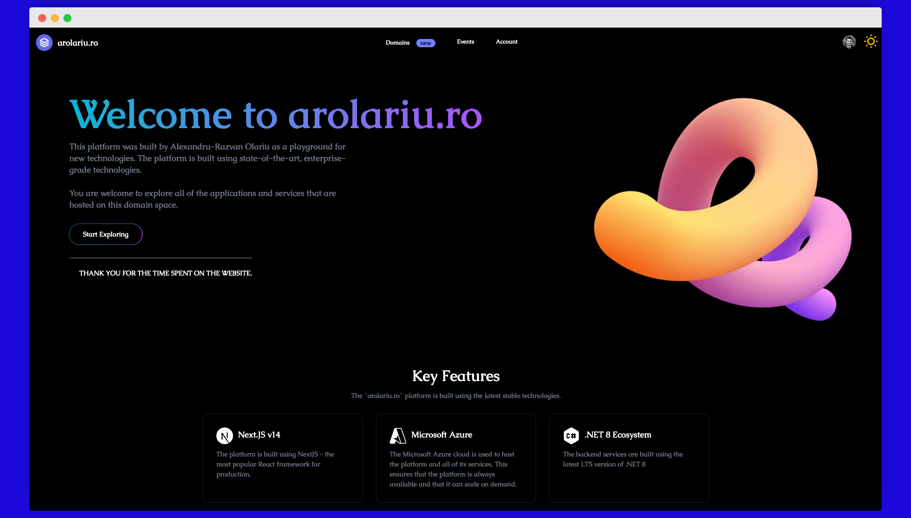
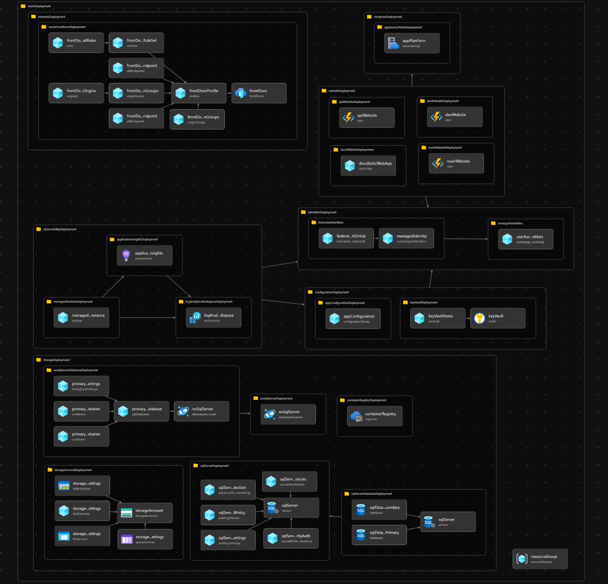
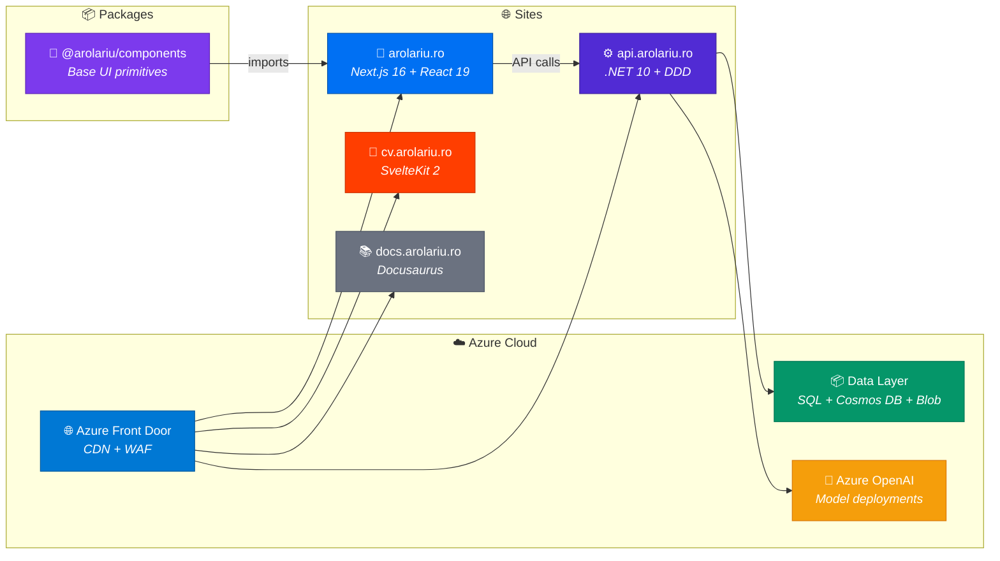
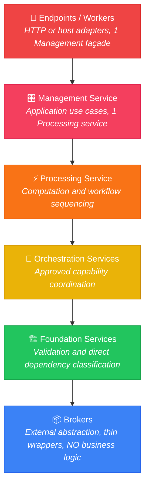
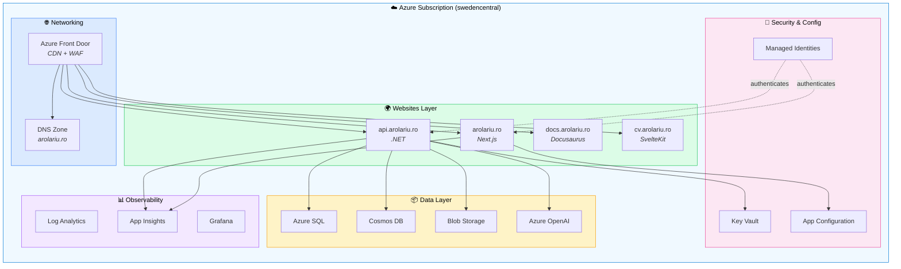
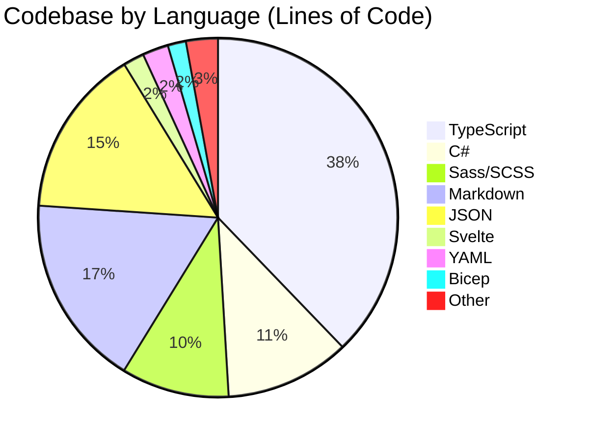

<!-- Back to top anchor -->
<a id="readme-top"></a>

<!-- PROJECT BANNER -->
<div align="center">

<!-- Animated header with gradient background simulation using table -->
<picture>
  <source media="(prefers-color-scheme: dark)" srcset="readme/logo.png">
  <source media="(prefers-color-scheme: light)" srcset="readme/logo.png">
  
</picture>

<br/>
<br/>

# ✨ AROLARIU.RO Monorepo

### 🏆 A Modern, Production-Grade Full-Stack Platform

<br/>

<!-- Quick action links -->
<p align="center">
  <a href="https://arolariu.ro"><strong>🌐 View Live Site »</strong></a>
  &nbsp;&nbsp;·&nbsp;&nbsp;
  <a href="https://api.arolariu.ro"><strong>📡 Explore the API »</strong></a>
  &nbsp;&nbsp;·&nbsp;&nbsp;
  <a href="https://docs.arolariu.ro"><strong>📚 Read the docs »</strong></a>
</p>

<p align="center">
  <a href="https://github.com/arolariu/arolariu.ro/issues/new?labels=bug&template=bug_report.yml">🐛 Report Bug</a>
  &nbsp;·&nbsp;
  <a href="https://github.com/arolariu/arolariu.ro/issues/new?labels=enhancement&template=feature_request.yml">💡 Request Feature</a>
  &nbsp;·&nbsp;
  <a href="https://github.com/arolariu/arolariu.ro/discussions">💬 Discussions</a>
</p>

<br/>

<!-- Primary Status Badges -->
[![Build Status][build-shield]][build-url]
[![License][license-shield]][license-url]
[![Contributors][contributors-shield]][contributors-url]
[![Issues][issues-shield]][issues-url]
[![PRs Welcome][prs-shield]][prs-url]

<!-- Metrics Badges Row -->
<br/>


<!-- Quality & Security Badges -->
<br/>


<br/>

---

### 🛠️ Built With

<p align="center">
  <a href="https://nextjs.org"></a>
  <a href="https://react.dev"></a>
  <a href="https://www.typescriptlang.org"></a>
  <a href="https://dotnet.microsoft.com"></a>
</p>

<p align="center">
  <a href="https://sass-lang.com"></a>
  <a href="https://azure.microsoft.com"></a>
  <a href="https://nx.dev"></a>
  <a href="https://storybook.js.org"></a>
</p>

---

</div>

<!-- PLATFORM PREVIEW -->
## 📸 Platform Preview

<div align="center">
<picture>
  <source media="(prefers-color-scheme: dark)" srcset="./readme/desktop-platform.png">
  <source media="(prefers-color-scheme: light)" srcset="./readme/desktop-platform.png">
  
</picture>

<br/>
<br/>

*🎨 Production-ready platform featuring modern UI/UX with dark mode support*

</div>

---

<!-- TABLE OF CONTENTS -->
## 📋 Table of Contents

<details open>
<summary><b>Click to expand/collapse</b></summary>

- [✨ AROLARIU.RO Monorepo](#-arolariuro-monorepo)
    - [🏆 A Modern, Production-Grade Full-Stack Platform](#-a-modern-production-grade-full-stack-platform)
    - [🛠️ Built With](#️-built-with)
  - [📸 Platform Preview](#-platform-preview)
  - [📋 Table of Contents](#-table-of-contents)
  - [🎯 About The Project](#-about-the-project)
    - [🌐 Live Services](#-live-services)
    - [✨ Key Features](#-key-features)
  - [🚀 Getting Started](#-getting-started)
    - [Prerequisites](#prerequisites)
    - [Quick Start](#quick-start)
    - [Development Commands](#development-commands)
    - [Aspire Mode (Default)](#aspire-mode-default)
    - [Selfhost Mode (Containerized)](#selfhost-mode-containerized)
    - [Troubleshooting](#troubleshooting)
  - [📂 Project Structure](#-project-structure)
    - [📖 Sub-Project Documentation](#-sub-project-documentation)
  - [🏗️ Architecture](#️-architecture)
    - [High-Level Overview](#high-level-overview)
    - [Monorepo Dependency Flow](#monorepo-dependency-flow)
    - [Backend — The Standard (5 Layers)](#backend--the-standard-5-layers)
    - [Azure Infrastructure](#azure-infrastructure)
  - [🔄 CI/CD Pipeline](#-cicd-pipeline)
    - [🌐 Website Pipelines](#-website-pipelines)
    - [⚙️ API Pipeline](#️-api-pipeline)
    - [📦 Additional Pipelines](#-additional-pipelines)
  - [🗺️ Roadmap](#️-roadmap)
  - [🤖 AI-Powered Development](#-ai-powered-development)
  - [📊 Repository Analytics](#-repository-analytics)
  - [🤝 Contributing](#-contributing)
    - [👥 Top Contributors](#-top-contributors)
  - [📜 License](#-license)
  - [🔒 Security](#-security)
  - [📞 Contact](#-contact)
  - [🙏 Acknowledgments](#-acknowledgments)
    - [💖 Support This Project](#-support-this-project)

</details>

<p align="right">(<a href="#readme-top">back to top</a>)</p>

---

<!-- ABOUT THE PROJECT -->
## 🎯 About The Project

The **arolariu.ro** monorepo is a comprehensive full-stack platform built with cutting-edge technologies and enterprise-grade best practices. It demonstrates modern software architecture patterns including:

- 🏛️ **Domain-Driven Design (DDD)** with well-defined bounded contexts
- 📦 **Modular Monolith** architecture for scalable backend services
- ⚡ **React Server Components** for optimal frontend performance
- 🔒 **Zero Trust Security** with managed identities and RBAC
- 📊 **Full Observability** with OpenTelemetry distributed tracing
- 📧 **Transactional Emails** with React Email and Resend

> [!TIP]
> **New to this project?** Start with the [Getting Started](#-getting-started) section, then explore the [Architecture](#️-architecture) to understand the system design.

### 🌐 Live Services

<div align="center">

| Service | Status | URL | Technology | Purpose |
|:-------:|:------:|:---:|:----------:|:-------:|
| 🎨 **Production** |  | [arolariu.ro](https://arolariu.ro) | Next.js 16 + React 19 | Main platform |
| 🔧 **Development** |  | [dev.arolariu.ro](https://dev.arolariu.ro) | Next.js 16 + React 19 | Preview environment |
| 🚀 **API** |  | [api.arolariu.ro](https://api.arolariu.ro) | .NET Minimal APIs | REST and OpenAPI |
| 📄 **CV/Resume** |  | [cv.arolariu.ro](https://cv.arolariu.ro) | SvelteKit 2 | Personal CV |
| 📚 **Documentation** |  | [docs.arolariu.ro](https://docs.arolariu.ro) | Docusaurus | Technical docs |
| 📟 **Status** |  | [status.arolariu.ro](https://status.arolariu.ro) | SvelteKit | Service availability |
| 🐍 **Configuration** |  | [exp.arolariu.ro](https://exp.arolariu.ro) | FastAPI | Target-scoped configuration proxy |

</div>

### ✨ Key Features

<div align="center">

| Category | Features |
|:--------:|:---------|
| 🏛️ **Architecture** | Domain-Driven Design • Modular Monolith • SOLID Principles • The Standard |
| ⚡ **Performance** | React Server Components • Edge Caching • CDN Optimization • Lazy Loading |
| 🔒 **Security** | SSL/TLS A+ • CSP Headers • RBAC • Managed Identities • OIDC |
| 📊 **Observability** | OpenTelemetry • Distributed Tracing • Application Insights • Grafana |
| 🧪 **Quality** | 85%+ Test Coverage • ESLint (20+ plugins) • TypeScript Strict • Prettier |
| 🔄 **CI/CD** | GitHub Actions • Container builds • Environment-scoped deployments |
| 🌍 **i18n** | Multi-language Support (EN/RO/FR) • Type-safe Translations • next-intl |
| 📧 **Email** | React Email Templates • Resend Integration • Transactional Emails |
| 📦 **Monorepo** | Nx Workspace • Shared Components • Incremental Builds • Affected Commands |

</div>

<p align="right">(<a href="#readme-top">back to top</a>)</p>

---

<!-- GETTING STARTED -->
## 🚀 Getting Started

> 💡 **Powered by [Nx](https://nx.dev)** — Enterprise-grade monorepo tooling for streamlined development workflows

### Prerequisites

Before you begin, ensure you have the following bootstrap prerequisites installed — `npm run setup` prepares everything else below and
never installs or upgrades Git, Node.js, or npm:

| Tool | Version | Purpose |
|:----:|:-------:|:--------|
|  | — | Version control — must be installed and on `PATH`; probed by `npm run setup` (no minimum version enforced) — bootstrap prerequisite |
|  | ≥24.x | JavaScript runtime — bootstrap prerequisite |
|  | ≥11.x | Package manager — bootstrap prerequisite |
|  | 10.0 | Backend runtime and Aspire AppHost — prepared by `npm run setup` |
| Container engine | Rancher Desktop or Podman Desktop | Local SQL, Cosmos, Azurite, and Redis containers — selected/persisted by `npm run setup` (Docker Desktop is not supported) |
|  | 3.12 | Required for `exp` config service (FastAPI) — prepared by `npm run setup` |

### Quick Start

> [!WARNING]
> The Aspire start command below resets all guarded local invoice/merchant
> documents, invoice blobs, and analysis queue messages before restoring the
> deterministic local scenarios.

```bash
# 1️⃣ Clone the repository
git clone https://github.com/arolariu/arolariu.ro.git
cd arolariu.ro

# 2️⃣ Install root dependencies
npm install
# (or use `npm ci` for a reproducible, lockfile-exact install in CI or clean checkouts)

# 3️⃣ One-command onboarding — validates root dependencies and prepares every toolchain
npm run setup

# 3️⃣ Start the full stack via Aspire with the engine setup selected/persisted
npm run dev
# → Aspire dashboard auto-opens at https://localhost:17080
# → Website https://localhost:3000 · API http://localhost:5000 · CV http://localhost:4173
#   Docs http://localhost:3100 · Status http://localhost:3002 · exp http://localhost:5002

# Or start a single service standalone (no orchestration):
npm run dev:website        # Next.js only
```

> 💡 **F5 in VS Code or Visual Studio 2026** launches the Aspire AppHost with debuggers attached for all runtimes (.NET, Node.js, Python).

**What `npm run setup` prepares** — a single dependency-aware run that never builds, type-checks, tests, or starts/stops a service:

- Validates the root npm dependency tree (already installed by `npm install`/`npm ci` above), restores the `.github/scripts` npm dependency tree, and regenerates taxonomy/GraphQL/i18n checkout artifacts;
- Prepares the .NET SDK/workload/tool restore, AppHost local-development user secrets, and the local HTTPS development certificate;
- Prepares an isolated Python virtual environment and its pinned dependencies for the `exp` service;
- Prepares the SvelteKit CV and status generated `.svelte-kit` state;
- Additively writes the website's core local defaults (`SITE_ENV`, `SITE_NAME`, `SITE_URL`, `USE_CDN`) to `sites/arolariu.ro/.env` without overwriting existing entries, and ensures Playwright's locked Chromium browser is installed;
- Selects a container engine (Rancher Desktop or Podman Desktop), persists it to `.arolariu/tooling.local.json`, with your consent installs it if missing, and checks — but never starts — its readiness for Aspire or selfhost.

Container engine selection precedence for `npm run setup`: `npm run setup -- --engine rancher|podman`, then `AROLARIU_CONTAINER_ENGINE`,
then the persisted `.arolariu/tooling.local.json`, then an interactive prompt when none are set. `npm run dev` and
`npm run dev:selfhost` consume the same CLI/environment/persisted selection, but throw instead of prompting when none is available.
Docker Desktop is unsupported and is never selected as a fallback.

Useful flags: `npm run setup -- --verbose` (diagnostic evidence per phase), `npm run setup -- --dry-run` (plan every mutation without
executing it and without any consent prompt — an engine-selection prompt can still appear when no engine has been chosen yet;
combine with `--engine` to avoid it), `npm run setup -- --yes` (approve system-scoped mutations — SDK, .NET workload, Python
interpreter, HTTPS-trust, Playwright Linux system-dependency, mkcert, and container-engine installs — without an interactive prompt;
it never invents an engine choice, prompted text, or a secret), and `npm run setup -- --engine rancher|podman` (select the engine
explicitly).

Clerk credentials are optional for `npm run setup`, not universally optional at runtime. When both keys are absent, ordinary non-CI
`next dev` can use Clerk's keyless development mode. The repository has no auth-disabled runtime path: CI, production, and any explicitly
configured Clerk state require a valid, mode-matched publishable/secret key pair, and partial or invalid pairs are unsupported. Setup still
exits `0` with a degraded React phase when that pair is not ready.

Running `npm run dev:selfhost`? Export `MSSQL_SA_PASSWORD` in your shell/session first — required only when selfhost starts its SQL
bootstrap, never stored in `.env` or `.arolariu/tooling.local.json`. `npm run setup`'s infrastructure phase strips it from the
container-engine, port-inspection, and certificate subprocesses it runs, but every other setup subprocess inherits your shell
environment — export it only in the session used to run `npm run dev:selfhost`.

### Development Commands

<details open>
<summary><b>📦 Build Commands</b></summary>

```bash
npm run build              # Build all projects
npm run build:website      # 🌐 Main website (Next.js)
npm run build:components   # 🧩 React component library
npm run build:api          # ⚙️ Backend API (.NET)
npm run build:cv           # 📄 CV site (SvelteKit)
npm run build:docs         # 📚 Documentation (Docusaurus)
```

</details>

<details open>
<summary><b>🔥 Development Servers</b></summary>

```bash
npm run dev -- --engine rancher                # 🚀 Aspire AppHost (choose rancher or podman)
npm run dev:aspire -- --engine podman          # 🚀 Explicit Aspire alias
npm run dev:selfhost -- --engine rancher       # 🐳 Containerized stack
npm run dev:selfhost:stop -- --engine rancher  # 🛑 Stop that containerized stack

# Standalone (single service, no AppHost coordination — fallback only):
npm run dev:website        # 🌐 Website → https://localhost:3000
npm run dev:components     # 🧩 Storybook → http://localhost:6006
npm run dev:api            # ⚙️ API → http://localhost:5000
npm run dev:cv             # 📄 CV → http://localhost:4173
npm run dev:docs           # 📚 Docs → http://localhost:3100
npm run dev:exp            # 🐍 exp config service → http://localhost:5002
npm run dev:status         # 📟 Status page → http://localhost:3002
```

</details>

<details>
<summary><b>🧪 Testing & Quality</b></summary>

```bash
npm run test               # Run all tests
npm run test:unit          # Unit tests only
npm run test:e2e           # End-to-end tests
npm run test:e2e:frontend  # Frontend Newman live tests
npm run test:e2e:backend   # Backend Newman live tests
npm run test:e2e:cv        # CV Newman live tests
npm run lint               # ESLint (20+ plugins)
npm run format             # Prettier formatting
```

</details>

<details>
<summary><b>🩺 Diagnostics</b></summary>

```bash
npm run doctor              # Read-only workspace health check — never mutates the repository
npm run status              # Six-section monorepo status dashboard (includes doctor's health score)
```

`npm run doctor` diagnoses the workspace; it never builds, type-checks, or runs tests. See
[DEVELOPMENT.md](DEVELOPMENT.md#diagnosing-with-npm-run-doctor) for the full CLI contract, module
order, and ecosystem-specific troubleshooting commands.

</details>

<details>
<summary><b>🎯 Advanced Nx Commands</b></summary>

```bash
npx nx graph               # 📊 Visualize project dependencies
npx nx affected --target=build   # 🎯 Build only affected projects
npx nx affected --target=test    # 🧪 Test only affected projects
npx nx show project website      # 🔍 Show project details
```

</details>

### Aspire Mode (Default)

`npm run dev -- --engine rancher` or `npm run dev -- --engine podman` starts the **.NET Aspire AppHost** at `tooling/AppHost/`. The AppHost orchestrates the entire dev stack:

- **Destructive local scenario bootstrap** — before restoring Alice, Bob, and
  Charlie, Aspire deletes all documents in the guarded local invoice/merchant
  Cosmos containers, removes the local invoice blob container, and clears the
  analysis queue. Preserve local work before starting.
- **Native website certificate preflight** — the website uses
  `next dev --experimental-https`; a certificate-free first run can
  download/run certificate tooling and install a local CA. Confirm that
  trust-store change before starting.
- **Apps run native** — .NET via `dotnet run`, Next.js / SvelteKit / Docusaurus / status via their `dev` scripts, Python `exp` via `uvicorn`. Hot reload is preserved on every runtime.
- **Infrastructure runs in containers** — SQL Server, Cosmos DB vNext emulator, Azurite (Blob/Queue/Table), and Redis are spawned as native Aspire integrations through the selected Rancher Desktop or Podman Desktop engine (no Docker Compose required).
- **Aspire dashboard** auto-opens at `https://localhost:17080` with live OpenTelemetry traces, metrics, logs, clickable URLs, and per-resource health badges.

VS Code F5 includes `🚀 [Podman] Full stack (Aspire)` and `🚀 [Rancher] Full stack (Aspire)` profiles. These keep the Aspire debugger integration and set the AppHost runtime to `podman` or Docker-compatible Rancher/Moby (`DOTNET_ASPIRE_CONTAINER_RUNTIME=docker`). The selected runtime must already be available to the VS Code process through the host environment; the launch profiles do not hardcode platform-specific PATH or socket values.

Rancher Desktop is selected through its Moby/Docker-compatible backend; Aspire/DCP sees this as `docker`, not as a separate `rancher-desktop` runtime.

| Resource | URL | Notes |
|----------|-----|-------|
| Aspire dashboard | `https://localhost:17080` | OTel traces · metrics · logs · resource graph |
| Website (Next.js) | `https://localhost:3000` | HTTPS via `--experimental-https` (mkcert root CA) |
| API (.NET) | `http://localhost:5000` | Swagger UI at `/` |
| CV (SvelteKit) | `http://localhost:4173` | Preview server |
| Docs (Docusaurus) | `http://localhost:3100` | |
| Status | `http://localhost:3002` | |
| exp (Python FastAPI) | `http://localhost:5002` | Config service for the API |
| SQL Server | `localhost:8082` | `Encrypt=False` required (vpnkit TLS) |
| Cosmos emulator | `https://localhost:8081` | vNext preview emulator |
| Azurite | `http://localhost:10000-10002` | Blob · Queue · Table |
| Redis | `localhost:6379` | |

### Selfhost Mode (Containerized)

Docker Desktop is deprecated for local development in this repository. Use one supported engine per run:

```powershell
npm run dev -- --engine rancher
npm run dev -- --engine podman
npm run dev:selfhost -- --engine rancher
npm run dev:selfhost -- --engine podman
```

Do not run Docker Desktop as a fallback. The runtime wrappers fail when Docker Desktop is detected.

Selfhost SQL requires a local password supplied by environment variable:

```powershell
$env:MSSQL_SA_PASSWORD = "<local strong password>"
```

Keep `MSSQL_SA_PASSWORD` in your shell/session environment only. Do not commit it to `.env` files, VS Code launch profiles, or source control.

`npm run dev:selfhost -- --engine rancher` or `npm run dev:selfhost -- --engine podman` brings up the **full Compose stack** including the apps themselves. Use this when you need to:

- Audit container behavior or validate CI parity
- Test a deploy-mock-of-prod configuration
- Reproduce a bug that only manifests in containerized form

The Compose definitions live under `infra/Local/{Storage,Management,Backend,Frontend}/docker-compose.yml`. Stop the stack with `npm run dev:selfhost:stop -- --engine rancher` or `npm run dev:selfhost:stop -- --engine podman`.

### Troubleshooting

<details>
<summary><b>🔌 Debugger won't attach to Next.js (port 9229)</b></summary>

The Aspire AppHost spawns `next dev --inspect` which exposes the V8 inspector on **port 9229**. If your debugger doesn't attach:

1. Confirm the website resource is **Running** in the Aspire dashboard.
2. In VS Code, use the **`Attach to Next.js (Aspire)`** launch configuration (auto-attaches via `inspect` protocol on `localhost:9229`).
3. If npm logs an `arborist` null-state error during startup, interrupt the
   owning AppHost terminal and re-run
   `npm run dev -- --engine <rancher|podman>`.
4. For .NET debugging, F5 from `tooling/AppHost/AppHost.csproj` attaches automatically. The `watch` task in `.vscode/tasks.json` also targets the AppHost project.

</details>

<details>
<summary><b>🩺 An app is marked unhealthy in the Aspire dashboard</b></summary>

Each resource has a health check; check the dashboard's **Health** column for the failing endpoint:

| Resource | Health endpoint | What it checks |
|----------|-----------------|----------------|
| API | `http://localhost:5000/health` | DB + Cosmos + Azurite + Redis + exp connectivity |
| Website | `https://localhost:3000/api/health` | Website readiness plus configured exp/API upstream checks |
| exp | `http://localhost:5002/api/ready` | FastAPI ready + config bootstrap done |
| SQL Server | TDS handshake | Aspire's built-in `WaitFor` gate (`sql-ready`) |

The API explicitly **waits on** SQL, Cosmos, Azurite, and exp before going live. If exp is yellow (Starting), the API stays Starting too — that's expected on cold boot for ~5-10 s while `ExpConfigGenerator` writes the bootstrap config. If exp stays Starting longer, check `tooling/AppHost/Aspire/ExpConfigGenerator.cs` logs in the dashboard.

</details>

<details>
<summary><b>🚪 DCP port collision (e.g. "address already in use")</b></summary>

Aspire's **Distributed Container Proxy (DCP)** allocates dynamic ports for proxied resources. When a fixed host port is required (e.g. the docs site on `:3100`), the resource must opt out via `isProxied: false` in `tooling/AppHost/Program.cs`. If you add a new resource and it can't bind, either:

- Let Aspire pick a port (read it from the dashboard), or
- Set `isProxied: false` on the endpoint and pin the host port explicitly.

</details>

<details>
<summary><b>🔐 SQL Server connection hangs or "TLS handshake failed"</b></summary>

The dev SQL container does not present a trusted TLS certificate. Use the
connection settings injected by the selected local mode. If connecting with a
separate database client, derive the current host/port/encryption requirements
from the live AppHost or Compose configuration rather than copying a password
or connection string from documentation.

</details>

<details>
<summary><b>📡 OTLP exporter / dashboard shows no telemetry</b></summary>

The dashboard exposes two OTLP endpoints — **gRPC on `:21030`** and **HTTP on `:21031`**. The .NET API uses gRPC by default; the Next.js website uses the HTTP exporter. If you see no traces:

1. Check the resource's **Console logs** tab in the dashboard for `OTLP exporter` errors.
2. Confirm `OTEL_EXPORTER_OTLP_ENDPOINT` is set to the right protocol's port — the AppHost sets these per-resource.
3. For Aspire dashboard TLS, inspect the Kestrel endpoint in
   `tooling/AppHost/Properties/launchSettings.json` and the current ASP.NET
   Core development certificate. `mkcert` owns selfhost Traefik certificates,
   not the Aspire dashboard.

</details>

<details>
<summary><b>🔑 Local HTTPS certificate errors (`*.localhost`)</b></summary>

Selfhost Traefik can use a wildcard `*.localhost` certificate generated by
**mkcert**. Aspire's dashboard and native website HTTPS have separate
development-certificate owners. Installing a local CA or modifying the trust
store is security-sensitive; confirm that change before running:

```bash
# Install/reinstall the local CA after approval
mkcert -install

# Regenerate the wildcard cert (devcontainer does this automatically in postCreate.sh)
cd infra/Local/Management/certs
mkcert -key-file local-key.pem -cert-file local-cert.pem "localhost" "*.localhost"
```

</details>

<details>
<summary><b>🐳 Containers won't start / selected engine not available</b></summary>

Aspire spawns containers via the selected Rancher Desktop or Podman Desktop runtime. Verify the engine you selected:

```bash
docker version            # Rancher Desktop in Moby/dockerd mode
podman --version          # Podman Desktop
podman compose version    # Podman Compose provider
```

If the selected engine is not running, start Rancher Desktop or Podman Desktop before `npm run dev -- --engine <rancher|podman>`. Do not start Docker Desktop as a fallback.

</details>

<details>
<summary><b>🧪 Aspire AppHost crashes immediately on startup</b></summary>

1. Run `dotnet restore ./arolariu.slnx` to refresh NuGet packages.
2. Inspect the first AppHost build/startup error rather than installing an
   undeclared workload.
3. If the evidence identifies stale build output, remove only
   `tooling/AppHost/bin` and `tooling/AppHost/obj`, then re-run
   `npm run dev -- --engine <rancher|podman>`.
4. Check that the current local AppHost configuration supplies the required
   parameter names without printing their values.

</details>

<p align="right">(<a href="#readme-top">back to top</a>)</p>

---

<!-- PROJECT STRUCTURE -->
## 📂 Project Structure

```plaintext
arolariu.ro/
├── 📦 packages/                    # Shared libraries
│   └── components/                 # 🧩 @arolariu/components (Base UI primitives)
│       ├── src/                    #    Component source
│       └── stories/                #    Storybook stories
│
├── 🌐 sites/                       # Applications
│   ├── arolariu.ro/                # 🎨 Main Next.js website
│   │   ├── src/
│   │   │   ├── app/                #    App Router pages (RSC by default)
│   │   │   ├── hooks/              #    Custom React hooks (useInvoice, etc.)
│   │   │   ├── stores/             #    Zustand stores with IndexedDB persistence
│   │   │   ├── lib/actions/        #    Server-only helpers, Server Actions, transport
│   │   │   └── types/              #    TypeScript type definitions
│   │   ├── emails/                 #    📧 React Email templates (Resend)
│   │   └── messages/               #    🌍 i18n translations (en, ro, fr)
│   │
│   ├── api.arolariu.ro/            # ⚙️ .NET Minimal API modular monolith
│   │   ├── src/
│   │   │   ├── Core/               #    Entry point, infrastructure, health
│   │   │   ├── Core.Auth/          #    Authentication bounded context
│   │   │   ├── Invoices/           #    Invoice management bounded context
│   │   │   └── Common/             #    Shared DDD base classes, telemetry
│   │   └── tests/                  #    MSTest tests
│   │
│   ├── cv.arolariu.ro/             # 📄 Standalone SvelteKit CV/Resume
│   ├── status.arolariu.ro/         # 📟 Standalone SvelteKit service status
│   ├── exp.arolariu.ro/            # 🐍 Experimental FastAPI config service
│   └── docs.arolariu.ro/           # 📚 Docusaurus documentation site
│
├── 🏗️ infra/                      # Infrastructure
│   ├── Azure/Bicep/                #    Azure IaC (main.bicep → facade → modules)
│   ├── containers/                 #    Container configurations
│   └── Local/                      #    Local development infrastructure
│
├── 📜 scripts/                     # Build & utility scripts
├── 🛠️  tooling/                    # Dev tooling
│   ├── AppHost/                    #    .NET Aspire local orchestrator
│   └── AppHost.Tests/              #    MSTest tests for AppHost helpers
├── 📖 docs/                        # Architecture documentation & RFCs
│   └── rfc/                        #    Architecture Decision Records
│
├── 🤖 .github/                     # GitHub configuration
│   ├── workflows/                  #    CI/CD workflows
│   ├── instructions/               #    Path instructions and reference catalogs
│   ├── agents/                     #    Specialist agent definitions
│   ├── prompts/                    #    Thin VS Code prompt shortcuts
│   ├── skills/                     #    Portable progressive workflows
│   ├── extensions/                 #    Optional CLI context and diagnostics
│   ├── memory/                     #    Durable non-source-derived context
│   ├── mcp.json                    #    Workspace MCP client configuration
│   └── ISSUE_TEMPLATE/             #    Issue templates
│
└── 🔧 Configuration Files
    ├── nx.json                     # Nx workspace config
    ├── eslint.config.ts            # ESLint configuration
    └── tsconfig.json               # TypeScript configuration
```

### 📖 Sub-Project Documentation

Each sub-project has its own detailed documentation:

| Project | README | Description |
|:-------:|:------:|:------------|
| 🎨 **Website** | [`sites/arolariu.ro/README.md`](sites/arolariu.ro/README.md) | Next.js frontend architecture & patterns |
| ⚙️ **API** | [`sites/api.arolariu.ro/README.md`](sites/api.arolariu.ro/README.md) | .NET backend DDD architecture |
| 🧩 **Components** | [`packages/components/README.md`](packages/components/README.md) | Shared component library usage |
| 📄 **CV** | [`sites/cv.arolariu.ro/README.md`](sites/cv.arolariu.ro/README.md) | SvelteKit CV site |
| 📟 **Status** | [`sites/status.arolariu.ro/README.md`](sites/status.arolariu.ro/README.md) | Service-status site |
| 🐍 **Experimental Service** | [`sites/exp.arolariu.ro/README.md`](sites/exp.arolariu.ro/README.md) | FastAPI configuration proxy |
| 📚 **Documentation** | [`sites/docs.arolariu.ro/README.md`](sites/docs.arolariu.ro/README.md) | Docusaurus documentation pipeline |
| 🏗️ **Infrastructure** | [`infra/Azure/Bicep/DEPLOYMENT_GUIDE.md`](infra/Azure/Bicep/DEPLOYMENT_GUIDE.md) | Azure deployment guide |

<p align="right">(<a href="#readme-top">back to top</a>)</p>

---

<!-- ARCHITECTURE -->
## 🏗️ Architecture

### High-Level Overview

This platform follows a **modular monolith** architecture deployed on **Microsoft Azure**. The architecture emphasizes:

- **Separation of Concerns** — Clear boundaries between frontend, backend, and infrastructure
- **Domain-Driven Design** — Business logic organized by bounded contexts
- **Infrastructure as Code** — Fully reproducible Azure deployment via Bicep
- **Observability First** — OpenTelemetry integration from day one

<div align="center">



<br/>

*Azure Cloud Architecture — Deployed using Infrastructure as Code (Bicep)*

</div>

### Monorepo Dependency Flow


```mermaid
graph LR
    subgraph "📦 Packages"
        COMP["🧩 @arolariu/components<br/><i>Base UI primitives</i>"]
    end

    subgraph "🌐 Sites"
        WEB["🎨 arolariu.ro<br/><i>Next.js 16 + React 19</i>"]
        API["⚙️ api.arolariu.ro<br/><i>.NET 10 + DDD</i>"]
        CV["📄 cv.arolariu.ro<br/><i>SvelteKit 2</i>"]
        DOCS["📚 docs.arolariu.ro<br/><i>Docusaurus</i>"]
    end

    subgraph "☁️ Azure Cloud"
        AFD["🌐 Azure Front Door<br/><i>CDN + WAF</i>"]
        DATA["📦 Data Layer<br/><i>SQL + Cosmos DB + Blob</i>"]
        AI["🤖 Azure OpenAI<br/><i>Model deployments</i>"]
    end

    COMP -->|imports| WEB
    WEB -->|API calls| API
    API --> DATA
    API --> AI
    AFD --> WEB
    AFD --> API
    AFD --> CV
    AFD --> DOCS

    style COMP fill:#7c3aed,stroke:#5b21b6,color:#fff
    style WEB fill:#0070f3,stroke:#0051a8,color:#fff
    style API fill:#512bd4,stroke:#3b1f9e,color:#fff
    style CV fill:#ff3e00,stroke:#cc3200,color:#fff
    style DOCS fill:#6b7280,stroke:#4b5563,color:#fff
    style AFD fill:#0078d4,stroke:#005a9e,color:#fff
    style DATA fill:#059669,stroke:#047857,color:#fff
    style AI fill:#f59e0b,stroke:#d97706,color:#fff
```

> **Note:** `cv.arolariu.ro` and `status.arolariu.ro` remain standalone sites
> with no website/component-package dependency.

### Backend — The Standard Flow

The Invoices bounded context follows
**[The Standard](https://github.com/hassanhabib/The-Standard)** through the
implemented flow below:


```mermaid
graph TB
    EP["🔌 Endpoints / Workers<br/><i>HTTP or host adapters, 1 Management façade</i>"]
    MS["🎛️ Management Service<br/><i>Application use cases, 1 Processing service</i>"]
    PS["⚡ Processing Service<br/><i>Computation and workflow sequencing</i>"]
    OS["🔄 Orchestration Services<br/><i>Approved capability coordination</i>"]
    FS["🏗️ Foundation Services<br/><i>Validation and direct dependency classification</i>"]
    BR["📦 Brokers<br/><i>External abstraction, thin wrappers, NO business logic</i>"]

    EP --> MS
    MS --> PS
    PS --> OS
    OS --> FS
    FS --> BR

    style EP fill:#ef4444,stroke:#dc2626,color:#fff
    style MS fill:#f43f5e,stroke:#e11d48,color:#fff
    style PS fill:#f97316,stroke:#ea580c,color:#fff
    style OS fill:#eab308,stroke:#ca8a04,color:#fff
    style FS fill:#22c55e,stroke:#16a34a,color:#fff
    style BR fill:#3b82f6,stroke:#2563eb,color:#fff
```

**Key constraints:** Services follow the direct-domain collaborator budget in
root `AGENTS.md`; framework/support dependencies do not count. Invoices
endpoints and workers enter through Management, Foundation-to-Foundation calls
are prohibited, and Brokers contain no business logic.

Core.Auth is a deliberate exception: framework Identity routes and the custom
logout handler do not use the Invoices service hierarchy.

### Azure Infrastructure

<details>
<summary><b>☁️ Azure Components (Click to expand)</b></summary>

<br/>

| Layer | Components | Purpose |
|:-----:|:-----------|:--------|
| 🌐 **Networking** | Azure Front Door, DNS Zone | Global CDN, WAF, traffic routing |
| 🖥️ **Compute** | App Service Plans | Production and development hosting |
| 🌍 **Sites** | App Services and Static Web Apps | Web applications |
| 🔐 **Identity** | User-Assigned Managed Identities | Workload identity |
| ⚙️ **Configuration** | Key Vault, App Configuration | Secrets & feature flags |
| 📦 **Storage** | Blob Storage, SQL Server, Cosmos DB, ACR | Data persistence |
| 📊 **Observability** | Log Analytics, App Insights, Grafana | Monitoring & alerting |
| 🤖 **AI** | Azure OpenAI, AI Foundry | GPT models & ML capabilities |

</details>

<details>
<summary><b>📐 Infrastructure Diagram (Mermaid)</b></summary>


```mermaid
graph TB
    subgraph SUB["☁️ Azure Subscription (swedencentral)"]
        direction TB

        subgraph NET["🌐 Networking"]
            AFD["Azure Front Door<br/><i>CDN + WAF</i>"]
            DNS["DNS Zone<br/><i>arolariu.ro</i>"]
        end

        subgraph WEB["🌍 Websites Layer"]
            S1["arolariu.ro<br/><i>Next.js</i>"]
            S2["api.arolariu.ro<br/><i>.NET</i>"]
            S3["docs.arolariu.ro<br/><i>Docusaurus</i>"]
            S4["cv.arolariu.ro<br/><i>SvelteKit</i>"]
        end

        subgraph DAT["📦 Data Layer"]
            SQL["Azure SQL"]
            CDB["Cosmos DB"]
            BLB["Blob Storage"]
            OAI["Azure OpenAI"]
        end

        subgraph SEC["🔐 Security & Config"]
            KV["Key Vault"]
            AC["App Configuration"]
            MI["Managed Identities"]
        end

        subgraph MON["📊 Observability"]
            LA["Log Analytics"]
            AI["App Insights"]
            GR["Grafana"]
        end
    end

    AFD --> DNS
    AFD --> S1
    AFD --> S2
    AFD --> S3
    AFD --> S4
    S2 --> SQL
    S2 --> CDB
    S2 --> BLB
    S2 --> OAI
    S2 --> KV
    S1 --> AC
    S1 --> AI
    S2 --> AI
    MI -.->|authenticates| S1
    MI -.->|authenticates| S2

    style SUB fill:#f0f9ff,stroke:#0078d4,color:#000
    style NET fill:#dbeafe,stroke:#3b82f6,color:#000
    style WEB fill:#dcfce7,stroke:#22c55e,color:#000
    style DAT fill:#fef3c7,stroke:#f59e0b,color:#000
    style SEC fill:#fce7f3,stroke:#ec4899,color:#000
    style MON fill:#f3e8ff,stroke:#a855f7,color:#000
```

</details>

<p align="right">(<a href="#readme-top">back to top</a>)</p>

---

<!-- CI/CD PIPELINE -->
## 🔄 CI/CD Pipeline

Automated pipelines enforce repository quality gates and environment-scoped
build/deployment flows.

<div align="center">

### 🌐 Website Pipelines

| Environment | Branch | Build | Release | Deployment |
|:-----------:|:------:|:-----:|:-------:|:----------:|
| 🟢 **Production** | `main` | [](https://github.com/arolariu/arolariu.ro/actions/workflows/official-website-build.yml) | [](https://github.com/arolariu/arolariu.ro/actions/workflows/official-website-release.yml) | [arolariu.ro](https://arolariu.ro) |
| 🟡 **Preview** | `preview` | [](https://github.com/arolariu/arolariu.ro/actions/workflows/official-website-build.yml) | [](https://github.com/arolariu/arolariu.ro/actions/workflows/official-website-release.yml) | [dev.arolariu.ro](https://dev.arolariu.ro) |

### ⚙️ API Pipeline

| Environment | Branch | Build & Deploy | Endpoint |
|:-----------:|:------:|:--------------:|:--------:|
| 🟢 **Production** | `main` | [](https://github.com/arolariu/arolariu.ro/actions/workflows/official-api-trigger.yml) | [api.arolariu.ro](https://api.arolariu.ro) |

### 📦 Additional Pipelines

| Pipeline | Status | Purpose |
|:--------:|:------:|:--------|
| **Components** | [](https://github.com/arolariu/arolariu.ro/actions/workflows/official-components-publish.yml) | Publish @arolariu/components |
| **CV Site** | [](https://github.com/arolariu/arolariu.ro/actions/workflows/official-cv-trigger.yml) | Deploy SvelteKit CV |
| **Status Site** | [](https://github.com/arolariu/arolariu.ro/actions/workflows/official-status-trigger.yml) | Deploy the SvelteKit status site |
| **Experimental Service** | [](https://github.com/arolariu/arolariu.ro/actions/workflows/official-exp-trigger.yml) | Build, test, and deploy the FastAPI configuration service |
| **Docs** | [](https://github.com/arolariu/arolariu.ro/actions/workflows/official-docs-trigger.yml) | Deploy Docusaurus site |
| **E2E Tests** | [](https://github.com/arolariu/arolariu.ro/actions/workflows/official-e2e-action.yml) | Playwright + Newman |
| **Hygiene** | [](https://github.com/arolariu/arolariu.ro/actions/workflows/official-hygiene-check-v2.yml) | Lint, format, type-check |

</div>

<details>
<summary><b>🎯 Pipeline Features</b></summary>

| Feature | Description |
|:-------:|:------------|
| ✅ **Automated Testing** | Unit, integration & E2E tests on every commit |
| ✅ **Code Quality Gates** | ESLint, Prettier, TypeScript strict checks |
| ✅ **Security Scanning** | Dependency vulnerability analysis |
| ✅ **Docker Multi-stage** | Optimized container builds with layer caching |
| ✅ **Environment Controls** | GitHub Environment scoping for deployment jobs |
| ✅ **Container Promotion** | Pre-built images deployed from Azure Container Registry |
| ✅ **OIDC Authentication** | Secure Azure authentication without secrets |

</details>

<p align="right">(<a href="#readme-top">back to top</a>)</p>

---

<!-- ROADMAP -->
## 🗺️ Roadmap

Track the project's progress and upcoming features:

- [x] 🏗️ Nx Monorepo architecture setup
- [x] 🎨 Next.js 16 with React 19 and RSC
- [x] ⚙️ .NET 10 backend with DDD architecture
- [x] 📊 OpenTelemetry observability (frontend + backend)
- [x] 🔐 Azure OIDC authentication for CI/CD
- [x] 🌍 Internationalization with next-intl (EN/RO/FR)
- [x] 📦 Shared component library with Storybook
- [x] 🤖 Azure OpenAI integration
- [x] 📧 Transactional email system (React Email + Resend)
- [x] 🎨 SCSS architecture system
- [ ] 📱 Progressive Web App (PWA) support
- [ ] 🔔 Real-time notifications with SignalR
- [ ] 📈 Advanced analytics dashboard
- [ ] 🧪 Visual regression testing
- [ ] 🌐 Multi-region deployment

> **See the [open issues](https://github.com/arolariu/arolariu.ro/issues)** for a full list of proposed features and known issues.

<p align="right">(<a href="#readme-top">back to top</a>)</p>

---

<!-- AI-POWERED DEVELOPMENT -->
## 🤖 AI-Powered Development

The repository provides a layered GitHub Copilot setup:

- `AGENTS.md` owns canonical repository facts and engineering constraints.
- `.github/copilot-instructions.md` owns universal Copilot execution behavior.
- Path instructions add language and domain-specific rules.
- Custom agents provide specialist ownership.
- Agent Skills provide portable, on-demand workflows.
- Prompt files provide local VS Code shortcuts.
- CLI extensions add optional bounded context and read-only diagnostics.
- Native Copilot permissions, sandboxing, and GitHub branch rules own command
  safety; no repository extension attempts to interpret arbitrary shell code.

See the [AI customization guide](.github/docs/ai-customization-guide.md) for
the live asset inventory, supported surfaces, authority model, maintenance, and
troubleshooting. Architecture decisions remain in [`docs/rfc/`](docs/rfc/);
use the [RFC template](docs/RFC_TEMPLATE.md) for new proposals.

<p align="right">(<a href="#readme-top">back to top</a>)</p>

---

<!-- REPOSITORY ANALYTICS -->
## 📊 Repository Analytics

> 📈 **Powered by [Repography](https://repography.com)** — Real-time analytics from GitHub API

<div align="center">

[](https://repography.com)

</div>

<details>
<summary><b>📐 Static Code Statistics (scc)</b></summary>

> Last updated: 2026-02-10

> Repository size (excluding `node_modules`, build artifacts, and test results): **9.824 MB**

```text
───────────────────────────────────────────────────────────────────────────────
Language            Files       Lines    Blanks  Comments       Code Complexity
───────────────────────────────────────────────────────────────────────────────
TypeScript            591     109,452    12,437    24,927     72,088      3,375
Sass                  196      25,805     3,826     3,464     18,515          6
C#                    182      39,427     4,995    13,016     21,416        298
Markdown              105      42,513     9,526         0     32,987          0
JSON                   58      29,011        30         0     28,981          0
Bicep                  45       5,120       473     1,530      3,117         21
YAML                   32       5,417       411       555      4,451          0
Svelte                 28       4,187       263       328      3,596         90
SVG                    12         621         0         0        621          0
MSBuild                10         563        60        28        475          5
JavaScript              5         165        10        11        144         10
Plain Text              5         343        27         0        316          0
XML                     4       3,077         0        20      3,057          0
SQL                     3          81        12        48         21          0
CSS                     2         473        71        64        338          0
Batch                   2          60        18         0         42          4
Docker ignore           2         154        18        20        116          0
Dockerfile              2         211        38        51        122          9
Shell                   2          54        16        12         26          2
HTML                    1         193        11         9        173          0
License                 1          21         4         0         17          0
TypeScript Typ…         1          12         3         5          4          0
───────────────────────────────────────────────────────────────────────────────
Total               1,289     266,960    32,249    44,088    190,623      3,820
───────────────────────────────────────────────────────────────────────────────
Estimated Cost to Develop (organic) $6,695,444
Estimated Schedule Effort (organic) 28.33 months
Estimated People Required (organic) 21.00
───────────────────────────────────────────────────────────────────────────────
Processed 9823755 bytes, 9.824 megabytes (SI)
───────────────────────────────────────────────────────────────────────────────
```

<details>
<summary><b>Commands used</b></summary>

```powershell
# Run from repository root
scc . --exclude-dir node_modules,.next,bin,obj,artifacts,coverage,TestResults,dist,.svelte-kit,build
```

> Notes: `scc` counts source-like files and can differ from other tools based on exclusions, generated assets, and large/binary-like bundles.

</details>

</details>

<details open>
<summary><b>📅 Activity Timeline</b></summary>

<div align="center">

[](https://github.com/arolariu/arolariu.ro/commits)

</div>

</details>

<details>
<summary><b>🐛 Issues & 🔀 Pull Requests</b></summary>

<div align="center">

| Issues | Pull Requests |
|:------:|:-------------:|
| [](https://github.com/arolariu/arolariu.ro/issues) | [](https://github.com/arolariu/arolariu.ro/pulls) |

</div>

</details>

<details>
<summary><b>🗺️ Activity Heatmap & 💬 Trending Topics</b></summary>

<div align="center">

| Activity Map | Trending Topics |
|:------------:|:---------------:|
| [](https://github.com/arolariu/arolariu.ro/commits) | [](https://github.com/arolariu/arolariu.ro/commits) |

</div>

</details>

<details open>
<summary><b>🌟 Star History</b></summary>

<div align="center">

[](https://star-history.com/#arolariu/arolariu.ro&Date)

</div>

</details>

<details>
<summary><b>📊 Language Breakdown</b></summary>

<div align="center">


```mermaid
pie title Codebase by Language (Lines of Code)
    "TypeScript" : 72088
    "C#" : 21416
    "Sass/SCSS" : 18515
    "Markdown" : 32987
    "JSON" : 28981
    "Svelte" : 3596
    "YAML" : 4451
    "Bicep" : 3117
    "Other" : 5472
```

</div>

</details>

<p align="right">(<a href="#readme-top">back to top</a>)</p>

---

<!-- CONTRIBUTING -->
## 🤝 Contributing

Contributions make the open source community an amazing place to learn, inspire, and create. Any contributions are **greatly appreciated**!

> [!NOTE]
> Please read the **[Contributing Guide](CONTRIBUTING.md)** for detailed instructions on how to fork, branch, and submit pull requests. By participating, you agree to abide by our **[Code of Conduct](CODE_OF_CONDUCT.md)**.

<details>
<summary><b>Quick Contribution Steps</b></summary>

1. **Fork** the Project
2. **Create** your Feature Branch (`git checkout -b feat/amazing-feature`)
3. **Commit** your Changes using [Conventional Commits](https://www.conventionalcommits.org/) (`git commit -m 'feat: add amazing feature'`)
4. **Push** to the Branch (`git push origin feat/amazing-feature`)
5. **Open** a Pull Request against `main`

</details>

### 👥 Top Contributors

<div align="center">

<a href="https://github.com/arolariu/arolariu.ro/graphs/contributors">
  
</a>

<br/>
<br/>

[](https://github.com/arolariu/arolariu.ro/graphs/contributors)

</div>

<p align="right">(<a href="#readme-top">back to top</a>)</p>

---

<!-- LICENSE -->
## 📜 License

Distributed under the **MIT License**. See [`LICENSE`](LICENSE) for more information.

<p align="right">(<a href="#readme-top">back to top</a>)</p>

---

<!-- SECURITY -->
## 🔒 Security

To report security vulnerabilities, please see our **[Security Policy](SECURITY.md)**. Do not report security issues through public GitHub issues.

<p align="right">(<a href="#readme-top">back to top</a>)</p>

---

<!-- CONTACT -->
## 📞 Contact

<div align="center">

| Channel | Link |
|:-------:|:----:|
| 🌐 **Website** | [arolariu.ro](https://arolariu.ro) |
| 📧 **Email** | [admin@arolariu.ro](mailto:admin@arolariu.ro) |
| 💼 **LinkedIn** | [Alexandru-Razvan Olariu](https://www.linkedin.com/in/olariu-alexandru/) |
| 💻 **GitHub** | [@arolariu](https://github.com/arolariu) |

</div>

<p align="right">(<a href="#readme-top">back to top</a>)</p>

---

<!-- ACKNOWLEDGMENTS -->
## 🙏 Acknowledgments

Special thanks to these amazing resources and tools:

<details open>
<summary><b>Frameworks & Libraries</b></summary>

- [Next.js](https://nextjs.org) — The React Framework for the Web
- [React](https://react.dev) — Library for building user interfaces
- [.NET](https://dotnet.microsoft.com) — Free, open-source developer platform
- [SvelteKit](https://svelte.dev/docs/kit) — Web framework for Svelte
- [Sass](https://sass-lang.com) — CSS preprocessor with superpowers
- [Base UI](https://base-ui.com) — Accessible unstyled React primitives
- [Zustand](https://zustand.docs.pmnd.rs/) — Lightweight state management
- [React Email](https://react.email) — Build emails using React components
- [Resend](https://resend.com) — Email API for developers
- [Recharts](https://recharts.org) — Composable charting library

</details>

<details>
<summary><b>Tooling & Infrastructure</b></summary>

- [Nx](https://nx.dev) — Smart, Fast and Extensible Build System
- [Azure](https://azure.microsoft.com) — Cloud computing platform
- [Docker](https://www.docker.com) — Container platform
- [Storybook](https://storybook.js.org) — UI component workshop
- [Clerk](https://clerk.com) — Authentication and user management
- [OpenTelemetry](https://opentelemetry.io) — Observability framework

</details>

<details>
<summary><b>Developer Experience</b></summary>

- [Shields.io](https://shields.io) — Badges for projects
- [Repography](https://repography.com) — Repository analytics
- [contrib.rocks](https://contrib.rocks) — Contributor image generation
- [Star History](https://star-history.com) — GitHub star history charts
- [Best-README-Template](https://github.com/othneildrew/Best-README-Template) — README inspiration

</details>

<p align="right">(<a href="#readme-top">back to top</a>)</p>

---

<div align="center">

### 💖 Support This Project

If you find this project useful, please consider giving it a ⭐ star on GitHub!

<br/>

[](https://github.com/arolariu/arolariu.ro/stargazers)
[](https://github.com/arolariu/arolariu.ro/network/members)
[](https://github.com/arolariu/arolariu.ro/watchers)

<br/>

**Made with ❤️ by [Alexandru-Razvan Olariu](https://arolariu.ro)**

<br/>

**[⬆ Back to Top](#readme-top)**

</div>

---

<!-- MARKDOWN LINKS & IMAGES -->
<!-- Reference-style links for badges -->
[build-shield]: https://img.shields.io/github/actions/workflow/status/arolariu/arolariu.ro/official-website-build.yml?style=for-the-badge&logo=githubactions&logoColor=white&label=Build
[build-url]: https://github.com/arolariu/arolariu.ro/actions/workflows/official-website-build.yml
[license-shield]: https://img.shields.io/github/license/arolariu/arolariu.ro?style=for-the-badge&color=blue
[license-url]: https://github.com/arolariu/arolariu.ro/blob/main/LICENSE
[contributors-shield]: https://img.shields.io/github/contributors/arolariu/arolariu.ro?style=for-the-badge&logo=github&color=yellow
[contributors-url]: https://github.com/arolariu/arolariu.ro/graphs/contributors
[issues-shield]: https://img.shields.io/github/issues/arolariu/arolariu.ro?style=for-the-badge&logo=github
[issues-url]: https://github.com/arolariu/arolariu.ro/issues
[prs-shield]: https://img.shields.io/badge/PRs-welcome-brightgreen.svg?style=for-the-badge
[prs-url]: https://github.com/arolariu/arolariu.ro/pulls
