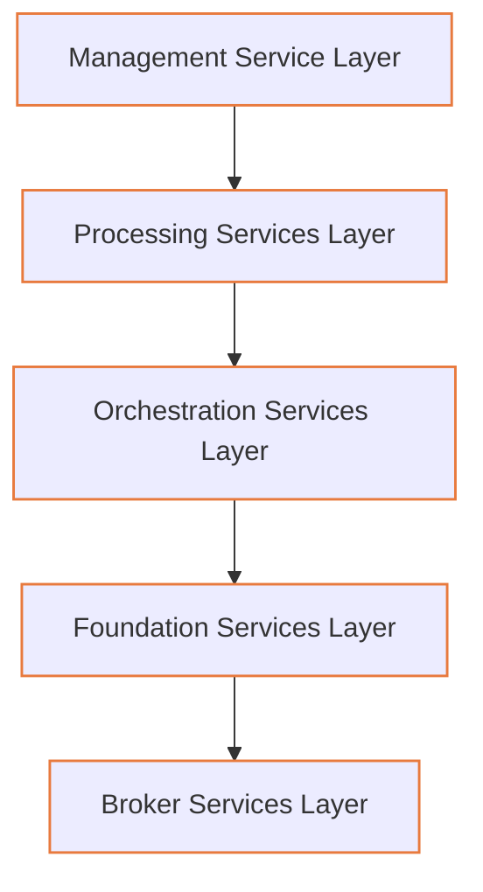

# RFC 2001: Domain-Driven Design Architecture

- **Status**: Implemented
- **Date**: 2025-10-12
- **Authors**: Alexandru-Razvan Olariu
- **Related Components**: `sites/api.arolariu.ro`, with the full service
  hierarchy implemented by the Invoices bounded context

---

## Abstract

This RFC defines the Domain-Driven Design (DDD) architecture used by the
arolariu.ro modular monolith. Bounded contexts organize aggregates, entities,
value objects, and application services around domain language. Invoices
implements the full flow-forward service hierarchy; Core.Auth deliberately
uses ASP.NET Core Identity managers directly from endpoints, while Core/Common
do not implement the domain-service chain.

---

## Architectural overview



The diagram describes the Standard roles implemented by Invoices. Its protocol
adapters call Management but are not themselves part of the service hierarchy.
Do not project this graph onto Core.Auth.

---

## 1. Motivation

### 1.1 Problem statement

Traditional layered architectures often produce:

1. **Anemic domain models** with rules scattered across application services.
2. **Poor modularity** caused by unconstrained dependencies.
3. **Inconsistent terminology** between business concepts and code.
4. **Fragile workflows** when computation, persistence, and external integrations
   share ownership.

### 1.2 Design goals

- Use a consistent ubiquitous language within each bounded context.
- Keep aggregate invariants with domain models and approved service boundaries.
- Make dependency direction and capability ownership explicit.
- Preserve recoverability for work that must survive process restarts.
- Preserve testability through focused interfaces and dependency limits.

---

## 2. Technical design

### 2.1 Bounded contexts

The backend is a modular monolith whose bounded contexts own their domain models,
contracts, services, and external dependency abstractions. Shared primitives,
telemetry, options, and HTTP contracts live outside those domain boundaries and
must not become a route for bypassing the service hierarchy.

The Invoices bounded context contains:

```text
BoundedContext/
├── DDD/                    # Aggregates, entities, value objects, and contracts
├── Services/
│   ├── Management/        # Application-facing coordination boundary
│   ├── Processing/        # Domain computation and workflow sequencing
│   ├── Orchestration/     # Composition of approved capabilities
│   └── Foundation/        # Validation and direct dependency classification
├── Brokers/               # Thin external-system adapters
├── Endpoints/             # Protocol adapters
└── Workers/               # Background host adapters
```

Other bounded contexts may use a subset or a framework-owned topology.
Core.Auth's direct Identity-manager endpoint dependencies are an explicit
example, not a layer violation.

### 2.2 Domain model

- **Aggregates** define consistency boundaries and protect domain invariants.
- **Entities** have stable identity and lifecycle within the domain.
- **Value objects** express immutable concepts through value equality.
- **Domain contracts** carry provider-neutral inputs and results between approved
  layers.

Cross-aggregate sequencing belongs above aggregate-local behavior. Provider SDK
types must not become domain contracts.

### 2.3 Service responsibilities

These responsibilities apply to the Invoices Standard service hierarchy.

| Architectural role | Responsibility |
|---|---|
| Management Service Layer | Exposes one application-facing boundary and coordinates operations spanning Processing services |
| Processing Services Layer | Performs domain computation, applies transformations, and sequences approved Orchestrations |
| Orchestration Services Layer | Composes only the Foundations approved for a workflow |
| Foundation Services Layer | Validates capability inputs, applies capability policy, and classifies direct Broker failures |
| Broker Services Layer | Invokes external dependencies and maps provider responses into domain-neutral contracts |

Sideways dependencies within Foundation or Orchestration are prohibited.
Processing services do not call Foundations or Brokers directly, and Management
does not bypass Processing.

### 2.4 Persistence boundaries

Persistence Brokers expose only the regions and primitive operations required by
their bounded context. Partition selection, provider calls, and direct provider
error translation belong in the Broker. Validation, authorization, aggregate
coordination, and workflow policy belong in higher layers.

The current Invoices persistence boundary contains invoice and merchant regions.
Analysis durability is not stored in that database boundary.

### 2.5 External capabilities

External storage, document extraction, generative analysis, taxonomy data, and
other integrations are represented by focused Broker contracts. Implementations
remain replaceable without changing the domain service graph. Foundations own
provider-independent validation and resilience policy; Orchestrations and
Processing services own capability composition.

---

## 3. Invoices runtime workflows

### 3.1 Invoices request workflow

```text
Protocol adapter
  -> Management Service Layer
    -> Processing Services Layer
      -> Orchestration Services Layer
        -> Foundation Services Layer
          -> Broker Services Layer
```

Invoices adapters own transport validation, authorization context, request
cancellation, DTO mapping, and response construction. They resolve the
Invoices Management contract rather than lower-layer contracts.

### 3.2 Durable analysis workflow

When analysis must survive request completion or process restart, the application
publishes a provider-neutral message to a backend-owned Azure Queue. A worker
receives visible messages through the same Management boundary used by request
adapters. Message visibility provides temporary ownership: successful work is
deleted, transiently failed work becomes visible for retry, and long-running work
renews visibility while it executes.

Queue transport details remain in Broker and Foundation roles. Target loading,
analysis execution, persistence ordering, and terminal retry policy remain in
Processing.

---

## 4. SOLID application in the Invoices hierarchy

### 4.1 Single responsibility

- Domain models own state and invariant-preserving behavior.
- Brokers own provider calls and provider-neutral mapping.
- Foundations own one external capability and its validation policy.
- Orchestrations compose only approved Foundations.
- Processing services own domain computation, transformations, and persistence sequencing.
- Management delegates application use cases to the approved Processing boundary.
- Endpoints and workers remain adapters.

### 4.2 Interface segregation and dependency inversion

Contracts are capability-specific. Consumers depend on the narrow abstraction
for the next approved role rather than concrete implementations or provider SDKs.

### 4.3 Open/closed and substitution

Provider implementations can be replaced behind Broker contracts without
changing the service graph. Foundation and Orchestration contracts permit focused
test doubles while retaining dependency direction.

---

## 5. Trade-offs

### Benefits

- Explicit capability ownership and constrained dependency direction.
- Provider-neutral domain contracts.
- Recoverable asynchronous work without database-owned workflow state.
- One stable application boundary for request and worker adapters.

### Costs

- More interfaces and service types than a conventional layered application.
- Durable queue processing requires visibility renewal and bounded retry policy.
- Processing must coordinate analysis results with resource Orchestrations
  without introducing Orchestration-to-Orchestration calls.

Microservices and event sourcing remain unnecessary for the current deployment
scale; the modular-monolith boundary retains those options without introducing
their operational cost.

---

## 6. Testing strategy

Invoices architecture tests should verify:

- Invoices adapters consume only their Management contract;
- dependencies flow only to the next approved role;
- no sideways Foundation or Orchestration dependencies exist;
- each Foundation owns only its approved Broker contracts;
- durable work covers enqueue, visibility renewal, retry, terminal deletion, and
  cancellation behavior;
- exception markers and cancellation propagate through every layer.

The backend coverage target remains 85% or higher for domain and application
code.

---

## 7. References

- [RFC 2002: OpenTelemetry Backend Observability](./2002-opentelemetry-backend-observability.md)
- [RFC 2003: The Standard Implementation](./2003-the-standard-implementation.md)
- [RFC 2004: Comprehensive XML Documentation Standard](./2004-comprehensive-xml-documentation-standard.md)
- [Domain-Driven Design by Eric Evans](https://www.domainlanguage.com/ddd/)
- [Implementing Domain-Driven Design by Vaughn Vernon](https://vaughnvernon.com/)

---

**Document Version**: 1.2.0
**Last Updated**: 2026-08-19
**Reviewed By**: Alexandru-Razvan Olariu
**Status**: ✅ Implemented
