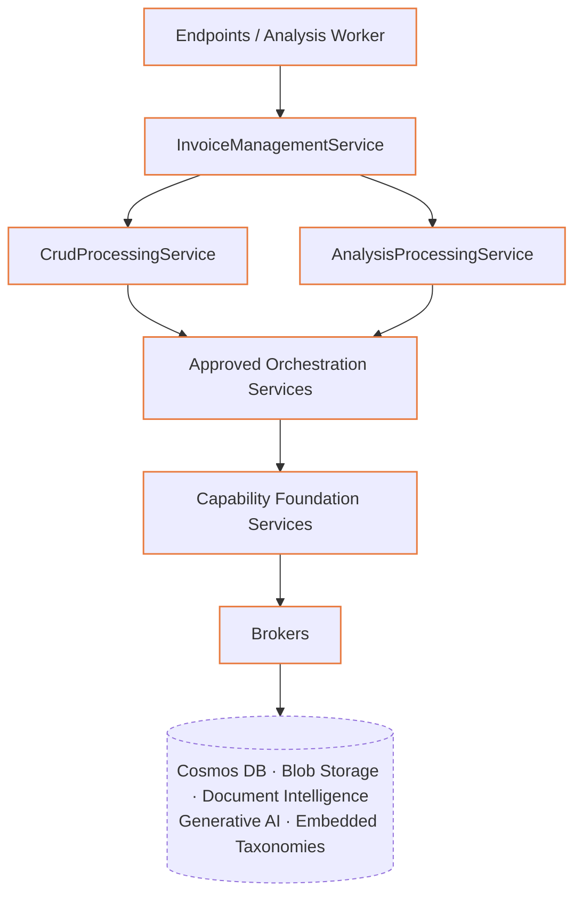

# RFC 2001: Domain-Driven Design Architecture

- **Status**: Implemented
- **Date**: 2025-10-12
- **Authors**: Alexandru-Razvan Olariu
- **Related Components**: `sites/api.arolariu.ro`, all backend domains

---

## Abstract

This RFC documents the Domain-Driven Design (DDD) architecture used by the
arolariu.ro .NET 10 modular monolith. The backend separates the Core,
Authentication, and Invoices bounded contexts and combines aggregates, entities,
value objects, and domain-specific application services with The Standard's
flow-forward dependency model.

The completed Invoices refactor exposes one application boundary to HTTP endpoints
and the background worker:

```text
Endpoint / Worker
  -> InvoiceManagementService
    -> CRUD or Analysis Processing
      -> approved Orchestrations
        -> capability Foundations
          -> Brokers
```

---

## Layer diagram



---

## 1. Motivation

### 1.1 Problem statement

Traditional layered architectures often produce:

1. **Anemic domain models** with rules scattered across application services.
2. **Poor modularity** caused by unconstrained dependencies.
3. **Inconsistent terminology** between business concepts and code.
4. **Fragile workflows** when computation, persistence, and external integrations
   share ownership.

### 1.2 Design goals

- Use a consistent ubiquitous language.
- Keep aggregate invariants with domain models and their approved service boundary.
- Make dependency direction and capability ownership explicit.
- Keep durable work recoverable across process restarts.
- Preserve testability through focused interfaces and dependency limits.

---

## 2. Technical design

### 2.1 Bounded-context organization

```text
sites/api.arolariu.ro/src/
├── Core/                         # Application entry point and infrastructure
├── Common/                       # Shared DDD, telemetry, options, and HTTP contracts
├── Core.Auth/                    # Authentication bounded context
└── Invoices/
    ├── Brokers/                  # External dependency boundaries
    ├── DDD/
    │   ├── AggregatorRoots/
    │   ├── Analysis/             # Durable runs, options, patches, and results
    │   ├── Entities/
    │   └── ValueObjects/
    ├── DTOs/
    ├── Endpoints/                # HTTP adapters
    ├── Services/
    │   ├── Management/           # Single application-facing façade
    │   ├── Processing/           # CRUD and analysis processing
    │   ├── Orchestration/        # Approved capability coordination
    │   └── Foundation/           # Broker-neighboring capability boundaries
    └── Workers/                  # Durable analysis queue consumer
```

### 2.2 Domain model

The Invoices bounded context currently owns:

- `Invoice`, the aggregate root for invoice state, scans, payment information,
  products, classifications, recipes, and analysis-derived metadata.
- `Merchant`, the merchant entity referenced by invoices and partitioned by parent
  company.
- `AnalysisRun`, the durable state machine for accepted, claimed, completed, and
  failed invoice or merchant analysis work.
- Immutable analysis contracts and patches under `DDD/Analysis/`, which separate
  capability results from persistence of the target aggregate.

The source tree does not currently expose explicit invoice domain-event types.
Cross-aggregate workflows are coordinated through the service graph described below.

### 2.3 Invoice application-service graph

The exact domain dependencies are:

| Service | Direct domain dependencies | Count |
|---|---|---:|
| `InvoiceManagementService` | `ICrudProcessingService`, `IAnalysisProcessingService` | 2 |
| `CrudProcessingService` | `IInvoiceOrchestrationService`, `IMerchantOrchestrationService` | 2 |
| `AnalysisProcessingService` | `IClassificationOrchestrationService`, `IAnalysisOrchestrationService` | 2 |
| `InvoiceOrchestrationService` | `IInvoiceStorageFoundationService` | 1 |
| `MerchantOrchestrationService` | `IMerchantStorageFoundationService` | 1 |
| `ClassificationOrchestrationService` | `IClassificationAnalysisFoundationService`, `IGenerativeAnalysisFoundationService` | 2 |
| `AnalysisOrchestrationService` | `IAnalysisRunFoundationService`, `IDocumentAnalysisFoundationService`, `IGenerativeAnalysisFoundationService` | 3 |

`InvoiceManagementService` is the only invoice-domain service consumed by endpoint
handlers and `AnalysisWorker`. Management delegates simple operations and owns
cross-processing sequencing. Processing calls only approved orchestration services;
no processing service reaches a Foundation or Broker directly.

### 2.4 Foundation capability ownership

| Foundation | Broker dependencies | Owned capability |
|---|---|---|
| Invoice Storage | `IDatabaseBroker`, `IInvoiceBlobStorageBroker` | Invoice persistence and validation of approved scan blobs |
| Merchant Storage | `IDatabaseBroker` | Merchant persistence and lookup |
| Classification Analysis | `ITaxonomyBroker` | Taxonomy search and canonical resolution |
| Generative Analysis | `IGenerativeAnalysisBroker` | Typed structured generation and retry policy |
| Document Analysis | `IDocumentIntelligenceBroker` | Receipt extraction from stored scan URIs |
| Analysis Run | `IDatabaseBroker` | Durable queue, claims, leases, and terminal transitions |

No Foundation calls another Foundation. Broker implementations remain thin external
adapters and do not own domain workflow decisions.

### 2.5 Unified Cosmos boundary

`IDatabaseBroker`, implemented by the partial `CosmosDatabaseBroker`, is the single
Cosmos persistence abstraction for all three regions:

- `invoices`, partitioned by invoice `UserIdentifier`;
- `merchants`, partitioned by `ParentCompanyId`;
- `analysisRuns`, partitioned by `/bucket`.

The analysis-run region uses the constant bucket `default`. Queued and running runs
have no item TTL. Completed and failed runs receive a 30-day item TTL, while the
container enables per-item TTL with `DefaultTimeToLive = -1`.

Workers claim the oldest queued run or a running run whose lease expired. Claims,
lease renewals, completion, and failure use immutable `AnalysisRun` transitions and
Cosmos `_etag` conditional replacement. This prevents two workers from silently
overwriting the same lease.

### 2.6 Analysis integration stack

The current capability stack is:

- Azure Blob Storage through `IInvoiceBlobStorageBroker` for approved invoice scan
  property inspection.
- Azure AI Document Intelligence through `IDocumentIntelligenceBroker`, using the
  `prebuilt-receipt` model against scan URIs.
- `Microsoft.Extensions.AI` through `IGenerativeAnalysisBroker` for typed JSON Schema
  output over an `IChatClient`.
- Embedded GS1 GPC, ECOICOP v2, and NACE 2.1 artifacts through `ITaxonomyBroker` for
  deterministic search and canonical classification.

This stack keeps provider mapping in Brokers, validation and retry behavior in
Foundations, and capability sequencing above the Foundation layer.

---

## 3. Runtime workflows

### 3.1 CRUD

```text
Endpoint
  -> InvoiceManagementService
    -> CrudProcessingService
      -> Invoice or Merchant Orchestration
        -> corresponding Storage Foundation
          -> IDatabaseBroker and, for invoice scans, IInvoiceBlobStorageBroker
```

### 3.2 Durable analysis

The analyze endpoint validates the target through CRUD Processing before Analysis
Processing persists an accepted run. `AnalysisWorker` later resolves only
`IInvoiceManagementService`, which coordinates:

1. Claiming the next run and maintaining its lease through Analysis Processing.
2. Reading the target through CRUD Processing.
3. Producing immutable capability results and patches through Analysis Processing.
4. Persisting invoice, merchant, and relationship changes through CRUD Processing.
5. Completing the run only after target persistence succeeds, or failing it when the
   target is missing, capability execution fails terminally, or persistence fails.

Analysis Processing does not persist invoice or merchant aggregates. Management is
the cross-processing coordinator that establishes this ordering.

---

## 4. SOLID application

### 4.1 Single responsibility

- Domain models own state and invariant-preserving transitions.
- Brokers own provider calls and provider-neutral mapping.
- Foundations own one storage or analysis capability.
- Orchestrations compose only their approved Foundations.
- Processing owns computation and domain transformations.
- Management owns application-level sequencing across Processing services.
- Endpoints and workers remain adapters.

### 4.2 Interface segregation and dependency inversion

Interfaces are capability-specific: storage, classification, generation, document
extraction, durable runs, CRUD processing, analysis processing, and management are
separate contracts. Consumers depend on the narrow abstraction for the next approved
layer rather than on concrete implementations.

### 4.3 Open/closed and substitution

Provider implementations can be replaced behind Broker contracts without changing
the domain service graph. Foundation and orchestration contracts likewise permit
isolated test doubles while preserving dependency direction.

---

## 5. Trade-offs

### Benefits

- Explicit capability ownership and bounded dependency counts.
- Recoverable analysis work with optimistic lease coordination.
- Provider-neutral domain contracts for external analysis systems.
- One stable application entry point for both request and worker adapters.

### Costs

- More interfaces and service types than a conventional layered application.
- Durable analysis requires lifecycle, lease, TTL, and compensation handling.
- Cross-processing persistence must remain in Management to avoid dependency bypasses.

Microservices and event sourcing remain unnecessary for the current deployment
scale; the modular-monolith boundary retains those options without introducing their
operational cost now.

---

## 6. Testing strategy

Architecture tests should verify:

- endpoints and the worker consume only `IInvoiceManagementService`;
- the dependency counts in section 2.3;
- every Foundation-to-Broker ownership rule in section 2.4;
- no sideways Foundation or Orchestration dependencies;
- queue creation, claim races, expired-lease recovery, heartbeat renewal, and TTL;
- Management-coordinated persistence before terminal run completion;
- exception marker and cancellation propagation through every layer.

The backend coverage target remains 85% or higher for domain and application code.

---

## 7. References

- [RFC 2002: OpenTelemetry Backend Observability](./2002-opentelemetry-backend-observability.md)
- [RFC 2003: The Standard Implementation](./2003-the-standard-implementation.md)
- [RFC 2004: Comprehensive XML Documentation Standard](./2004-comprehensive-xml-documentation-standard.md)
- [Domain-Driven Design by Eric Evans](https://www.domainlanguage.com/ddd/)
- [Implementing Domain-Driven Design by Vaughn Vernon](https://vaughnvernon.com/)

---

**Document Version**: 1.1.0
**Last Updated**: 2026-08-19
**Reviewed By**: Alexandru-Razvan Olariu
**Status**: ✅ Implemented
