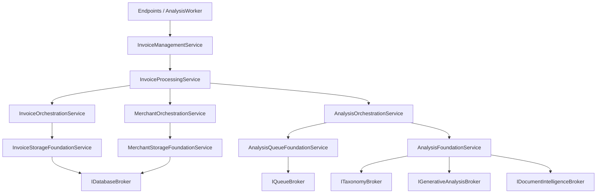

# RFC 2003: The Standard Implementation in arolariu.ro Backend

- **Status**: Implemented
- **Date**: 2025-01-26
- **Authors**: Alexandru Olariu
- **Related Components**: `sites/api.arolariu.ro/src/Invoices`, `sites/api.arolariu.ro/src/Common`, `sites/api.arolariu.ro/tests`
- **References**: [The Standard by Hassan Habib](https://github.com/hassanhabib/The-Standard)

---

## Abstract

This RFC documents the current implementation of The Standard in the
arolariu.ro .NET 10 backend. The Invoices bounded context uses flow-forward
dependencies, provider-neutral contracts, layer-local exception classification,
and the Florance Pattern. HTTP endpoints and the analysis worker share one
Management boundary. Azure Storage Queue supplies durable analysis delivery,
while Cosmos DB remains responsible only for invoice and merchant persistence.

---

## Documentation accuracy note

Source code under `sites/api.arolariu.ro/src/Invoices` is authoritative. When
this RFC and the implementation differ, update this RFC from the implemented
dependency graph rather than changing code to match an obsolete example.

---

## Table of contents

1. [Problem statement](#problem-statement)
2. [Implemented service hierarchy](#implemented-service-hierarchy)
3. [Exact dependency graph](#exact-dependency-graph)
4. [Brokers](#brokers)
5. [Foundation services](#foundation-services)
6. [Orchestration services](#orchestration-services)
7. [Processing services](#processing-services)
8. [Management service](#management-service)
9. [Exposers and worker adapters](#exposers-and-worker-adapters)
10. [Durable analysis contract](#durable-analysis-contract)
11. [Accepted product identity limitation](#accepted-product-identity-limitation)
12. [Validation and exception classification](#validation-and-exception-classification)
13. [Testing approach](#testing-approach)
14. [Exception to HTTP mapping](#exception-to-http-mapping)

---

## Problem statement

The invoice domain requires synchronous CRUD, external analysis capabilities,
and recoverable background execution without allowing endpoint, persistence, or
provider concerns to cross layer boundaries. The implementation therefore
targets:

1. One application-facing service for every invoice endpoint and worker
   operation.
2. Flow-forward calls with no sideways Foundation or Orchestration
   dependencies.
3. One Processing service coordinating CRUD, persistence, and analysis computation.
4. Explicit capability ownership at Foundation and Broker boundaries.
5. Azure Queue delivery that survives request completion and process restarts.
6. Small, testable constructor dependency sets.

---

## Implemented service hierarchy



The required direction is:

```text
Endpoint / Worker
  -> InvoiceManagementService
    -> InvoiceProcessingService
      -> approved Orchestrations
        -> capability Foundations
          -> Brokers
```

Management delegates to one Processing service and never calls an Orchestration,
Foundation, or Broker directly.

---

## Exact dependency graph

Logging, telemetry, options, and framework services are supporting dependencies
and do not alter the domain dependency counts below.

| Layer | Implementation | Direct domain dependencies | Count |
|---|---|---|---:|
| Management | `InvoiceManagementService` | `IInvoiceProcessingService` | 1 |
| Processing | `InvoiceProcessingService` | `IInvoiceOrchestrationService`, `IMerchantOrchestrationService`, `IAnalysisOrchestrationService` | 3 |
| Orchestration | `InvoiceOrchestrationService` | `IInvoiceStorageFoundationService` | 1 |
| Orchestration | `MerchantOrchestrationService` | `IMerchantStorageFoundationService` | 1 |
| Orchestration | `AnalysisOrchestrationService` | `IAnalysisFoundationService`, `IAnalysisQueueFoundationService` | 2 |
| Foundation | `InvoiceStorageFoundationService` | `IDatabaseBroker` | 1 |
| Foundation | `MerchantStorageFoundationService` | `IDatabaseBroker` | 1 |
| Foundation | `AnalysisFoundationService` | `IDocumentIntelligenceBroker`, `IGenerativeAnalysisBroker`, `ITaxonomyBroker` | 3 |
| Foundation | `AnalysisQueueFoundationService` | `IQueueBroker` | 1 |

This graph is closed: Processing calls only its listed Orchestrations, and each
Orchestration and Foundation calls only its listed domain dependencies.

---

## Brokers

Brokers are thin adapters over external systems. They perform provider calls,
provider response mapping, client selection, and direct dependency-error
translation. They do not validate domain workflows, choose capabilities,
coordinate aggregates, or call services.

### Database broker

`IDatabaseBroker`, implemented by the partial `CosmosDatabaseBroker`, has two
persistence regions:

| Region/container | Partition | Operations |
|---|---|---|
| `invoices` | invoice `UserIdentifier` | Invoice CRUD and soft deletion |
| `merchants` | `ParentCompanyId` | Merchant CRUD and soft deletion |

Both regions use the raw Cosmos SDK paths in
`CosmosDatabaseBroker.Invoices.cs` and
`CosmosDatabaseBroker.Merchants.cs`. The EF model retained on
`CosmosDatabaseBroker` is dormant and is not the runtime persistence path.

### Queue broker

`IQueueBroker`, implemented by `AzureStorageQueueBroker`, owns transport through
the backend queue named `invoice-analysis`. It:

- assumes the deployment-provisioned queue already exists;
- serializes and enqueues an `AnalysisQueueMessage`;
- returns Azure Queue's `MessageId`;
- receives at most one visible message with a caller-supplied visibility timeout;
- updates the message and its pop receipt when visibility is renewed; and
- deletes a message by provider message identifier and current pop receipt; and
- reports queue existence and the provider's approximate message count.

The Broker maps received provider data into `AnalysisQueueReceipt`, which carries
the application message, provider `MessageId`, current pop receipt, dequeue
count, and next-visible time.

### Analysis capability brokers

| Broker contract | Implementation responsibility |
|---|---|
| `IDocumentIntelligenceBroker` | Calls Azure AI Document Intelligence's `prebuilt-receipt` model for a scan URI and maps the response to `DocumentIntelligenceRecord` |
| `IGenerativeAnalysisBroker` | `AzureFoundryBroker` uses `Microsoft.Extensions.AI.IChatClient` typed JSON Schema responses and returns provider-neutral structured results |
| `ITaxonomyBroker` | Loads embedded GS1 GPC, ECOICOP v2, and NACE 2.1 artifacts for deterministic search and canonical resolution |

`AzureFoundryBroker` contains no retry or orchestration policy and does not log
prompt or response content. Composition supplies its `IChatClient` and applies
Microsoft.Extensions.AI OpenTelemetry with sensitive data disabled.

---

## Foundation services

Foundations are Broker-neighboring capabilities. They validate their own inputs,
apply capability-specific policy, and classify direct Broker failures.

| Foundation | Direct Broker ownership | Responsibility |
|---|---|---|
| `InvoiceStorageFoundationService` | `IDatabaseBroker` | Invoice persistence |
| `MerchantStorageFoundationService` | `IDatabaseBroker` | Merchant CRUD |
| `AnalysisFoundationService` | `IDocumentIntelligenceBroker`, `IGenerativeAnalysisBroker`, `ITaxonomyBroker` | Independent OCR, typed generation, taxonomy search, and canonical resolution capabilities |
| `AnalysisQueueFoundationService` | `IQueueBroker` | Queue input validation, provider failure classification, enqueue, receive, visibility renewal, and deletion |

No Foundation calls another Foundation.

---

## Orchestration services

Orchestration services expose domain workflows over approved Foundations:

- **Invoice Orchestration** delegates invoice and scan lifecycle operations to
  Invoice Storage.
- **Merchant Orchestration** delegates merchant persistence and reads to Merchant
  Storage.
- **Analysis Orchestration** sequences OCR, generative, taxonomy, and queue
  capabilities through the unified Analysis Foundation and the separate
  Analysis Queue Foundation. It owns bounded taxonomy candidate collection,
  canonical resolution, and manual classification lookup.

---

## Processing services

`InvoiceProcessingService` owns:

- invoice and merchant CRUD delegation;
- product, scan, and metadata collection operations;
- invoice/merchant relationship handling;
- application of immutable analysis patches; and
- persistence of analysis-derived invoice or merchant changes;
- consumption of request-resolved analysis options and `AnalysisQueueMessage` creation;
- queue receive and delete delegation;
- periodic visibility renewal while an operation executes;
- delegation of invoice and merchant workflow composition to Analysis Orchestration;
- coordination of immutable execution results and target patches with persistence; and
- bounded retry and terminal-deletion policy.

It persists only through Invoice and Merchant Orchestration. Production uses a
two-minute visibility timeout and renews visibility every 30 seconds.

---

## Management service

`InvoiceManagementService` is the application façade and has exactly one domain
dependency: Invoice Processing. Every method delegates to that boundary.

### Queue acceptance

```text
Analyze endpoint
  -> InvoiceManagementService
    -> InvoiceProcessingService (target existence, ownership, and queue publication)
      -> AnalysisOrchestrationService
        -> AnalysisQueueFoundationService
          -> IQueueBroker
```

Invoice Processing creates `AnalysisQueueMessage` with a correlation identifier,
target type and identifier, requester, optional target partition identifier,
target-specific options, and W3C trace context. Azure Queue's returned
`MessageId` is returned directly through Processing and Management. Both invoice
and merchant analysis endpoints return that string as the HTTP 202 Accepted
response body.

### Manual classification updates

Invoice, product, and merchant updates containing a classification selection are
resolved synchronously through Analysis Orchestration before persistence.
Processing supplies the required taxonomy system (ECOICOP v2, GS1 GPC, or NACE
2.1), replaces client-provided labels and hierarchy data with the canonical
taxonomy snapshot, and then delegates persistence to the resource Orchestration.
Updates without a classification selection do not invoke Analysis Orchestration.

### Worker execution and persistence

```text
AnalysisWorker
  -> InvoiceManagementService
    -> InvoiceProcessingService
       -> AnalysisOrchestrationService (receive, renewal, and capabilities)
       -> InvoiceOrchestrationService or MerchantOrchestrationService (read/persist)
       -> immutable patch/result
       -> AnalysisOrchestrationService (delete successful or terminal message)
```

Processing persists a successful target patch before deleting the queue message.
Failures before the fifth delivery leave the message undeleted; Azure Queue makes
it visible again after the visibility timeout. A successful message is deleted
immediately. A failed message is deleted when its dequeue count reaches five,
making the fifth delivery terminal. The current design does not move terminal
messages to a separate poison queue.

Malformed provider payloads retain message ID, pop receipt, raw payload, and
dequeue count without exposing payload content to logs. Processing leaves
deliveries one through four for visibility recovery and deletes the fifth
delivery with `InvalidStructuredOutput`.

---

## Exposers and worker adapters

All invoice and merchant endpoint handlers inject
`IInvoiceManagementService`. Handlers own route and claim validation, request
budgets, DTO mapping, HTTP results, and exception-to-ProblemDetails translation;
they do not inject lower-layer contracts.

`AnalysisWorker` is a host adapter. It creates a fresh service scope for each
poll and resolves only
`IInvoiceManagementService`. It processes at most one received message per
iteration and waits five seconds when no message is visible.

---

## Durable analysis contract

### Message contract

`AnalysisQueueMessage` is the provider-neutral durable request. It carries:

- `CorrelationId`;
- `TargetType` (`Invoice` or `Merchant`);
- `TargetId`;
- `RequestedBy`;
- optional `TargetPartitionIdentifier`;
- exactly one of `InvoiceOptions` or `MerchantOptions`; and
- `TraceParent`.

The constructor rejects empty required identifiers, unsupported target types,
missing trace context, or an invalid combination of target type and options.

### Visibility and retries

Receiving a message makes it invisible for two minutes. Analysis Processing
renews visibility every 30 seconds and replaces the receipt's pop receipt with
the value returned by Azure Queue. If renewal fails, coordinated execution is
cancelled because the process can no longer safely assume exclusive visibility.

Transient execution failures are retried by leaving the message undeleted. Azure
Queue redelivers it after its visibility timeout and increments the dequeue
count. Management deletes a failed message on dequeue five. Queue availability
is a deployment prerequisite; per-iteration failures are logged without
terminating the hosted worker.

### Capability stack

Invoice analysis can combine Document Intelligence receipt extraction,
`AzureFoundryBroker` structured generation, and canonical taxonomy
classification. Merchant analysis combines canonical classification and
structured description generation. Classification resolves provider suggestions
against embedded taxonomy artifacts before returning a canonical
`StandardClassification`.

---

## Accepted product identity limitation

Product update and delete currently identify a product by a
case-insensitive exact name and operate on the first matching item in the
invoice. Product names are not unique, so duplicate names make the selected item
ambiguous. This ambiguity is accepted for the PR #960 remediation; introducing a
stable product identifier or duplicate-name conflict behavior is separate
follow-up work.

---

## Validation and exception classification

Each layer validates and classifies only what it owns:

| Layer | Validation/classification focus |
|---|---|
| Broker | Provider errors and primitive provider response mapping |
| Foundation | Structural/capability validation and direct Broker failures |
| Orchestration | Foundation composition and cross-capability contract validation |
| Processing | Used-data-only validation, computation, and direct Orchestration failures |
| Management | Cross-processing sequencing and direct Processing failures |
| Endpoint/Worker | Protocol or host concerns |

Cancellation is propagated without reclassification. Domain exceptions retain
marker interfaces such as validation, dependency validation, dependency, not
found, conflict, locked, rate limited, unauthorized, and forbidden so the HTTP
mapper can select the correct status through nested layer wrappers.

---

## Testing approach

Tests should enforce:

- the dependency counts and ownership in the exact graph;
- endpoints and the worker resolve the invoice domain only through Management;
- no Endpoint-to-Processing, Processing-to-Foundation/Broker,
  Orchestration-to-Orchestration, or Foundation-to-Foundation bypass exists;
- message serialization, Azure `MessageId` acknowledgements,
  receive behavior, pop-receipt updates, visibility renewal, visibility-based
  retries, and deletion on dequeue five;
- Management persists successful patches before message deletion;
- replacement Broker mappings return provider-neutral contracts; and
- cancellation and exception markers survive every layer.

Unit tests mock direct dependencies. Broker integrations use focused integration
tests or provider test doubles. The backend domain and application coverage
target remains 85% or higher.

---

## Exception to HTTP mapping

All bounded contexts classify exceptions using marker interfaces from
`arolariu.Backend.Common.Exceptions`. Endpoint handlers delegate response
construction to `ExceptionToHttpResultMapper`; `ExceptionMappingHandler` is the
defense-in-depth handler for exceptions that escape before or around an endpoint.

| Marker interface/type | HTTP status | Problem type |
|---|---:|---|
| `IUnauthorizedException` | 401 | `ProblemTypeUris.Unauthorized` |
| `IForbiddenException` | 403 | `ProblemTypeUris.Forbidden` |
| `INotFoundException` | 404 | `ProblemTypeUris.NotFound` |
| `IAlreadyExistsException` | 409 | `ProblemTypeUris.Conflict` |
| `ILockedException` | 423 | `ProblemTypeUris.Locked` |
| `IRateLimitedException` | 429 | `ProblemTypeUris.RateLimited` |
| `BadHttpRequestException` | exception status | `ProblemTypeUris.Validation` |
| `IValidationException` | 400 | `ProblemTypeUris.Validation` |
| `IDependencyValidationException` | 400 | `ProblemTypeUris.Validation` |
| `IDependencyException` | 503 | `ProblemTypeUris.ServiceUnavailable` |
| `IServiceException` | 500 | `ProblemTypeUris.InternalServerError` |
| Unclassified | 500 | `ProblemTypeUris.InternalServerError` |

The mapper walks the inner-exception chain and chooses the innermost classifiable
exception. ProblemDetails responses include `traceId`, omit stack traces and
exception type/source details, use non-leaking messages for 401/403/500/503, and
add `retryAfterSeconds` for rate limits.

---

## References

- **The Standard Book**: <https://github.com/hassanhabib/The-Standard>
- **RFC 2001**: [Domain-Driven Design Architecture](./2001-domain-driven-design-architecture.md)
- **RFC 2002**: [OpenTelemetry Backend Observability](./2002-opentelemetry-backend-observability.md)
- **RFC 2004**: [Comprehensive XML Documentation Standard](./2004-comprehensive-xml-documentation-standard.md)

---

**Document Version**: 1.2.0
**Last Updated**: 2026-08-19
**Maintainer**: Alexandru Olariu ([@arolariu](https://github.com/arolariu))
