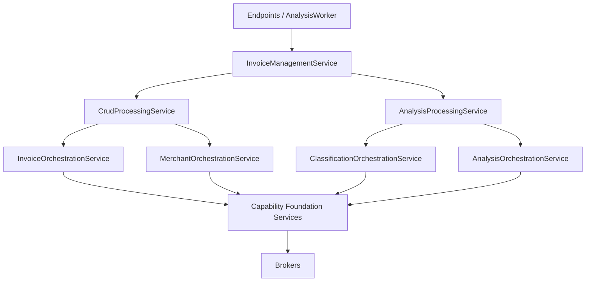

# RFC 2003: The Standard Implementation in arolariu.ro Backend

- **Status**: Implemented
- **Date**: 2025-01-26
- **Authors**: Alexandru Olariu
- **Related Components**: `sites/api.arolariu.ro/src/Invoices`, `sites/api.arolariu.ro/src/Common`, `sites/api.arolariu.ro/tests`
- **References**: [The Standard by Hassan Habib](https://github.com/hassanhabib/The-Standard)

---

## Abstract

This RFC documents the implementation of The Standard in the arolariu.ro .NET 10
backend. The Invoices bounded context uses strict flow-forward dependencies, pure
contracts, domain language, layer-local exception classification, and the Florance
Pattern. Its application boundary is a Management service shared by HTTP endpoints
and the durable analysis worker.

---

## Documentation accuracy note

Source code under `sites/api.arolariu.ro/src/Invoices` is authoritative. When this
RFC and the implementation differ, update this RFC from the implemented dependency
graph rather than changing code to match an obsolete example.

---

## Table of contents

1. [Problem statement](#problem-statement)
2. [Implemented service hierarchy](#implemented-service-hierarchy)
3. [Exact dependency graph](#exact-dependency-graph)
4. [Brokers](#brokers)
5. [Foundation services](#foundation-services)
6. [Orchestration services](#orchestration-services)
7. [Processing services](#processing-services)
8. [Management service](#management-service)
9. [Exposers and worker adapters](#exposers-and-worker-adapters)
10. [Durable analysis contract](#durable-analysis-contract)
11. [Validation and exception classification](#validation-and-exception-classification)
12. [Testing approach](#testing-approach)
13. [Exception to HTTP mapping](#exception-to-http-mapping)

---

## Problem statement

The invoice domain requires synchronous CRUD, external analysis capabilities, and
recoverable background execution without allowing endpoint, persistence, or provider
concerns to cross layer boundaries. The implementation therefore targets:

1. One application-facing service for every invoice endpoint and worker operation.
2. Flow-forward calls with no sideways Foundation or Orchestration dependencies.
3. Two focused Processing services for CRUD/persistence and analysis computation.
4. Explicit capability ownership at Foundation and Broker boundaries.
5. Durable, lease-protected analysis runs that survive process restarts.
6. Two or three direct domain dependencies per coordinating service.

---

## Implemented service hierarchy



The required direction is:

```text
Endpoint / Worker
  -> InvoiceManagementService
    -> CRUD or Analysis Processing
      -> approved Orchestrations
        -> capability Foundations
          -> Brokers
```

Management is an application coordination layer, not an HTTP exposer and not a
Broker-neighboring service. It may coordinate both Processing services but never
calls an Orchestration, Foundation, or Broker directly.

---

## Exact dependency graph

Logging, telemetry, options, and framework services are supporting dependencies and
do not alter the domain dependency counts below.

| Layer | Implementation | Direct domain dependencies | Count |
|---|---|---|---:|
| Management | `InvoiceManagementService` | `ICrudProcessingService`, `IAnalysisProcessingService` | 2 |
| Processing | `CrudProcessingService` | `IInvoiceOrchestrationService`, `IMerchantOrchestrationService` | 2 |
| Processing | `AnalysisProcessingService` | `IClassificationOrchestrationService`, `IAnalysisOrchestrationService` | 2 |
| Orchestration | `InvoiceOrchestrationService` | `IInvoiceStorageFoundationService` | 1 |
| Orchestration | `MerchantOrchestrationService` | `IMerchantStorageFoundationService` | 1 |
| Orchestration | `ClassificationOrchestrationService` | `IClassificationAnalysisFoundationService`, `IGenerativeAnalysisFoundationService` | 2 |
| Orchestration | `AnalysisOrchestrationService` | `IAnalysisRunFoundationService`, `IDocumentAnalysisFoundationService`, `IGenerativeAnalysisFoundationService` | 3 |

This graph is closed: only the listed Orchestrations are approved for the two
Processing services, and each Orchestration calls only the Foundations listed by its
constructor.

---

## Brokers

Brokers are thin adapters over external systems. They perform provider calls,
provider response mapping, container/client selection, and direct dependency-error
translation. They do not validate domain workflows, choose capabilities, coordinate
aggregates, or call services.

### Unified database broker

`IDatabaseBroker` is the single invoice-domain Cosmos boundary. The partial
`CosmosDatabaseBroker` implementation owns three regions:

| Region/container | Partition | Operations |
|---|---|---|
| `invoices` | invoice `UserIdentifier` | Invoice CRUD and soft deletion |
| `merchants` | `ParentCompanyId` | Merchant CRUD and normalized-name lookup |
| `analysisRuns` | `/bucket` | Store creation, run creation/read, claim-candidate streaming, pending counts, and ETag-conditional replacement |

Invoice and merchant persistence use the raw Cosmos SDK paths implemented in their
partial broker files. The analysis-run region is also raw Cosmos SDK persistence.
The dormant EF model on `CosmosDatabaseBroker` is not the runtime persistence path.

### Analysis and storage brokers

| Broker contract | Implementation responsibility |
|---|---|
| `IInvoiceBlobStorageBroker` | Reads properties from the backend-owned `invoices` Blob Storage container without exposing SAS paths to telemetry |
| `IDocumentIntelligenceBroker` | Calls Azure AI Document Intelligence's `prebuilt-receipt` model for a scan URI and maps the result to `ReceiptDocument` |
| `IGenerativeAnalysisBroker` | Uses `Microsoft.Extensions.AI.IChatClient` typed JSON Schema responses and returns provider-neutral structured results |
| `ITaxonomyBroker` | Loads embedded GS1 GPC, ECOICOP v2, and NACE 2.1 artifacts for deterministic search and canonical resolution |

The generative broker is provider-neutral at its contract. Composition currently
backs `IChatClient` with Azure OpenAI and applies Microsoft.Extensions.AI
OpenTelemetry without sensitive prompt or response content.

---

## Foundation services

Foundations are Broker-neighboring capabilities. They validate their own inputs,
apply capability-specific policy, and classify direct Broker failures.

| Foundation | Direct Broker ownership | Responsibility |
|---|---|---|
| `InvoiceStorageFoundationService` | `IDatabaseBroker`, `IInvoiceBlobStorageBroker` | Invoice CRUD and approved scan-blob validation |
| `MerchantStorageFoundationService` | `IDatabaseBroker` | Merchant CRUD and canonical normalized-name lookup |
| `ClassificationAnalysisFoundationService` | `ITaxonomyBroker` | Taxonomy version lookup, bounded search, and canonical classification resolution |
| `GenerativeAnalysisFoundationService` | `IGenerativeAnalysisBroker` | Typed structured generation, validation, retry policy, and capability telemetry |
| `DocumentAnalysisFoundationService` | `IDocumentIntelligenceBroker` | Parallel scan extraction and deterministic receipt merge |
| `AnalysisRunFoundationService` | `IDatabaseBroker` | Queue provisioning, claim policy, ETag races, lease renewal, and terminal transitions |

No Foundation calls another Foundation. In particular, taxonomy selection is not a
storage concern, and invoice or merchant persistence is not an analysis Foundation
concern.

---

## Orchestration services

Orchestration services expose domain workflows over approved Foundations:

- **Invoice Orchestration** delegates invoice and scan lifecycle operations to
  Invoice Storage.
- **Merchant Orchestration** delegates merchant persistence, reads, and normalized
  lookup to Merchant Storage.
- **Classification Orchestration** combines Generative Analysis search-term or
  candidate selection with Classification Analysis's canonical taxonomy lookup.
  Manual classification resolution uses Classification Analysis directly.
- **Analysis Orchestration** owns durable run delegation, document extraction, and
  non-classification generative capabilities through Analysis Run, Document
  Analysis, and Generative Analysis Foundations.

Classification Orchestration and Analysis Orchestration do not call each other.
Analysis Processing is the layer that sequences their capabilities.

---

## Processing services

### CRUD Processing

`CrudProcessingService` owns:

- invoice and merchant CRUD delegation;
- product, scan, and metadata collection operations;
- invoice/merchant relationship handling;
- application of immutable analysis patches;
- persistence of analysis-derived invoice, merchant, and relationship changes.

It persists only through Invoice and Merchant Orchestration.

### Analysis Processing

`AnalysisProcessingService` owns:

- effective analysis option resolution and durable queue requests;
- claim, lease-heartbeat, completion, and failure coordination through Analysis
  Orchestration;
- invoice and merchant capability sequencing across Classification and Analysis
  Orchestration;
- immutable execution results and target patches;
- best-effort capability outcome classification and telemetry.

It does not persist invoice or merchant aggregates. Its production defaults use a
two-minute lease, a 30-second renewal heartbeat, and a 30-second queue-depth refresh.

---

## Management service

`InvoiceManagementService` is the application façade and has exactly two
dependencies: CRUD Processing and Analysis Processing.

Simple CRUD methods delegate to CRUD Processing. Cross-processing operations remain
in Management:

### Queue acceptance

```text
Analyze endpoint
  -> InvoiceManagementService
    -> CrudProcessingService (target existence and ownership)
    -> AnalysisProcessingService
      -> AnalysisOrchestrationService
        -> AnalysisRunFoundationService
          -> IDatabaseBroker.analysisRuns
```

### Worker execution and persistence

```text
AnalysisWorker
  -> InvoiceManagementService
    -> AnalysisProcessingService (claim + lease heartbeat)
    -> CrudProcessingService (read target)
    -> AnalysisProcessingService
       -> ClassificationOrchestrationService
       -> AnalysisOrchestrationService
       -> immutable patch/result
    -> CrudProcessingService (persist target and relationships)
    -> AnalysisProcessingService (complete or fail durable run)
```

Management completes a run only after CRUD Processing persists the target patch.
Missing targets and persistence failures transition the claimed run to a durable
failed state. This ordering prevents Analysis Processing from acquiring persistence
dependencies and makes Management the explicit cross-processing compensation
boundary.

---

## Exposers and worker adapters

All invoice and merchant endpoint handlers inject `IInvoiceManagementService`.
Handlers own route/claim validation, request budgets, DTO mapping, HTTP results, and
exception-to-ProblemDetails translation; they do not inject Processing,
Orchestration, Foundation, or Broker contracts.

`AnalysisWorker` is a host adapter. Each polling iteration creates a fresh service
scope and resolves only `IInvoiceManagementService`. It provisions the durable store
before polling, processes one run per iteration, waits five seconds when idle, and
allows an abandoned run's lease to expire if an unexpected iteration failure occurs.

---

## Durable analysis contract

### Cosmos durability

`AnalysisRun` documents are stored in `analysisRuns` with partition-key path
`/bucket`. The current design uses one logical partition value, `default`.

- Container `DefaultTimeToLive` is `-1`, enabling per-item TTL without a default
  expiry.
- Queued and running runs have no item TTL and therefore do not expire mid-flight.
- Completed and failed runs receive a 30-day item TTL.
- Accepted options, target/partition context, requester, correlation data, status,
  attempt count, lease owner/expiry, capability outcomes, and failure code are
  persisted with the run.

### Claims and leases

The Broker streams the oldest queued runs and running runs with expired leases.
`AnalysisRunFoundationService` owns claim policy: it applies the immutable `Claim`
transition and conditionally replaces the document with its expected `_etag`.
Precondition failures mean another worker won the race and the Foundation continues
to the next candidate.

The same owner must renew, complete, or fail a run. Analysis Processing maintains a
heartbeat while Management executes and persists the work. A heartbeat failure
cancels execution because lease ownership can no longer be proven. Expired leases
are recoverable and increment the attempt count when reclaimed.

### Capability stack

Invoice analysis can combine Document Intelligence receipt extraction,
Microsoft.Extensions.AI structured generation, and canonical taxonomy
classification. Merchant analysis combines canonical classification and structured
description generation. Classification always resolves provider suggestions against
embedded taxonomy artifacts before a canonical `StandardClassification` is returned.

---

## Validation and exception classification

Each layer validates and classifies only what it owns:

| Layer | Validation/classification focus |
|---|---|
| Broker | Provider errors and primitive provider response mapping |
| Foundation | Structural/capability validation and direct Broker failures |
| Orchestration | Foundation composition and cross-capability contract validation |
| Processing | Used-data-only validation, computation, and direct Orchestration failures |
| Management | Cross-processing sequencing and direct Processing failures |
| Endpoint/Worker | Protocol or host concerns |

Cancellation is propagated without reclassification. Domain exceptions retain marker
interfaces such as validation, dependency validation, dependency, not found,
conflict, locked, rate limited, unauthorized, and forbidden so the HTTP mapper can
select the correct status through nested layer wrappers.

---

## Testing approach

Tests should enforce:

- Management, CRUD Processing, and Analysis Processing each have exactly two domain
  dependencies.
- Analysis Orchestration has exactly three Foundations; the other dependency counts
  match the graph above.
- Endpoint and worker graphs resolve only through Management.
- No Endpoint-to-Processing, Processing-to-Foundation/Broker,
  Orchestration-to-Orchestration, or Foundation-to-Foundation bypass exists.
- Foundation-to-Broker ownership matches the table above.
- `analysisRuns` provisioning, `/bucket`, item TTL, queue order, ETag claim races,
  lease renewal/loss, and expired-lease recovery.
- Management persists patches before completion and records missing-target or
  persistence failures.
- Replacement Broker mappings return provider-neutral contracts.
- Cancellation and exception markers survive every layer.

Unit tests mock direct dependencies. Broker integrations use focused integration
tests or provider test doubles. The backend domain and application coverage target
remains 85% or higher.

---

## Exception to HTTP mapping

All bounded contexts classify exceptions using marker interfaces from
`arolariu.Backend.Common.Exceptions`. Endpoint handlers delegate response construction
to `ExceptionToHttpResultMapper`; `ExceptionMappingHandler` is the defense-in-depth
handler for exceptions that escape before or around an endpoint.

| Marker interface/type | HTTP status | Problem type |
|---|---:|---|
| `IUnauthorizedException` | 401 | `ProblemTypeUris.Unauthorized` |
| `IForbiddenException` | 403 | `ProblemTypeUris.Forbidden` |
| `INotFoundException` | 404 | `ProblemTypeUris.NotFound` |
| `IAlreadyExistsException` | 409 | `ProblemTypeUris.Conflict` |
| `ILockedException` | 423 | `ProblemTypeUris.Locked` |
| `IRateLimitedException` | 429 | `ProblemTypeUris.RateLimited` |
| `BadHttpRequestException` | exception status | `ProblemTypeUris.Validation` |
| `IValidationException` | 400 | `ProblemTypeUris.Validation` |
| `IDependencyValidationException` | 400 | `ProblemTypeUris.Validation` |
| `IDependencyException` | 503 | `ProblemTypeUris.ServiceUnavailable` |
| `IServiceException` | 500 | `ProblemTypeUris.InternalServerError` |
| Unclassified | 500 | `ProblemTypeUris.InternalServerError` |

The mapper walks the inner-exception chain and chooses the innermost classifiable
exception. ProblemDetails responses include `traceId`, omit stack traces and
exception type/source details, use non-leaking messages for 401/403/500/503, and add
`retryAfterSeconds` for rate limits.

---

## References

- **The Standard Book**: <https://github.com/hassanhabib/The-Standard>
- **RFC 2001**: [Domain-Driven Design Architecture](./2001-domain-driven-design-architecture.md)
- **RFC 2002**: [OpenTelemetry Backend Observability](./2002-opentelemetry-backend-observability.md)
- **RFC 2004**: [Comprehensive XML Documentation Standard](./2004-comprehensive-xml-documentation-standard.md)

---

**Document Version**: 1.1.0
**Last Updated**: 2026-08-19
**Maintainer**: Alexandru Olariu ([@arolariu](https://github.com/arolariu))
