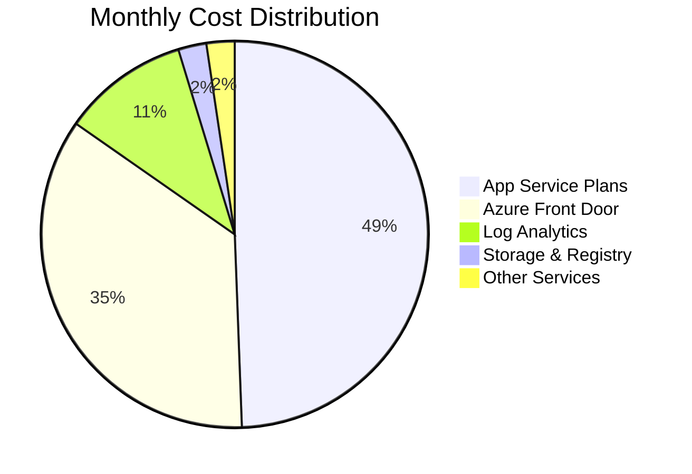

# 💰 Cost Optimization Guide

A comprehensive guide for optimizing Azure infrastructure costs while maintaining performance, security, and reliability standards.

## 📋 **Table of Contents**

- [💡 Cost Overview](#-cost-overview)
- [📊 Resource Cost Breakdown](#-resource-cost-breakdown)
- [🎯 Optimization Strategies](#-optimization-strategies)
- [📈 Monitoring & Alerts](#-monitoring--alerts)
- [⚙️ Right-Sizing Guidelines](#️-right-sizing-guidelines)
- [🔄 Automation & Scheduling](#-automation--scheduling)
- [📅 Regular Review Process](#-regular-review-process)

## 💡 **Cost Overview**

### **Estimated Monthly Costs (Sweden Central)**

| Category       | Service                        | SKU/Tier      | Estimated Cost (EUR) |
| -------------- | ------------------------------ | ------------- | -------------------- |
| **Compute**    | App Service Plan (Production)  | B2            | ~€23                 |
| **Compute**    | App Service Plan (Development) | B1            | ~€11                 |
| **Storage**    | Storage Account (Standard LRS) | Standard      | ~€2                  |
| **Monitoring** | Log Analytics (5GB/month)      | Pay-as-you-go | ~€9                  |
| **Networking** | Azure Front Door (Standard)    | Standard      | ~€30                 |
| **Networking** | Azure DNS (Global)             | Global        | ~€2                  |
| **Total**      |                                |               | **~€77-82/month**    |

_Estimates based on June 2025 pricing in Sweden Central region_

### **Cost Factors**

- ✅ **Data Transfer**: Minimal for single-region deployment
- ✅ **Storage Transactions**: Low with standard web application usage
- ✅ **Compute Hours**: 24/7 operation for production workloads
- ✅ **Monitoring Data**: Log retention and analytics costs

## 📊 **Resource Cost Breakdown**

### **High-Impact Cost Components**

### **Cost by Category**

| Category   | Monthly Cost | Percentage | Optimization Potential |
| ---------- | ------------ | ---------- | ---------------------- |
| Compute    | €34          | 44%        | High                   |
| Networking | €32          | 41%        | Medium                 |
| Monitoring | €9           | 12%        | Medium                 |
| Storage    | €2           | 3%         | Low                    |
| Other      | €0           | 0%         | Low                    |

## ⚙️ **Right-Sizing Guidelines**

### **Performance Metrics Thresholds**

| Metric        | Target Range | Action if Below    | Action if Above          |
| ------------- | ------------ | ------------------ | ------------------------ |
| CPU Usage     | 40-70%       | Downgrade SKU      | Upgrade SKU or scale out |
| Memory Usage  | 60-80%       | Downgrade SKU      | Upgrade SKU              |
| Response Time | <500ms       | Consider downgrade | Upgrade immediately      |
| Error Rate    | <1%          | Monitor            | Investigate and scale    |

## 📅 **Regular Review Process**

### **Monthly Cost Review Checklist**

- [ ] **Review cost alerts and budgets**
- [ ] **Analyze resource utilization metrics**
- [ ] **Identify unused or underutilized resources**
- [ ] **Check for resource size optimization opportunities**
- [ ] **Review storage account usage and lifecycle policies**
- [ ] **Validate backup and disaster recovery costs**
- [ ] **Assess monitoring and logging costs**

### **Quarterly Optimization Actions**

- [ ] **Performance vs. cost analysis**
- [ ] **Consider reserved instances for stable workloads**
- [ ] **Review and update auto-scaling policies**
- [ ] **Evaluate new Azure cost optimization features**
- [ ] **Benchmark against industry standards**

### **Cost Optimization KPIs**

| KPI                              | Target | Current   | Status |
| -------------------------------- | ------ | --------- | ------ |
| Cost per transaction             | <€0.01 | Calculate | 📊     |
| Infrastructure cost % of revenue | <5%    | Calculate | 📊     |
| Month-over-month cost growth     | <10%   | Monitor   | 📊     |
| Resource utilization             | >60%   | Monitor   | 📊     |

---

## 💡 **Quick Wins Checklist**

### **Immediate Actions (0-7 days)**

- [ ] Enable development environment scheduling
- [ ] Configure storage lifecycle policies
- [ ] Set up cost alerts and budgets
- [ ] Enable Azure Front Door caching
- [ ] Review and optimize Log Analytics retention

**Estimated Savings**: €18-28/month

### **Short-term Actions (1-4 weeks)**

- [ ] Implement auto-scaling for production
- [ ] Right-size App Service Plans based on metrics
- [ ] Optimize monitoring data collection
- [ ] Configure compression and caching policies

**Estimated Savings**: €14-23/month

### **Long-term Actions (1-6 months)**

- [ ] Consider reserved instances for stable workloads
- [ ] Evaluate alternative architectures (serverless, containers)
- [ ] Implement advanced monitoring and alerting
- [ ] Regular cost optimization reviews

**Estimated Savings**: €28-55/month with reserved instances

## 🎯 **Target Architecture Costs**

### **Optimized Monthly Budget**

| Component         | Current | Optimized | Savings |
| ----------------- | ------- | --------- | ------- |
| App Service Plans | €34     | €20       | €14     |
| Azure Front Door  | €30     | €30       | €0      |
| Monitoring        | €9      | €5        | €4      |
| Storage           | €2      | €2        | €0      |
| Other             | €2      | €1        | €1      |
| **Total**         | **€77** | **€58**   | **€19** |

**Target Savings**: 25% reduction in monthly costs

---

**Last Updated**: June 2025
**Version**: 2.0.0  
**Maintainer**: Alexandru-Razvan Olariu
