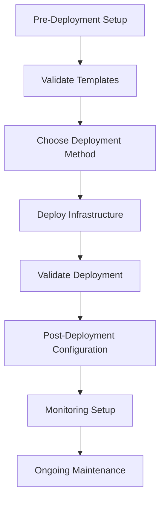
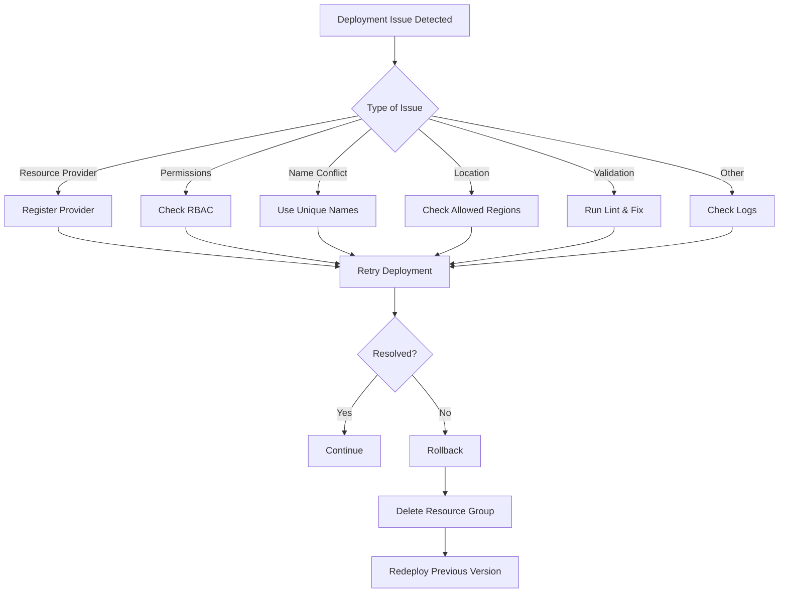

# 🚀 Deployment Guide

## 🗺️ **Deployment Process Overview**



A comprehensive guide for deploying the Azure Bicep infrastructure, from prerequisites to post-deployment validation.

## 📋 **Table of Contents**

- [📋 Prerequisites](#-prerequisites)
- [🔧 Pre-Deployment Setup](#-pre-deployment-setup)
- [🚀 Deployment Methods](#-deployment-methods)
- [📊 Deployment Validation](#-deployment-validation)
- [🔄 Post-Deployment Configuration](#-post-deployment-configuration)
- [📈 Monitoring Setup](#-monitoring-setup)
- [🚨 Troubleshooting](#-troubleshooting)

## 📋 **Prerequisites**

### **Required Tools**

| Tool       | Version | Purpose                             |
| ---------- | ------- | ----------------------------------- |
| Azure CLI  | ≥2.50.0 | Azure resource management           |
| Bicep CLI  | ≥0.24.0 | Template compilation and deployment |
| PowerShell | ≥7.0    | Script execution (optional)         |
| Git        | ≥2.30.0 | Source code management              |

### **Azure Requirements**

- **Azure Subscription** with appropriate permissions
- **Resource Provider Registration** for required services
- **Service Principal** or **User Account** with sufficient RBAC
- **Network Access** to Azure endpoints

### **Permission Requirements**

| Scope          | Role                    | Purpose                         |
| -------------- | ----------------------- | ------------------------------- |
| Subscription   | Contributor             | Create resource groups          |
| Resource Group | Owner                   | Deploy all resources            |
| Key Vault      | Key Vault Administrator | Manage secrets and certificates |

## 🔧 **Pre-Deployment Setup**

### **1. Install Required Tools**

```bash
# Install Azure CLI (Windows)
winget install Microsoft.AzureCLI

# Install Azure CLI (macOS)
brew install azure-cli

# Install Azure CLI (Linux)
curl -sL https://aka.ms/InstallAzureCLIDeb | sudo bash

# Install Bicep CLI
az bicep install

# Verify installations
az --version
az bicep version
```

### **2. Azure Authentication**

```bash
# Login to Azure
az login

# Set subscription (if you have multiple)
az account set --subscription "your-subscription-id"

# Verify current subscription
az account show --output table
```

### **3. Register Resource Providers**

```bash
# Register required resource providers
az provider register --namespace Microsoft.Web
az provider register --namespace Microsoft.Storage
az provider register --namespace Microsoft.KeyVault
az provider register --namespace Microsoft.ManagedIdentity
az provider register --namespace Microsoft.Insights
az provider register --namespace Microsoft.OperationalInsights
az provider register --namespace Microsoft.Cdn
az provider register --namespace Microsoft.AppConfiguration

# Check registration status
az provider list --query "[?namespace=='Microsoft.Web'].registrationState" --output table
```

### **4. Validate Bicep Templates**

```bash
# Clone the repository
git clone https://github.com/arolariu/arolariu.ro.git
cd arolariu.ro/infra/Azure/Bicep

# Validate main template
az bicep build --file main.bicep

# Run linting
az bicep lint --file main.bicep

# Check for errors
echo $? # Should return 0 if successful
```

## 🚀 **Deployment Methods**

### **Method 1: Azure CLI (Recommended)**

#### **Basic Deployment**

```bash
# Deploy with default parameters
az deployment sub create \
  --location swedencentral \
  --template-file main.bicep \
  --name "arolariu-infra-$(date +%Y%m%d-%H%M%S)"
```

#### **Custom Parameters**

```bash
# Deploy with custom parameters
az deployment sub create \
  --location swedencentral \
  --template-file main.bicep \
  --parameters \
    resourceGroupName="arolariu-rg-prod" \
    resourceGroupLocation="swedencentral" \
    resourceGroupAuthor="Your Name <your.email@domain.com>" \
  --name "arolariu-infra-$(date +%Y%m%d-%H%M%S)"
```

#### **Parameters File**

Create `main.parameters.json`:

```json
{
  "$schema": "https://schema.management.azure.com/schemas/2019-04-01/deploymentParameters.json#",
  "contentVersion": "1.0.0.0",
  "parameters": {
    "resourceGroupName": {
      "value": "arolariu-rg-prod"
    },
    "resourceGroupLocation": {
      "value": "swedencentral"
    },
    "resourceGroupAuthor": {
      "value": "Alexandru-Razvan Olariu <admin@arolariu.ro>"
    }
  }
}
```

Deploy with parameters file:

```bash
az deployment sub create \
  --location swedencentral \
  --template-file main.bicep \
  --parameters @main.parameters.json \
  --name "arolariu-infra-$(date +%Y%m%d-%H%M%S)"
```

### **Method 2: Azure PowerShell**

```powershell
# Connect to Azure
Connect-AzAccount

# Set subscription
Set-AzContext -SubscriptionId "your-subscription-id"

# Deploy template
New-AzSubscriptionDeployment `
  -Location "swedencentral" `
  -TemplateFile "main.bicep" `
  -resourceGroupName "arolariu-rg-prod" `
  -resourceGroupLocation "swedencentral" `
  -Name "arolariu-infra-$(Get-Date -Format 'yyyyMMdd-HHmmss')"
```

### **Method 3: GitHub Actions (CI/CD)**

Create `.github/workflows/deploy-infrastructure.yml`:

```yaml
name: Deploy Azure Infrastructure

on:
  push:
    branches: [main]
    paths: ["infra/Azure/Bicep/**"]
  workflow_dispatch:

jobs:
  deploy:
    runs-on: ubuntu-latest
    steps:
      - uses: actions/checkout@v4

      - name: Azure Login
        uses: azure/login@v1
        with:
          creds: ${{ secrets.AZURE_CREDENTIALS }}

      - name: Deploy Bicep Template
        uses: azure/arm-deploy@v1
        with:
          subscriptionId: ${{ secrets.AZURE_SUBSCRIPTION_ID }}
          scope: subscription
          region: swedencentral
          template: ./infra/Azure/Bicep/main.bicep
          parameters: |
            resourceGroupName=arolariu-rg-prod
            resourceGroupLocation=swedencentral
```

## 📊 **Deployment Validation**

### **1. Check Deployment Status**

```bash
# List recent deployments
az deployment sub list \
  --query "[?contains(name, 'arolariu-infra')].{Name:name, State:properties.provisioningState, Timestamp:properties.timestamp}" \
  --output table

# Get deployment details
az deployment sub show \
  --name "your-deployment-name" \
  --query "properties.{State:provisioningState, Duration:duration, Outputs:outputs}"
```

### **2. Validate Resources**

```bash
# List all resources in the resource group
az resource list \
  --resource-group "arolariu-rg-prod" \
  --output table

# Check specific resource types
az appservice plan list \
  --resource-group "arolariu-rg-prod" \
  --output table

az webapp list \
  --resource-group "arolariu-rg-prod" \
  --output table
```

### **3. Test Connectivity**

```bash
# Test web application endpoints
curl -I https://your-webapp-name.azurewebsites.net

# Check SSL certificate
openssl s_client -connect your-webapp-name.azurewebsites.net:443 -servername your-webapp-name.azurewebsites.net
```

## 🔄 **Post-Deployment Configuration**

### **1. DNS Configuration**

If using custom domains:

```bash
# Add custom domain to web app
az webapp config hostname add \
  --webapp-name "your-webapp-name" \
  --resource-group "arolariu-rg-prod" \
  --hostname "yourdomain.com"

# Configure SSL binding
az webapp config ssl bind \
  --certificate-thumbprint "cert-thumbprint" \
  --ssl-type SNI \
  --name "your-webapp-name" \
  --resource-group "arolariu-rg-prod"
```

### **2. Application Settings**

```bash
# Configure application settings
az webapp config appsettings set \
  --name "your-webapp-name" \
  --resource-group "arolariu-rg-prod" \
  --settings \
    "ENVIRONMENT=Production" \
    "APPINSIGHTS_INSTRUMENTATIONKEY=your-key"
```

### **3. Scaling Configuration**

```bash
# Configure auto-scaling (if using Standard/Premium plans)
az monitor autoscale create \
  --resource-group "arolariu-rg-prod" \
  --resource "your-app-service-plan" \
  --resource-type Microsoft.Web/serverfarms \
  --name "autoscale-rules" \
  --min-count 1 \
  --max-count 5 \
  --count 2
```

## 📈 **Monitoring Setup**

### **1. Configure Alerts**

```bash
# Create resource health alert
az monitor activity-log alert create \
  --resource-group "arolariu-rg-prod" \
  --name "webapp-health-alert" \
  --scopes "/subscriptions/your-sub-id/resourceGroups/arolariu-rg-prod" \
  --condition category=ResourceHealth

# Create metric alert for high CPU
az monitor metrics alert create \
  --name "high-cpu-alert" \
  --resource-group "arolariu-rg-prod" \
  --scopes "/subscriptions/your-sub-id/resourceGroups/arolariu-rg-prod/providers/Microsoft.Web/serverfarms/your-plan" \
  --condition "avg Percentage CPU > 80" \
  --description "High CPU usage alert"
```

### **2. Enable Diagnostics**

```bash
# Enable diagnostics for App Service
az monitor diagnostic-settings create \
  --name "webapp-diagnostics" \
  --resource "/subscriptions/your-sub-id/resourceGroups/arolariu-rg-prod/providers/Microsoft.Web/sites/your-webapp" \
  --workspace "/subscriptions/your-sub-id/resourceGroups/arolariu-rg-prod/providers/Microsoft.OperationalInsights/workspaces/your-workspace" \
  --logs '[{"category":"AppServiceHTTPLogs","enabled":true}]' \
  --metrics '[{"category":"AllMetrics","enabled":true}]'
```

## 🚨 **Troubleshooting**

### **Troubleshooting & Rollback Flow**



### **Common Deployment Issues**

| Issue                                | Symptoms                                                              | Solution                                                                |
| ------------------------------------ | --------------------------------------------------------------------- | ----------------------------------------------------------------------- |
| **Resource Provider Not Registered** | `The subscription is not registered to use namespace 'Microsoft.Web'` | Run `az provider register --namespace Microsoft.Web`                    |
| **Insufficient Permissions**         | `Authorization failed`                                                | Verify RBAC permissions at subscription/resource group level            |
| **Resource Name Conflicts**          | `Resource name already exists`                                        | Use unique resource names or delete existing resources                  |
| **Location Constraints**             | `Location not available for subscription`                             | Use allowed regions: swedencentral, norwayeast, westeurope, northeurope |
| **Template Validation Errors**       | `Template validation failed`                                          | Run `az bicep lint` and fix syntax errors                               |

### **Debugging Commands**

```bash
# Get detailed error information
az deployment sub show \
  --name "failed-deployment-name" \
  --query "properties.error"

# Check activity log
az monitor activity-log list \
  --resource-group "arolariu-rg-prod" \
  --start-time "2024-01-01T00:00:00Z" \
  --query "[?level=='Error']"

# Validate specific resource
az resource show \
  --resource-group "arolariu-rg-prod" \
  --name "resource-name" \
  --resource-type "Microsoft.Web/sites"
```

### **Performance Troubleshooting**

```bash
# Check App Service Plan metrics
az monitor metrics list \
  --resource "/subscriptions/your-sub-id/resourceGroups/arolariu-rg-prod/providers/Microsoft.Web/serverfarms/your-plan" \
  --metric "CpuPercentage" \
  --start-time "2024-01-01T00:00:00Z" \
  --end-time "2024-01-01T23:59:59Z"

# View application logs
az webapp log tail \
  --name "your-webapp-name" \
  --resource-group "arolariu-rg-prod"
```

### **Rollback Procedures**

If deployment fails or causes issues:

```bash
# Delete the resource group (complete rollback)
az group delete \
  --name "arolariu-rg-prod" \
  --yes \
  --no-wait

# Redeploy previous version
git checkout previous-commit
az deployment sub create \
  --location swedencentral \
  --template-file main.bicep \
  --parameters @main.parameters.json
```

## 📞 **Support**

### **Getting Help**

1. **Documentation**: Check module-specific README files
2. **Issues**: Create GitHub issues for bugs or feature requests
3. **Community**: Azure Bicep community forums
4. **Microsoft Support**: For Azure-specific issues

### **Useful Resources**

- [Azure Bicep Documentation](https://docs.microsoft.com/en-us/azure/azure-resource-manager/bicep/)
- [Azure CLI Reference](https://docs.microsoft.com/en-us/cli/azure/)
- [Azure Resource Manager Templates](https://docs.microsoft.com/en-us/azure/azure-resource-manager/templates/)

---

---

**Last Updated**: July 2025  
**Version**: 2.1.0  
**Maintainer**: Alexandru-Razvan Olariu
