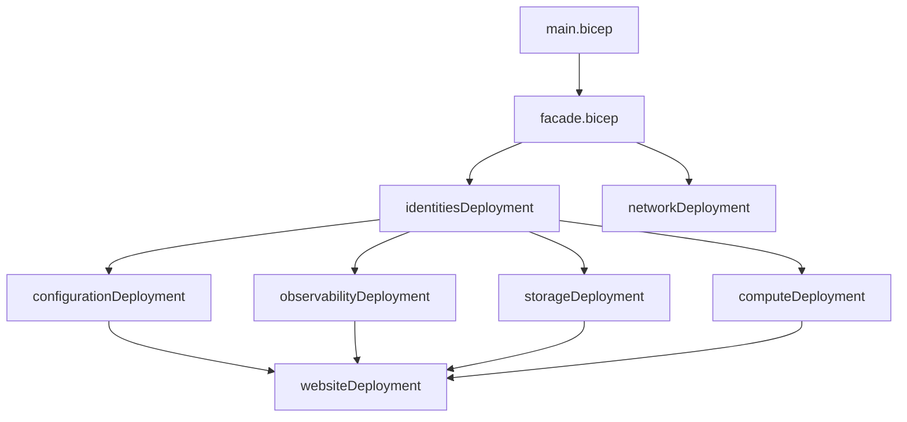

# 🚀 Azure Bicep Infrastructure

[](https://docs.microsoft.com/en-us/azure/azure-resource-manager/bicep/)
[](https://github.com/arolariu/arolariu.ro)
[](https://arolariu.ro)

A comprehensive, production-ready Azure infrastructure-as-code solution built with Azure Bicep, featuring standardized naming conventions, explicit dependency management, and enterprise-grade parameter validation.

## 📋 **Table of Contents**

- [🚀 Azure Bicep Infrastructure](#-azure-bicep-infrastructure)
  - [📋 **Table of Contents**](#-table-of-contents)
  - [🏗️ **Architecture Overview**](#️-architecture-overview)
    - [**🎯 Key Features**](#-key-features)
  - [🚀 **Quick Start**](#-quick-start)
    - [**Prerequisites**](#prerequisites)
    - [**Deployment**](#deployment)
    - [**Parameters**](#parameters)
  - [📁 **Module Structure**](#-module-structure)
    - [**Module Dependencies**](#module-dependencies)
  - [🔧 **Configuration**](#-configuration)
    - [**Bicep Configuration**](#bicep-configuration)
    - [**Naming Convention**](#naming-convention)
  - [📊 **Deployment Flow**](#-deployment-flow)
  - [🛠️ **Development**](#️-development)
    - [**Local Development**](#local-development)
    - [**Best Practices**](#best-practices)
  - [📖 **Documentation**](#-documentation)
  - [🤝 **Contributing**](#-contributing)
    - [**Code Quality Standards**](#code-quality-standards)

## 🏗️ **Architecture Overview**

This infrastructure solution deploys a complete web application platform on Azure with the following components:

- **🔐 Identity & Security**: Managed identities, Key Vault, RBAC
- **💻 Compute**: App Service Plans (Production + Development)
- **🌐 Networking**: Azure Front Door, DNS zones
- **📦 Storage**: Storage accounts, Container Registry
- **📊 Observability**: Log Analytics, Application Insights, Managed Grafana
- **⚙️ Configuration**: App Configuration service
- **🌍 Web Applications**: Main site, API, documentation

### **🎯 Key Features**

- ✅ **Production-ready** with enterprise-grade standards
- ✅ **Standardized naming** across all Azure resources
- ✅ **Explicit dependencies** for reliable deployments
- ✅ **Parameter validation** prevents invalid configurations
- ✅ **Modular design** for easy maintenance and updates
- ✅ **Comprehensive linting** with 33+ quality rules

## 🚀 **Quick Start**

### **Prerequisites**

- Azure CLI (latest version)
- Azure subscription with appropriate permissions
- Bicep CLI (latest version)

### **Deployment**

1. **Clone the repository**

   ```bash
   git clone https://github.com/arolariu/arolariu.ro.git
   cd arolariu.ro/infra/Azure/Bicep
   ```

2. **Login to Azure**

   ```bash
   az login
   az account set --subscription "your-subscription-id"
   ```

3. **Deploy the infrastructure**
   ```bash
   az deployment sub create \
     --location swedencentral \
     --template-file main.bicep \
     --parameters resourceGroupName="arolariu-rg-prod" \
                  resourceGroupLocation="swedencentral"
   ```

### **Parameters**

| Parameter               | Type   | Default                   | Description                 |
| ----------------------- | ------ | ------------------------- | --------------------------- |
| `resourceGroupName`     | string | `myResourceGroup`         | Name of the resource group  |
| `resourceGroupAuthor`   | string | `Alexandru-Razvan Olariu` | Author of the deployment    |
| `resourceGroupLocation` | string | `swedencentral`           | Azure region for deployment |

**Allowed Regions**: `swedencentral`, `norwayeast`, `westeurope`, `northeurope`

## 📁 **Module Structure**

```
infra/Azure/Bicep/
├── 📄 main.bicep                    # Subscription-level entry point
├── 📄 facade.bicep                  # Main orchestration module
├── ⚙️ bicepconfig.json              # Bicep configuration & linting
├── 📁 compute/                      # App Service Plans
├── 📁 configuration/                # App Configuration
├── 📁 identity/                     # Managed Identities & Key Vault
├── 📁 naming/                       # Centralized naming convention
├── 📁 network/                      # Azure Front Door & DNS
├── 📁 observability/                # Monitoring & logging
├── 📁 sites/                        # Web applications
├── 📁 storage/                      # Storage accounts & Container Registry
└── 📁 types/                        # User-defined types
```

### **Module Dependencies**



## 🔧 **Configuration**

### **Bicep Configuration**

The `bicepconfig.json` file provides:

- ✅ **33 linting rules** for code quality
- ✅ **Advanced features** (userDefinedTypes, imports)
- ✅ **Standardized formatting** (2-space indentation)
- ✅ **Security rules** (no hardcoded values)

### **Naming Convention**

All resources follow a standardized naming pattern:

```
{applicationName}-{locationCode}-{resourceType}-{tier}
```

Examples:

- `arolariu-swe-asp-prod` (Production App Service Plan)
- `arolariu-swe-asp-dev` (Development App Service Plan)
- `arolariu-swe-kv` (Key Vault)
- `arolariusweprodsa` (Storage Account)

## 📊 **Deployment Flow**

1. **🔐 Identities** - Managed identities created first (required for RBAC)
2. **🌐 Networking** - Front Door and DNS configuration
3. **⚙️ Configuration** - App Configuration service (depends on identities)
4. **📊 Observability** - Monitoring stack (depends on identities & config)
5. **📦 Storage** - Storage accounts (depends on identities for RBAC)
6. **💻 Compute** - App Service Plans (depends on identities for RBAC)
7. **🌍 Websites** - Web applications (depends on ALL above)

## 🛠️ **Development**

### **Local Development**

1. **Install Bicep CLI**

   ```bash
   az bicep install
   ```

2. **Validate templates**

   ```bash
   az bicep build --file main.bicep
   ```

3. **Run linting**
   ```bash
   az bicep lint --file main.bicep
   ```

### **Best Practices**

- ✅ Use parameter validation decorators (`@minLength`, `@maxLength`, `@allowed`)
- ✅ Document all parameters with `@description`
- ✅ Follow the established naming convention
- ✅ Add explicit dependencies where needed
- ✅ Use the centralized naming module

## 📖 **Documentation**

Each module contains detailed documentation:

- [📁 compute/](./compute/README.md) - App Service Plans documentation
- [📁 configuration/](./configuration/README.md) - App Configuration documentation
- [📁 identity/](./identity/README.md) - Identity & security documentation
- [📁 naming/](./naming/README.md) - Naming convention documentation
- [📁 network/](./network/README.md) - Networking documentation
- [📁 observability/](./observability/README.md) - Monitoring documentation
- [📁 sites/](./sites/README.md) - Web applications documentation
- [📁 storage/](./storage/README.md) - Storage documentation

## 🤝 **Contributing**

1. Fork the repository
2. Create a feature branch
3. Follow the established patterns and naming conventions
4. Ensure all linting rules pass
5. Add appropriate documentation
6. Submit a pull request

### **Code Quality Standards**

- ✅ All Bicep files must pass linting without errors
- ✅ Parameters must include validation and descriptions
- ✅ Follow the standardized naming convention
- ✅ Document dependencies and their reasons
- ✅ Include appropriate metadata

---

**Author**: Alexandru-Razvan Olariu (<admin@arolariu.ro>)  
**License**: MIT  
**Version**: 2.0.0  
**Status**: Production Ready 🚀
