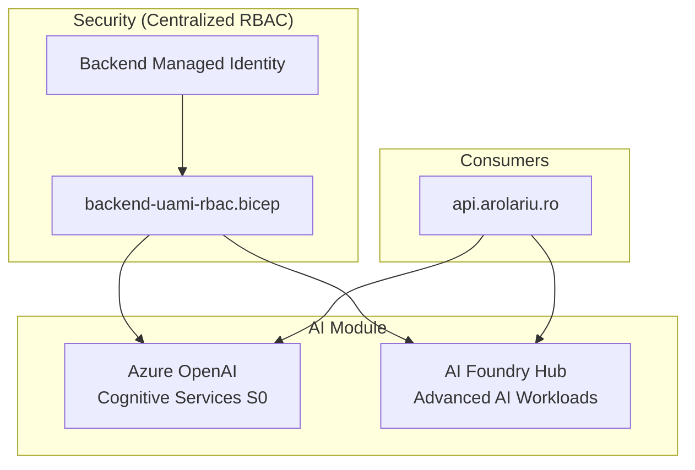

# 🤖 AI Module

This module deploys Azure AI services including Azure OpenAI and AI Foundry for the arolariu.ro platform.

## 📋 Overview

- Deploys Azure OpenAI (Cognitive Services) with S0 SKU
- Deploys Azure AI Foundry hub for advanced AI workloads
- Configures custom subdomain, public network access, and tags
- RBAC assignments are centralized in `rbac/backend-uami-rbac.bicep`

## 🏗️ Resources Created

| Resource Type     | Name Pattern         | Purpose                        |
| ----------------- | -------------------- | ------------------------------ |
| CognitiveServices | `{prefix}-openai`    | Azure OpenAI resource          |
| AI Foundry Hub    | `{prefix}-ai-hub`    | AI Foundry hub for AI services |

## 📊 Architecture



## 🔧 Parameters

| Parameter                  | Type   | Required | Description                          |
| -------------------------- | ------ | -------- | ------------------------------------ |
| `resourceLocation`         | string | ✅       | Azure region for the OpenAI resource |
| `resourceDeploymentDate`   | string | ✅       | Deployment timestamp                 |
| `resourceConventionPrefix` | string | ✅       | Prefix for resource names            |

## 📤 Outputs

| Output           | Type   | Description                        |
| ---------------- | ------ | ---------------------------------- |
| `openAiId`       | string | Resource ID of the OpenAI account  |
| `openAiEndpoint` | string | Endpoint URL of the OpenAI account |
| `resource`       | object | Full OpenAI resource object        |

## 🛡️ Security & RBAC

> **Note**: RBAC assignments are centralized in the `rbac/` module for better maintainability.

- The backend managed identity is granted the **Cognitive Services User** role via `rbac/backend-uami-rbac.bicep`
- No inline RBAC assignments in this module
- See: [rbac/README.md](../rbac/README.md) for complete RBAC documentation

## 🚀 Example Usage

```bicep
module aiDeployment 'ai/deploymentFile.bicep' = {
  name: 'aiDeployment'
  params: {
    resourceLocation: 'swedencentral'
    resourceDeploymentDate: '2025-07-03'
    resourceConventionPrefix: 'arolariu'
  }
}
```

## 📁 Module Files

| File                  | Purpose                              |
| --------------------- | ------------------------------------ |
| `deploymentFile.bicep`| Orchestrates AI service deployments  |
| `openai.bicep`        | Azure OpenAI Cognitive Services      |
| `aiFoundry.bicep`     | Azure AI Foundry hub                 |

## 🚨 Troubleshooting

| Issue                | Solution                                              |
| -------------------- | ----------------------------------------------------- |
| Access denied        | Check RBAC in `rbac/backend-uami-rbac.bicep`          |
| Quota exceeded       | Request quota increase in Azure portal                |
| Region not available | OpenAI is only available in select regions            |

## 📚 References

- [Azure OpenAI Documentation](https://learn.microsoft.com/en-us/azure/ai-services/openai/)
- [Azure AI Foundry](https://learn.microsoft.com/en-us/azure/ai-studio/)
- [Cognitive Services RBAC](https://learn.microsoft.com/en-us/azure/cognitive-services/authorizing-users)

---

**Module Version**: 2.0.0  
**Last Updated**: December 2025  
**Maintainer**: Alexandru-Razvan Olariu
