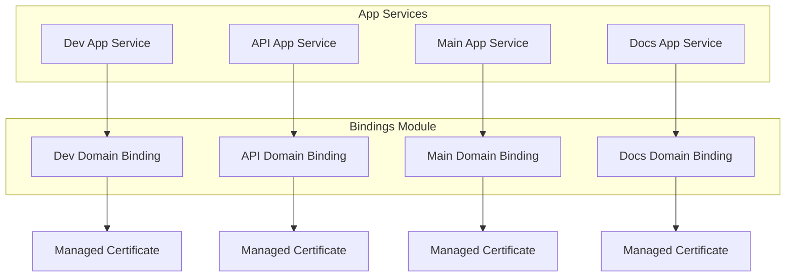

# 🔗 Bindings Module

This module manages custom domain bindings and managed certificates for App Services (main, dev, api, docs) in the arolariu.ro platform. It ensures correct sequencing and secure configuration for domain and certificate provisioning.

---

## 📋 Overview

- Deploys domain bindings and managed certificates for all web apps.
- Ensures dependencies: App Service and DNS must exist before bindings.
- Modular structure for dev, api, main, and docs sites.

---

## 🏗️ Resources Created

| Resource Type                     | Purpose                              |
| --------------------------------- | ------------------------------------ |
| App Service Custom Domain Binding | Binds custom domains to App Services |
| Managed Certificate               | Issues and attaches certificates     |

---

## 🔧 Parameters

| Name                        | Type   | Required | Description                              | Allowed Values                                     |
| --------------------------- | ------ | -------- | ---------------------------------------- | -------------------------------------------------- |
| resourceDeploymentDate      | string | ✅       | The date when the deployment is executed | -                                                  |
| resourceLocation            | string | ✅       | Azure region for resources               | swedencentral, norwayeast, westeurope, northeurope |
| resourceConventionPrefix    | string | ✅       | Prefix for resource names                | -                                                  |
| dnsZoneName                 | string | ✅       | The name of the Azure DNS Zone resource  | -                                                  |
| devWebsiteAppServicePlanId  | string | ✅       | Dev App Service Plan resource ID         | -                                                  |
| prodWebsiteAppServicePlanId | string | ✅       | Prod App Service Plan resource ID        | -                                                  |
| apiWebsiteHostname          | string | ✅       | Hostname for API website                 | -                                                  |
| devWebsiteHostname          | string | ✅       | Hostname for Dev website                 | -                                                  |
| docsWebsiteHostname         | string | ✅       | Hostname for Docs website                | -                                                  |
| prodWebsiteHostname         | string | ✅       | Hostname for Prod website                | -                                                  |

---

## 📤 Outputs

_None (module is orchestration layer for submodules)_

---

## 🛠️ Usage Example

```bicep
module bindings 'bindings/deploymentFile.bicep' = {
  name: 'bindingsDeployment'
  params: {
    resourceDeploymentDate: utcNow()
    resourceLocation: 'swedencentral'
    resourceConventionPrefix: 'arolariu'
    devWebsiteAppServicePlanId: '<dev-app-service-plan-id>'
    prodWebsiteAppServicePlanId: '<prod-app-service-plan-id>'
    apiWebsiteHostname: 'api.arolariu.ro'
    devWebsiteHostname: 'dev.arolariu.ro'
    docsWebsiteHostname: 'docs.arolariu.ro'
  }
}
```

---

## 📊 Architecture Diagram



---

## 🔄 Deployment Flow

1. **Deploy App Services** (dev, api, main, docs)
2. **Deploy DNS zones and records**
3. **Deploy Bindings Module** (this module)
   - Binds domains to App Services
   - Issues managed certificates

---

## 🔗 Dependencies

- **Requires:** App Services and DNS zones to exist before binding.
- **Used by:** Sites module for domain/cert integration.

---

## 🛡️ Security & Best Practices

- Certificates are managed by Azure for automatic renewal.
- No secrets or keys are stored in code.
- Explicit dependency management for reliable deployment.

---

## 🚨 Troubleshooting

| Issue                     | Solution                                               |
| ------------------------- | ------------------------------------------------------ |
| Binding fails             | Ensure App Service and DNS are deployed and propagated |
| Certificate not issued    | Check DNS CNAME records and domain ownership           |
| Resource naming conflicts | Use unique `resourceConventionPrefix`                  |
| Permission errors         | Verify deployment identity has sufficient permissions  |

---

## 📚 References

- [Azure App Service Custom Domains](https://docs.microsoft.com/en-us/azure/app-service/app-service-web-tutorial-custom-domain)
- [App Service Managed Certificates](https://docs.microsoft.com/en-us/azure/app-service/configure-ssl-certificate#create-a-free-managed-certificate)
- [Bicep Modules](https://docs.microsoft.com/en-us/azure/azure-resource-manager/bicep/modules)

---

**Module Version**: 2.1.0  
**Last Updated**: July 2025  
**Maintainer**: Alexandru-Razvan Olariu
