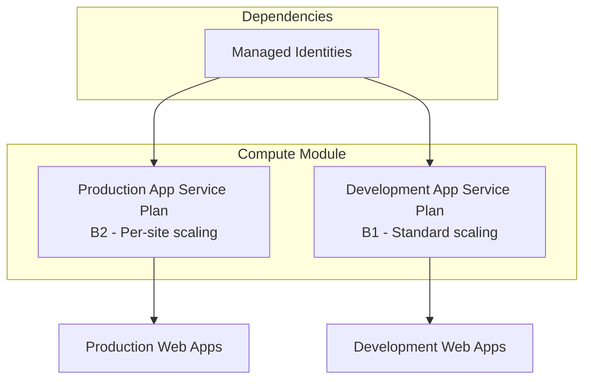

# 💻 Compute Module

This module provisions Linux-based Azure App Service Plans for production and development workloads, with secure defaults and managed identity integration.

## 📋 Overview

- Two App Service Plans: Production (B2) and Development (B1)
- Linux containers, per-site scaling (production), cost-optimized
- Managed identity integration for secure authentication

## 📁 Module Files

| File                      | Purpose                                    |
| ------------------------- | ------------------------------------------ |
| `deploymentFile.bicep`    | Orchestrates App Service Plan deployments  |
| `appServicePlans.bicep`   | App Service Plans (production & development)|

## 🏗️ Resources Created

| Resource Type    | Name Pattern           | SKU        | Purpose                      |
| ---------------- | ---------------------- | ---------- | ---------------------------- |
| App Service Plan | `{prefix}-production`  | B2 (Basic) | Production web applications  |
| App Service Plan | `{prefix}-development` | B1 (Basic) | Development web applications |

## 📊 **Architecture**



## 🔧 Parameters

| Parameter                  | Type   | Required | Description                                                       |
| -------------------------- | ------ | -------- | ----------------------------------------------------------------- |
| `resourceConventionPrefix` | string | ✅       | Prefix for resource naming (1-20 chars)                           |
| `resourceLocation`         | string | ✅       | Azure region (swedencentral, norwayeast, westeurope, northeurope) |
| `resourceDeploymentDate`   | string | ✅       | Deployment timestamp                                              |

### Example Usage

```bicep
module computeDeployment 'compute/deploymentFile.bicep' = {
  name: 'computeDeployment'
  params: {
    resourceConventionPrefix: 'arolariu'
    resourceLocation: 'swedencentral'
    resourceDeploymentDate: utcNow()
  }
}
```

## 📤 Outputs

| Output                 | Type   | Description                                     |
| ---------------------- | ------ | ----------------------------------------------- |
| `productionAppPlanId`  | string | Resource ID of the production App Service Plan  |
| `developmentAppPlanId` | string | Resource ID of the development App Service Plan |

## �️ Security Features

- Linux-based plans for security and performance
- Managed identity integration for secure authentication
- Per-site scaling (production)
- Resource tags for governance and cost tracking

## 💰 Cost Considerations

| Plan        | SKU | vCPU | RAM     | Estimated Monthly Cost\* |
| ----------- | --- | ---- | ------- | ------------------------ |
| Production  | B2  | 2    | 3.5 GB  | ~€24                     |
| Development | B1  | 1    | 1.75 GB | ~€12                     |

\*Estimates based on Sweden Central pricing (July 2025)

## 🔧 Customization Options

- **Per-site scaling**: Enabled for production plan
- **SKU upgrades**: Upgrade to Standard or Premium for more features

## 🛠️ Maintenance

- Integrates with Application Insights, Log Analytics, Azure Monitor
- Production plan supports manual and automatic scaling

## 🔄 Dependencies

- **Requires**: Managed Identities (for RBAC)
- **Used by**: Sites Module (needs App Service Plan IDs)

## 📊 Deployment Flow

1. Identity Module creates managed identities
2. Compute Module provisions App Service Plans
3. Sites Module deploys web applications

## 🚨 Troubleshooting

| Issue                                | Solution                                                                |
| ------------------------------------ | ----------------------------------------------------------------------- |
| Deployment fails with location error | Use allowed regions: swedencentral, norwayeast, westeurope, northeurope |
| Resource naming conflicts            | Ensure unique `resourceConventionPrefix`                                |
| Permission errors                    | Verify managed identity permissions                                     |

## 📚 References

- [Azure App Service Plans](https://docs.microsoft.com/en-us/azure/app-service/overview-hosting-plans)
- [App Service Linux](https://docs.microsoft.com/en-us/azure/app-service/overview#app-service-on-linux)
- [Per-site Scaling](https://docs.microsoft.com/en-us/azure/app-service/manage-scale-per-app)

---

**Module Version**: 2.0.0  
**Last Updated**: July 2025  
**Maintainer**: Alexandru-Razvan Olariu
