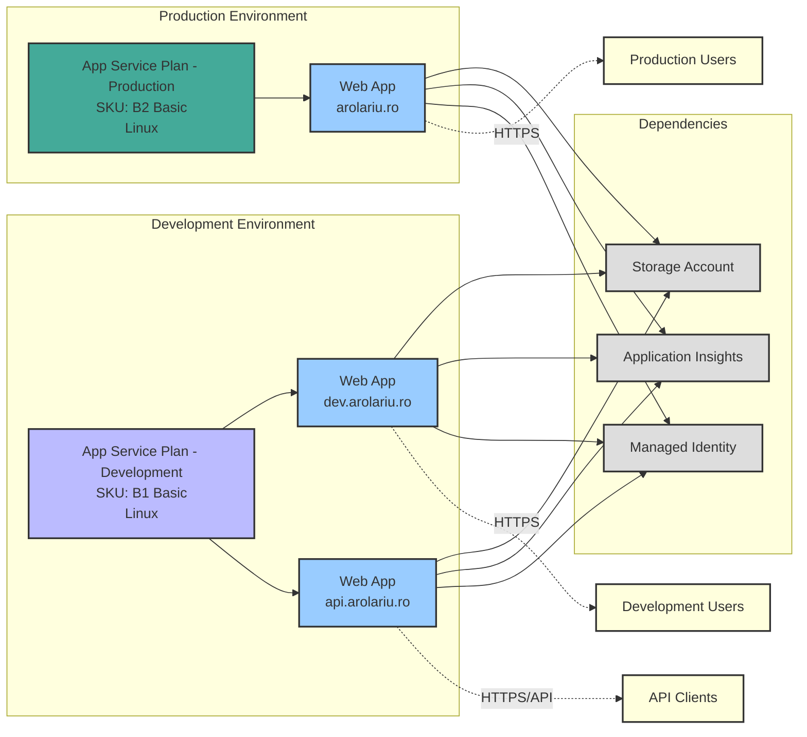

# Compute Resources

This module deploys the compute infrastructure for the arolariu.ro platform, consisting of App Service Plans and Web Applications organized by environment.

## Overview

The compute infrastructure is divided into two environments:
- **Production Environment**: Hosts the main arolariu.ro website
- **Development Environment**: Hosts the development website and API services

## Architecture Diagram

## Components

### App Service Plans

#### Production App Service Plan
- **SKU**: B2 Basic (2 vCPUs, 3.5 GB RAM)
- **OS**: Linux
- **Features**: Per-site scaling enabled
- **Purpose**: Hosts the production website with better performance and reliability

#### Development App Service Plan
- **SKU**: B1 Basic (1 vCPU, 1.75 GB RAM)
- **OS**: Linux
- **Features**: Standard configuration
- **Purpose**: Hosts development and API services with cost optimization

### Web Applications

#### arolariu.ro (Production)
- **Environment**: Production
- **App Service Plan**: Production
- **Purpose**: Main public-facing website
- **Access**: Global users via HTTPS

#### dev.arolariu.ro (Development)
- **Environment**: Development
- **App Service Plan**: Development
- **Purpose**: Development and testing environment
- **Access**: Development team and testers

#### api.arolariu.ro (API)
- **Environment**: Development
- **App Service Plan**: Development
- **Purpose**: RESTful API services for data operations
- **Access**: API clients and internal services

### Dependencies

Each web application integrates with:

- **Storage Account**: For file storage, blob storage, and static assets
- **Application Insights**: For monitoring, logging, and performance tracking
- **Managed Identity**: For secure, passwordless authentication to Azure services

## Security Considerations

- All web applications use Managed Identities for authentication
- HTTPS-only traffic enforcement
- Integration with Azure Key Vault through App Configuration
- Network isolation capabilities through service endpoints

## Scaling Strategy

- Production environment uses B2 SKU with per-site scaling for better performance
- Development environment uses B1 SKU for cost optimization
- Both environments can be scaled up/down based on demand
- Horizontal scaling (scale-out) available when needed
