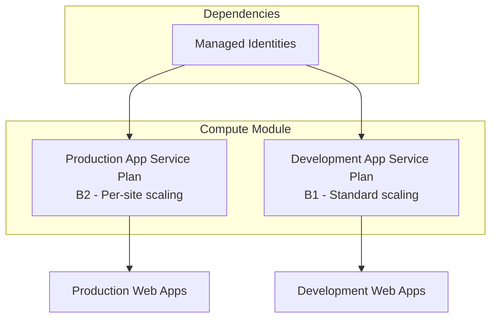

# 💻 Compute Module

This module provisions Azure App Service Plans for hosting web applications in both production and development environments.

## 📋 **Overview**

The compute module creates two Linux-based App Service Plans:

- **Production Plan**: Higher-tier (B2) with per-site scaling enabled
- **Development Plan**: Basic-tier (B1) for development workloads

## 🏗️ **Resources Created**

| Resource Type    | Name Pattern           | SKU        | Purpose                      |
| ---------------- | ---------------------- | ---------- | ---------------------------- |
| App Service Plan | `{prefix}-production`  | B2 (Basic) | Production web applications  |
| App Service Plan | `{prefix}-development` | B1 (Basic) | Development web applications |

## 📊 **Architecture**



## 🔧 **Configuration**

### **Parameters**

| Parameter                  | Type   | Required | Description                                                       |
| -------------------------- | ------ | -------- | ----------------------------------------------------------------- |
| `resourceConventionPrefix` | string | ✅       | Prefix for resource naming (1-20 chars)                           |
| `location`                 | string | ✅       | Azure region (swedencentral, norwayeast, westeurope, northeurope) |

### **Example Usage**

```bicep
module computeDeployment 'compute/deploymentFile.bicep' = {
  name: 'computeDeployment'
  params: {
    resourceConventionPrefix: 'myapp'
    location: 'swedencentral'
  }
}
```

## 📤 **Outputs**

| Output                 | Type   | Description                                     |
| ---------------------- | ------ | ----------------------------------------------- |
| `productionAppPlanId`  | string | Resource ID of the production App Service Plan  |
| `developmentAppPlanId` | string | Resource ID of the development App Service Plan |

## 🔒 **Security Features**

- **Linux-based plans** for better security and performance
- **Zone redundancy** disabled for cost optimization
- **Managed Identity integration** for secure authentication
- **Resource tags** for governance and cost tracking

## 💰 **Cost Considerations**

| Plan        | SKU | vCPU | RAM     | Estimated Monthly Cost\* |
| ----------- | --- | ---- | ------- | ------------------------ |
| Production  | B2  | 2    | 3.5 GB  | ~€24                     |
| Development | B1  | 1    | 1.75 GB | ~€12                     |

\*Estimates based on Sweden Central pricing (June 2025)

## 🔧 **Customization Options**

### **Scaling Configuration**

The production plan supports **per-site scaling**, allowing individual web applications to scale independently:

```bicep
properties: {
  perSiteScaling: true  // Production only
  reserved: true        // Linux containers
  zoneRedundant: false  // Cost optimization
}
```

### **SKU Options**

Current SKUs can be upgraded as needed:

- **Basic (B1, B2)**: Current configuration
- **Standard (S1, S2, S3)**: Auto-scaling, staging slots
- **Premium (P1v2, P2v2, P3v2)**: Enhanced performance, VNet integration

## 🛠️ **Maintenance**

### **Monitoring**

The App Service Plans integrate with:

- **Application Insights** for performance monitoring
- **Log Analytics** for centralized logging
- **Azure Monitor** for alerting and metrics

### **Scaling**

Production plan supports manual and automatic scaling:

```bash
# Scale production plan manually
az appservice plan update \
  --name "myapp-production" \
  --resource-group "myResourceGroup" \
  --number-of-workers 3
```

## 🔄 **Dependencies**

### **Required Dependencies**

- **Managed Identities** (for RBAC authentication)

### **Dependent Modules**

- **Sites Module** (requires App Service Plan IDs)

## 📊 **Deployment Flow**

1. **Identity Module** creates managed identities
2. **Compute Module** provisions App Service Plans
3. **Sites Module** deploys web applications to the plans

## 🚨 **Troubleshooting**

### **Common Issues**

| Issue                                | Cause                    | Solution                                                                |
| ------------------------------------ | ------------------------ | ----------------------------------------------------------------------- |
| Deployment fails with location error | Invalid Azure region     | Use allowed regions: swedencentral, norwayeast, westeurope, northeurope |
| Resource naming conflicts            | Duplicate resource names | Ensure unique `resourceConventionPrefix`                                |
| Permission errors                    | Insufficient RBAC        | Verify managed identity permissions                                     |

### **Validation Commands**

```bash
# Validate the compute module
az bicep build --file compute/deploymentFile.bicep

# Check App Service Plan status
az appservice plan show \
  --name "myapp-production" \
  --resource-group "myResourceGroup"
```

## 📚 **References**

- [Azure App Service Plans](https://docs.microsoft.com/en-us/azure/app-service/overview-hosting-plans)
- [App Service Linux](https://docs.microsoft.com/en-us/azure/app-service/overview#app-service-on-linux)
- [Per-site Scaling](https://docs.microsoft.com/en-us/azure/app-service/manage-scale-per-app)

---

**Module Version**: 2.0.0  
**Last Updated**: June 2025  
**Maintainer**: Alexandru-Razvan Olariu
