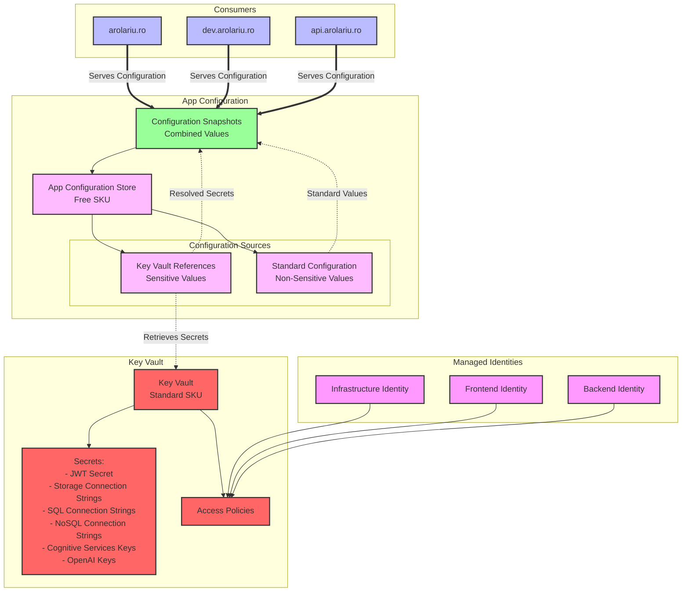

# Configuration Resources

This module deploys the configuration management infrastructure for the arolariu.ro platform, providing centralized configuration and secrets management through Azure App Configuration and Key Vault.

## Overview

The configuration infrastructure implements a secure, centralized configuration management system that:
- Separates sensitive secrets (Key Vault) from application configuration (App Configuration)
- Provides configuration snapshots for consistent deployments
- Enables secure access through Managed Identities
- Supports environment-specific configurations

## Architecture Diagram

## Components

### Azure Key Vault

The Key Vault serves as the secure secrets store for all sensitive configuration values.

#### Specifications
- **SKU**: Standard
- **Soft Delete**: Enabled (90 days retention)
- **Purge Protection**: Enabled
- **Access Model**: Access Policies (not RBAC)

#### Stored Secrets

##### Authentication Secrets
- **jwt-secret**: JWT token signing key for authentication services

##### Storage Connection Strings
- **DEV-AzureOptions-StorageAccountConnectionString**: Development storage account
- **PROD-AzureOptions-StorageAccountConnectionString**: Production storage account

##### Database Connection Strings
- **DEV-AzureOptions-SqlConnectionString**: Development SQL database
- **PROD-AzureOptions-SqlConnectionString**: Production SQL database
- **DEV-AzureOptions-NoSqlConnectionString**: Development NoSQL database
- **PROD-AzureOptions-NoSqlConnectionString**: Production NoSQL database

##### External Service Keys
- **DEV-AzureOptions-CognitiveServicesKey**: Development Cognitive Services
- **PROD-AzureOptions-CognitiveServicesKey**: Production Cognitive Services
- **DEV-AzureOptions-OpenAIKey**: Development OpenAI API
- **PROD-AzureOptions-OpenAIKey**: Production OpenAI API

##### Configuration Store
- **ConfigurationStore**: App Configuration connection string

### Azure App Configuration

The App Configuration service provides centralized configuration management with versioning and feature flags.

#### Specifications
- **SKU**: Free (1000 requests/day, 10MB storage)
- **Authentication**: Local authentication enabled
- **Features**: Configuration snapshots, Key Vault references

#### Configuration Types

##### Key Vault References
References to secrets stored in Key Vault, automatically resolved at runtime:
- Connection strings
- API keys
- Authentication secrets

##### Standard Configuration
Non-sensitive application settings:
- Feature flags
- Application settings
- Environment-specific configurations
- Service endpoints

### Configuration Snapshots

Configuration snapshots provide:
- **Immutable configuration sets**: Point-in-time configuration state
- **Consistent deployments**: All services receive the same configuration
- **Rollback capability**: Easy reversion to previous configurations
- **Environment isolation**: Separate snapshots for dev/prod

### Managed Identities

Three managed identities provide secure, passwordless access:

#### Infrastructure Identity
- **Purpose**: Deployment and infrastructure management
- **Access**: Full permissions on Key Vault (all operations)
- **Usage**: CI/CD pipelines, infrastructure provisioning

#### Frontend Identity
- **Purpose**: Frontend application access
- **Access**: Read-only for secrets and certificates
- **Usage**: Web applications (arolariu.ro, dev.arolariu.ro)

#### Backend Identity
- **Purpose**: Backend services and APIs
- **Access**: Read/write for secrets, read-only for certificates
- **Usage**: API services (api.arolariu.ro)

## Security Model

### Access Control
1. **No direct Key Vault access**: Applications only access App Configuration
2. **Managed Identity authentication**: No passwords or keys in code
3. **Least privilege**: Each identity has minimal required permissions
4. **Network restrictions**: Can be configured for private endpoint access

### Secret Rotation
- Secrets can be rotated in Key Vault without application changes
- App Configuration automatically picks up new secret versions
- Zero-downtime secret rotation capability

## Configuration Flow

1. **Secret Storage**: Sensitive values stored in Key Vault
2. **Reference Creation**: App Configuration creates Key Vault references
3. **Snapshot Generation**: Configuration snapshot combines all values
4. **Application Request**: Consumer requests configuration
5. **Secret Resolution**: App Configuration resolves Key Vault references
6. **Configuration Delivery**: Complete configuration returned to consumer

## Best Practices

1. **Environment Separation**: Use prefixes (DEV-, PROD-) for environment-specific settings
2. **Secret Rotation**: Regularly rotate secrets and API keys
3. **Access Auditing**: Monitor Key Vault access logs
4. **Configuration Versioning**: Use snapshots for deployment consistency
5. **Minimal Permissions**: Grant only required permissions to each identity

## Deployment Considerations

- Key Vault must be deployed before App Configuration
- Managed Identities must be created before access policy assignment
- Configuration values should be loaded after infrastructure deployment
- Consider using deployment slots for zero-downtime configuration updates
