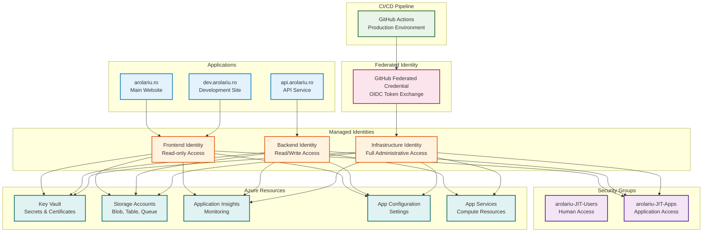
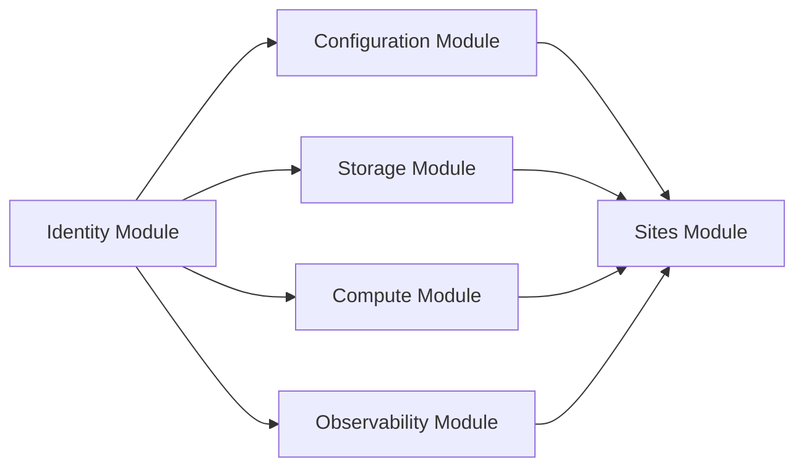

# 🔐 Identity Module

This module provisions all identity and access management resources for the arolariu.ro platform, including user-assigned managed identities, federated identity credentials, and security groups.

## 📋 **Overview**

The identity module creates a comprehensive identity management system that:

- **Provides passwordless authentication** through managed identities
- **Enables secure CI/CD** with federated identity credentials
- **Implements RBAC** with security groups
- **Separates concerns** with role-specific identities
- **Supports zero-trust architecture** principles

## 🏗️ **Resources Created**

| Resource Type                  | Name Pattern                | Purpose                          |
| ------------------------------ | --------------------------- | -------------------------------- |
| User Assigned Managed Identity | `{prefix}-frontend`         | Frontend applications access     |
| User Assigned Managed Identity | `{prefix}-backend`          | Backend services access          |
| User Assigned Managed Identity | `{prefix}-infrastructure`   | Infrastructure management access |
| Federated Identity Credential  | `FederatedGithubCredential` | GitHub Actions authentication    |
| Security Group                 | `arolariu-JIT-Users`        | Just-in-time user access         |
| Security Group                 | `arolariu-JIT-Apps`         | Managed identities group         |

## 📊 **Architecture**



## 🔧 **Configuration**

### **Parameters**

| Parameter                               | Type   | Required | Description                                        |
| --------------------------------------- | ------ | -------- | -------------------------------------------------- |
| `userAssignedManagedIdentityNamePrefix` | string | ✅       | Prefix for managed identity names (1-20 chars)     |
| `userAssignedManagedIdentityLocation`   | string | ❌       | Azure region (defaults to resource group location) |
| `resourceDeploymentDate`                | string | ❌       | Deployment timestamp (defaults to utcNow())        |

### **Example Usage**

```bicep
module identitiesDeployment 'identity/deploymentFile.bicep' = {
  name: 'identitiesDeployment'
  params: {
    resourceConventionPrefix: 'arolariu'
  }
}
```

## 📤 **Outputs**

| Output                  | Type       | Description                             |
| ----------------------- | ---------- | --------------------------------------- |
| `managedIdentitiesList` | identity[] | Array of all created managed identities |

**Output Structure:**

```bicep
type identity = {
  name: string         // Resource name
  displayName: string  // Human-readable name
  id: string          // Full Azure resource ID
}
```

## 🔒 **Identity Details**

### **Frontend Identity (`{prefix}-frontend`)**

**Purpose:** Secure access for frontend applications (main website, development site)

**Permissions:**

- **Read-only** access to Key Vault secrets
- **Read-only** access to storage accounts
- **Read-only** access to App Configuration
- **Read** access to Application Insights

**Used By:**

- `arolariu.ro` (main website)
- `dev.arolariu.ro` (development site)

### **Backend Identity (`{prefix}-backend`)**

**Purpose:** Enhanced access for backend services and APIs

**Permissions:**

- **Read/Write** access to Key Vault secrets
- **Read/Write** access to storage accounts
- **Read/Write** access to App Configuration
- **Read/Write** access to Application Insights
- **Read** access to compute resources for monitoring

**Used By:**

- `api.arolariu.ro` (API service)

### **Infrastructure Identity (`{prefix}-infrastructure`)**

**Purpose:** Full administrative access for infrastructure management and CI/CD

**Permissions:**

- **Full** access to Key Vault (all operations)
- **Full** access to storage accounts
- **Full** access to App Configuration
- **Full** access to Application Insights
- **Full** access to compute resources
- **Deployment** permissions for resource provisioning

**Used By:**

- GitHub Actions CI/CD pipeline
- Infrastructure deployment scripts
- Administrative operations

## 🌐 **Federated Identity**

### **GitHub Actions Integration**

The module creates a federated identity credential that enables passwordless authentication from GitHub Actions:

**Configuration:**

- **Issuer**: `https://token.actions.githubusercontent.com`
- **Subject**: `repo:arolariu/arolariu.ro:environment:production`
- **Audience**: `api://AzureADTokenExchange`

**Benefits:**

- **No secrets in GitHub**: No need to store Azure credentials
- **Automatic token exchange**: OIDC tokens exchanged for Azure tokens
- **Enhanced security**: Tokens are short-lived and scoped
- **Audit trail**: All access is logged and traceable

### **Usage in GitHub Actions**

```yaml
# .github/workflows/deploy.yml
- name: Azure Login
  uses: azure/login@v1
  with:
    client-id: ${{ secrets.AZURE_CLIENT_ID }} # Infrastructure Identity Client ID
    tenant-id: ${{ secrets.AZURE_TENANT_ID }}
    subscription-id: ${{ secrets.AZURE_SUBSCRIPTION_ID }}
```

## 👥 **Security Groups**

### **arolariu-JIT-Users**

**Purpose:** Just-in-time access for human users

**Configuration:**

- **Mail Enabled**: Yes (for notifications)
- **Security Enabled**: Yes
- **Members**: Added manually when JIT access is needed

**Use Cases:**

- Emergency access to production resources
- Temporary elevated permissions
- Audit and compliance requirements

### **arolariu-JIT-Apps**

**Purpose:** Group membership for all managed identities

**Configuration:**

- **Mail Enabled**: No
- **Security Enabled**: Yes
- **Members**: All three managed identities (automatic)

**Use Cases:**

- Bulk permission assignments
- Centralized access control
- Simplified RBAC management

## 💰 **Cost Considerations**

| Resource Type                  | Quantity | Monthly Cost |
| ------------------------------ | -------- | ------------ |
| User Assigned Managed Identity | 3        | €0 (Free)    |
| Federated Identity Credential  | 1        | €0 (Free)    |
| Microsoft Graph Groups         | 2        | €0 (Free)    |
| **Total**                      |          | **€0**       |

**Cost Benefits:**

- **No authentication costs**: Managed identities are free
- **Reduced operational overhead**: No credential rotation needed
- **Enhanced security**: No password-related vulnerabilities

## 🔧 **Security Features**

### **Zero-Trust Principles**

- **Least privilege access**: Each identity has minimal required permissions
- **Identity verification**: All access requires valid Azure AD authentication
- **Continuous monitoring**: All operations are logged and auditable
- **Conditional access**: Can be enhanced with conditional access policies

### **RBAC Implementation**

```bicep
// Example: Assign Key Vault Reader role to frontend identity
resource keyVaultReaderAssignment 'Microsoft.Authorization/roleAssignments@2022-04-01' = {
  scope: keyVault
  name: guid(keyVault.id, frontendIdentity.id, 'Key Vault Reader')
  properties: {
    roleDefinitionId: subscriptionResourceId('Microsoft.Authorization/roleDefinitions', '4633458b-17de-408a-b874-0445c86b69e6') // Key Vault Reader
    principalId: frontendIdentity.properties.principalId
    principalType: 'ServicePrincipal'
  }
}
```

### **Audit & Compliance**

- **Activity logs**: All identity operations logged to Azure Activity Log
- **Sign-in logs**: Authentication events tracked in Azure AD
- **Resource access**: All resource access logged at target resources
- **Compliance ready**: Supports SOC, ISO, and other compliance frameworks

## 🛠️ **Maintenance**

### **Identity Lifecycle**

**Creation:**

1. Identities created during initial deployment
2. Automatic assignment to security groups
3. RBAC permissions applied via dependent modules

**Management:**

- **No password rotation** required (passwordless)
- **Permission updates** via RBAC role assignments
- **Monitoring** through Azure AD and Activity logs

**Deletion:**

- Identities deleted with resource group
- Automatic cleanup of dependent permissions

### **Monitoring & Alerting**

```bash
# Monitor identity usage
az monitor activity-log list \
  --resource-group "arolariu-rg" \
  --caller "frontend-identity-object-id" \
  --start-time "2024-01-01T00:00:00Z"

# Check identity permissions
az role assignment list \
  --assignee "frontend-identity-object-id" \
  --all
```

## 🔄 **Dependencies**

### **Required Dependencies**

**None** - This module is typically deployed first as other modules depend on it.

### **Dependent Modules**

All other modules depend on the identity module for secure access:

1. **Configuration Module**: Requires identities for Key Vault access
2. **Storage Module**: Requires identities for RBAC assignments
3. **Compute Module**: Requires identities for App Service assignment
4. **Sites Module**: Requires identities for application authentication
5. **Observability Module**: Requires identities for monitoring access

## 📊 **Deployment Flow**



**Order:**

1. **Identity Module** (first - no dependencies)
2. **All other modules** (depend on identities)

## 🚨 **Troubleshooting**

### **Common Issues**

| Issue                           | Symptoms                             | Solution                                          |
| ------------------------------- | ------------------------------------ | ------------------------------------------------- |
| **Federated credential failed** | GitHub Actions authentication errors | Verify repository name and environment in subject |
| **Missing Graph permissions**   | Security group creation fails        | Ensure deployment identity has Graph permissions  |
| **Identity not found**          | Resource access denied               | Check identity exists and has proper RBAC         |
| **Principal ID not available**  | Role assignment fails                | Wait for identity propagation (up to 5 minutes)   |

### **Validation Commands**

```bash
# List all managed identities
az identity list \
  --resource-group "arolariu-rg" \
  --output table

# Check identity details
az identity show \
  --name "arolariu-frontend" \
  --resource-group "arolariu-rg"

# Verify federated credential
az identity federated-credential list \
  --identity-name "arolariu-infrastructure" \
  --resource-group "arolariu-rg"

# Test GitHub Actions authentication
az login --identity --username "infrastructure-identity-client-id"
```

### **Security Verification**

```bash
# Check role assignments for an identity
az role assignment list \
  --assignee "principal-id-of-identity" \
  --all \
  --output table

# Verify Key Vault access
az keyvault secret list \
  --vault-name "your-key-vault" \
  --auth-mode login
```

## 📚 **References**

- [Azure Managed Identities](https://docs.microsoft.com/en-us/azure/active-directory/managed-identities-azure-resources/)
- [Workload Identity Federation](https://docs.microsoft.com/en-us/azure/active-directory/workload-identities/workload-identity-federation)
- [GitHub Actions with Azure](https://docs.microsoft.com/en-us/azure/developer/github/connect-from-azure)
- [Azure RBAC](https://docs.microsoft.com/en-us/azure/role-based-access-control/)
- [Microsoft Graph Groups](https://docs.microsoft.com/en-us/graph/api/resources/group)

---

**Module Version**: 2.0.0  
**Last Updated**: June 2025  
**Maintainer**: Alexandru-Razvan Olariu
