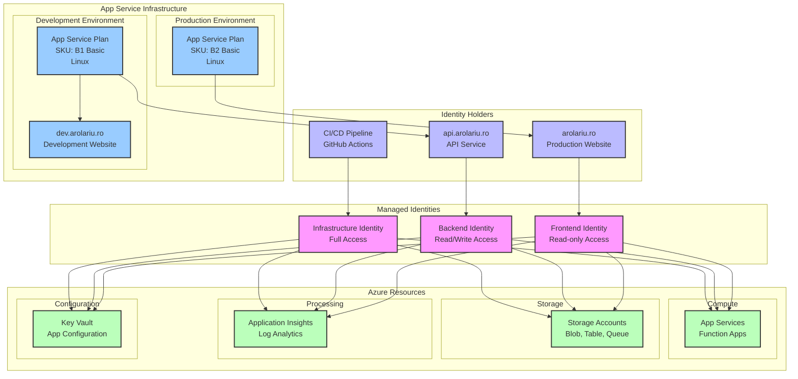

# Identity & Access Management

This diagram shows the identity and access management resources.

```mermaid
graph TB
    subgraph "Identity Holders"
        WA_PROD[arolariu.ro<br/>Production Website]
        WA_API[api.arolariu.ro<br/>API Service]
        CICD[CI/CD Pipeline<br/>GitHub Actions]
    end

    subgraph "Managed Identities"
        MI_FRONTEND[Frontend Identity<br/>Read-only Access]
        MI_BACKEND[Backend Identity<br/>Read/Write Access]
        MI_INFRA[Infrastructure Identity<br/>Full Access]
    end

    subgraph "App Service Infrastructure"
        subgraph "Production Environment"
            ASP_PROD[App Service Plan<br/>SKU: B2 Basic<br/>Linux]
        end

        subgraph "Development Environment"
            ASP_DEV[App Service Plan<br/>SKU: B1 Basic<br/>Linux]
            WA_DEV[dev.arolariu.ro<br/>Development Website]
        end
    end

    subgraph "Azure Resources"
        subgraph "Compute"
            COMPUTE[App Services<br/>Function Apps]
        end

        subgraph "Storage"
            STORAGE[Storage Accounts<br/>Blob, Table, Queue]
        end

        subgraph "Processing"
            PROCESS[Application Insights<br/>Log Analytics]
        end

        subgraph "Configuration"
            CONFIG[Key Vault<br/>App Configuration]
        end
    end

    WA_PROD --> MI_FRONTEND
    WA_API --> MI_BACKEND
    CICD --> MI_INFRA

    MI_FRONTEND --> COMPUTE
    MI_FRONTEND --> STORAGE
    MI_FRONTEND --> PROCESS
    MI_FRONTEND --> CONFIG

    MI_BACKEND --> COMPUTE
    MI_BACKEND --> STORAGE
    MI_BACKEND --> PROCESS
    MI_BACKEND --> CONFIG

    MI_INFRA --> COMPUTE
    MI_INFRA --> STORAGE
    MI_INFRA --> PROCESS
    MI_INFRA --> CONFIG

    ASP_PROD --> WA_PROD
    ASP_DEV --> WA_API
    ASP_DEV --> WA_DEV

    classDef holder fill:#bbf,stroke:#333,stroke-width:2px
    classDef identity fill:#f9f,stroke:#333,stroke-width:2px
    classDef infra fill:#9cf,stroke:#333,stroke-width:2px
    classDef resource fill:#bfb,stroke:#333,stroke-width:2px

    class WA_PROD,WA_API,CICD holder
    class MI_FRONTEND,MI_BACKEND,MI_INFRA identity
    class ASP_PROD,ASP_DEV,WA_DEV infra
    class COMPUTE,STORAGE,PROCESS,CONFIG resource
```
