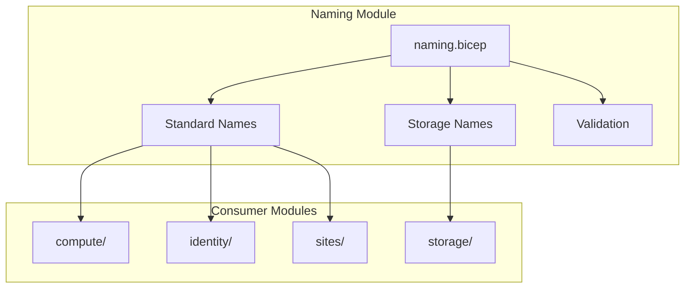

# 🏷️ Naming Convention Module

This module provides a centralized, standardized naming convention for all Azure resources, ensuring consistency, compliance, and easy identification across your infrastructure.

## 📋 **Overview**

The naming module generates standardized names for Azure resources based on:

- **Application name** (e.g., "arolariu")
- **Location code** (abbreviated Azure region)
- **Resource type** (abbreviated service name)
- **Deployment tier** (prod/dev)
- **Unique suffix** (for globally unique resources)

## 🎯 **Naming Convention**

### **Standard Pattern**

```
{applicationName}-{locationCode}-{resourceType}-{tier}
```

### **Storage Pattern** (no hyphens for compliance)

```
{applicationName}{uniqueSuffix}{resourceType}
```

## 📊 **Location Abbreviations**

| Azure Region   | Code  | Example                 |
| -------------- | ----- | ----------------------- |
| Sweden Central | `swe` | `arolariu-swe-asp-prod` |
| Norway East    | `noe` | `arolariu-noe-asp-prod` |
| West Europe    | `weu` | `arolariu-weu-asp-prod` |
| North Europe   | `neu` | `arolariu-neu-asp-prod` |

## 🏗️ **Generated Resource Names**

### **Compute Resources**

| Resource Type                  | Pattern             | Example                 |
| ------------------------------ | ------------------- | ----------------------- |
| App Service Plan (Production)  | `{prefix}-asp-prod` | `arolariu-swe-asp-prod` |
| App Service Plan (Development) | `{prefix}-asp-dev`  | `arolariu-swe-asp-dev`  |

### **Web Applications**

| Resource Type   | Pattern            | Example                |
| --------------- | ------------------ | ---------------------- |
| Main Website    | `{prefix}-wa-main` | `arolariu-swe-wa-main` |
| API Application | `{prefix}-wa-api`  | `arolariu-swe-wa-api`  |
| Development App | `{prefix}-wa-dev`  | `arolariu-swe-wa-dev`  |
| Documentation   | `{prefix}-wa-docs` | `arolariu-swe-wa-docs` |

### **Identity & Security**

| Resource Type                          | Pattern                  | Example                      |
| -------------------------------------- | ------------------------ | ---------------------------- |
| User Managed Identity (Frontend)       | `{prefix}-uami-frontend` | `arolariu-swe-uami-frontend` |
| User Managed Identity (Backend)        | `{prefix}-uami-backend`  | `arolariu-swe-uami-backend`  |
| User Managed Identity (Infrastructure) | `{prefix}-uami-infra`    | `arolariu-swe-uami-infra`    |
| Key Vault                              | `{prefix}-kv`            | `arolariu-swe-kv`            |

### **Storage Resources**

| Resource Type      | Pattern                | Example             |
| ------------------ | ---------------------- | ------------------- |
| Storage Account    | `{appname}{suffix}sa`  | `arolariuabc123sa`  |
| Container Registry | `{appname}{suffix}acr` | `arolariuabc123acr` |

### **Networking**

| Resource Type      | Pattern                | Example                    |
| ------------------ | ---------------------- | -------------------------- |
| Azure Front Door   | `{prefix}-afd`         | `arolariu-swe-afd`         |
| Front Door Profile | `{prefix}-afd-profile` | `arolariu-swe-afd-profile` |
| DNS Zone           | `{prefix}-dns`         | `arolariu-swe-dns`         |

### **Observability**

| Resource Type           | Pattern         | Example             |
| ----------------------- | --------------- | ------------------- |
| Log Analytics Workspace | `{prefix}-law`  | `arolariu-swe-law`  |
| Application Insights    | `{prefix}-appi` | `arolariu-swe-appi` |
| Managed Grafana         | `{prefix}-graf` | `arolariu-swe-graf` |

### **Configuration**

| Resource Type     | Pattern            | Example                |
| ----------------- | ------------------ | ---------------------- |
| App Configuration | `{prefix}-appconf` | `arolariu-swe-appconf` |

### **Databases**

| Resource Type     | Pattern             | Example                 |
| ----------------- | ------------------- | ----------------------- |
| SQL Server        | `{prefix}-sql`      | `arolariu-swe-sql`      |
| SQL Database      | `{prefix}-sqldb`    | `arolariu-swe-sqldb`    |
| Cosmos DB Account | `{prefix}-cosmos`   | `arolariu-swe-cosmos`   |
| Cosmos Database   | `{prefix}-cosmosdb` | `arolariu-swe-cosmosdb` |

## 🔧 **Configuration**

### **Parameters**

| Parameter         | Type   | Required | Description                              |
| ----------------- | ------ | -------- | ---------------------------------------- |
| `deploymentTier`  | string | ✅       | Deployment tier (prod/dev)               |
| `applicationName` | string | ✅       | Application name prefix (2-10 chars)     |
| `location`        | string | ✅       | Azure region                             |
| `instance`        | string | ❌       | Optional instance identifier (0-3 chars) |

### **Example Usage**

```bicep
module naming 'naming/naming.bicep' = {
  name: 'naming'
  params: {
    deploymentTier: 'prod'
    applicationName: 'arolariu'
    location: 'swedencentral'
    instance: '' // Optional
  }
}

// Use the naming outputs
resource appServicePlan 'Microsoft.Web/serverfarms@2023-12-01' = {
  name: naming.outputs.naming.appServicePlanProduction
  location: location
  // ... other properties
}
```

## 📤 **Outputs**

### **Main Output Object**

The module provides a comprehensive `naming` object with all standardized names:

```bicep
output naming object = {
  // Base components
  resourcePrefix: string
  locationCode: string
  deploymentTier: string
  instanceSuffix: string

  // All resource names...
}
```

### **Validation Output**

```bicep
output validation object = {
  isValid: bool
  validationRules: {
    maxResourceNameLength: string
    uniquenessSuffix: string
    locationCode: string
    deploymentTier: string
  }
}
```

## 🔒 **Compliance Features**

### **Azure Naming Rules**

- ✅ **Storage accounts**: lowercase, no hyphens, globally unique
- ✅ **Resource names**: valid characters only
- ✅ **Length limits**: respects Azure service limits
- ✅ **Uniqueness**: automatic suffix for global resources

### **Governance**

- ✅ **Consistent patterns** across all resources
- ✅ **Location awareness** for compliance requirements
- ✅ **Environment identification** for proper resource management
- ✅ **Cost tracking** enabled through standardized naming

## 🛠️ **Customization**

### **Adding New Resource Types**

To add a new resource type to the naming convention:

1. **Add to the naming output object**:

```bicep
output naming object = {
  // ... existing names

  // New resource type
  newResourceType: '${resourcePrefix}-{type-abbreviation}${instanceSuffix}'
}
```

2. **Update documentation** with the new pattern
3. **Test the naming** in your deployment

### **Custom Instance Suffix**

For multi-instance deployments:

```bicep
module naming 'naming/naming.bicep' = {
  params: {
    // ... other params
    instance: '01'  // Results in names like: arolariu-swe-asp-prod-01
  }
}
```

## 📊 **Architecture Integration**



## 🚨 **Troubleshooting**

### **Common Issues**

| Issue                 | Cause                            | Solution                                       |
| --------------------- | -------------------------------- | ---------------------------------------------- |
| Names too long        | Long application name + location | Use shorter application name (max 10 chars)    |
| Naming conflicts      | Duplicate resource names         | Add instance suffix or change application name |
| Invalid characters    | Special characters in names      | Use only alphanumeric characters and hyphens   |
| Storage naming errors | Hyphens in storage names         | Module automatically handles storage naming    |

### **Validation Commands**

```bash
# Validate naming module
az bicep build --file naming/naming.bicep

# Test naming output
az deployment group create \
  --resource-group "test-rg" \
  --template-file naming/naming.bicep \
  --parameters applicationName="test" location="swedencentral"
```

## 📚 **References**

- [Azure Resource Naming Conventions](https://docs.microsoft.com/en-us/azure/cloud-adoption-framework/ready/azure-best-practices/resource-naming)
- [Azure Resource Name Rules](https://docs.microsoft.com/en-us/azure/azure-resource-manager/management/resource-name-rules)
- [Cloud Adoption Framework](https://docs.microsoft.com/en-us/azure/cloud-adoption-framework/ready/azure-best-practices/naming-and-tagging)

---

**Module Version**: 2.0.0  
**Last Updated**: December 2024  
**Maintainer**: Alexandru-Razvan Olariu
