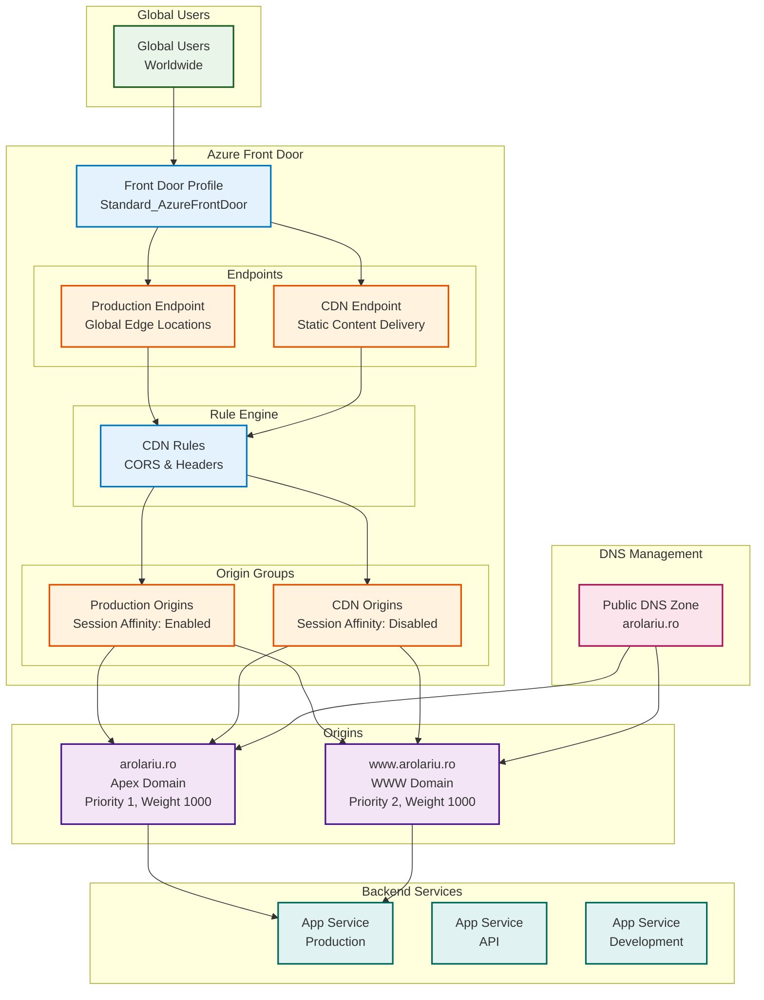

# 🌐 Network Module

This module provisions the global networking infrastructure for the arolariu.ro platform, including Azure Front Door for global content delivery, load balancing, and DNS management.

## 📋 **Overview**

The network module creates a comprehensive global networking solution that:

- **Provides global content delivery** through Azure Front Door
- **Enables high availability** with load balancing and failover
- **Implements security features** with CORS and header management
- **Manages DNS** for the domain
- **Optimizes performance** with edge caching and routing

## 🏗️ **Resources Created**

| Resource Type             | Name Pattern    | Purpose                            |
| ------------------------- | --------------- | ---------------------------------- |
| CDN Profile               | `{prefix}-afd`  | Modern Front Door CDN profile      |
| AFD Endpoint              | `production`    | Production traffic endpoint        |
| AFD Endpoint              | `cdn`           | CDN traffic endpoint               |
| Origin Group              | `production`    | Production origin servers          |
| Origin Group              | `cdn`           | CDN origin servers                 |
| Rule Set                  | `CdnRuleSet`    | Traffic routing and header rules   |
| DNS Zone                  | `{domain-name}` | Public DNS zone management         |
| DNSSEC Config             | `default`       | Cryptographic DNS security         |

## 📁 **Module Files**

| File                       | Purpose                              |
| -------------------------- | ------------------------------------ |
| `deploymentFile.bicep`     | Orchestrates network deployments     |
| `azureFrontDoor.bicep`     | Azure Front Door CDN profile         |
| `dnsZone.bicep`            | DNS Zone with all records            |

## 📊 **Architecture**



## 🔧 **Configuration**

### **Parameters**

| Parameter                  | Type   | Required | Description                                   |
| -------------------------- | ------ | -------- | --------------------------------------------- |
| `resourceConventionPrefix` | string | ✅       | Prefix for resource naming (e.g., "arolariu") |
| `resourceLocation`         | string | ✅       | Azure region for deployment                   |
| `resourceDeploymentDate`   | string | ✅       | Deployment timestamp                          |
| `mainWebsiteHostname`      | string | ✅       | Hostname of the main production website       |

### **Example Usage**

```bicep
module networkDeployment 'network/deploymentFile.bicep' = {
  name: 'networkDeployment'
  params: {
    resourceConventionPrefix: 'arolariu'
    resourceLocation: 'swedencentral'
    resourceDeploymentDate: utcNow()
    mainWebsiteHostname: websiteDeployment.outputs.mainWebsiteUrl
  }
}
```

## 📤 **Outputs**

| Output                    | Type   | Description                         |
| ------------------------- | ------ | ----------------------------------- |
| `frontDoorProductionFqdn` | string | Front Door production endpoint FQDN |
| `frontDoorCdnFqdn`        | string | Front Door CDN endpoint FQDN        |
| `frontDoorProfileId`      | string | Front Door profile resource ID      |
| `dnsZoneName`             | string | DNS zone name (arolariu.ro)         |

## 🌍 **Front Door Configuration**

### **CDN Profile Settings**

**SKU**: Standard_AzureFrontDoor

- **Global presence**: 200+ edge locations worldwide
- **Response timeout**: 16 seconds
- **Load balancing**: Advanced health probes and failover

### **Endpoints**

#### **Production Endpoint**

- **Purpose**: Primary application traffic
- **Session affinity**: Enabled (sticky sessions)
- **Load balancing**: 4 samples, 3 successful required
- **Additional latency**: 50ms tolerance

#### **CDN Endpoint**

- **Purpose**: Static content delivery
- **Session affinity**: Disabled (optimal caching)
- **Load balancing**: Same as production
- **Optimized for**: Static assets, images, scripts

### **Origin Configuration**

#### **Apex Domain (arolariu.ro)**

- **Priority**: 1 (primary)
- **Weight**: 1000
- **Ports**: HTTP (80), HTTPS (443)
- **Host header**: arolariu.ro
- **Certificate check**: Disabled for flexibility

#### **WWW Subdomain (www.arolariu.ro)**

- **Priority**: 2 (secondary)
- **Weight**: 1000
- **Ports**: HTTP (80), HTTPS (443)
- **Host header**: www.arolariu.ro
- **Certificate check**: Disabled for flexibility

## 🔒 **Security & Performance**

### **CORS Management**

The module implements sophisticated CORS handling through rule sets:

```bicep
// CORS rule configuration
conditions: [
  {
    name: 'RequestHeader'
    parameters: {
      operator: 'Equal'
      selector: 'Origin'
      matchValues: ['https://arolariu.ro', 'https://www.arolariu.ro']
    }
  }
]
actions: [
  {
    name: 'ModifyResponseHeader'
    parameters: {
      headerAction: 'Overwrite'
      headerName: 'Access-Control-Allow-Origin'
      value: 'https://arolariu.ro'
    }
  }
]
```

### **Custom Headers**

- **X-Woff2-Access**: ALLOW (for web font delivery)
- **Access-Control-Allow-Origin**: Controlled CORS policy
- **Security headers**: Can be extended with additional security policies

### **SSL/TLS**

- **HTTPS enforcement**: Automatic redirect from HTTP
- **Certificate management**: Azure-managed certificates
- **TLS versions**: Modern TLS support (1.2+)
- **HSTS**: Can be configured for enhanced security

## 🌐 **DNS Management**

### **Public DNS Zone**

The module creates a public DNS zone with DNSSEC enabled for the arolariu.ro domain:

- **Zone type**: Public
- **Global scope**: Worldwide DNS resolution
- **DNSSEC**: Enabled for cryptographic DNS security
- **TTL**: 3600 seconds (1 hour) for most records

### **DNS Records**

| Record Type | Name                      | Purpose                                      |
| ----------- | ------------------------- | -------------------------------------------- |
| **A**       | `@`                       | Apex domain → Front Door (ALIAS)             |
| **CNAME**   | `www`                     | WWW subdomain → Front Door                   |
| **CNAME**   | `cdn`                     | CDN endpoint → Front Door CDN                |
| **CNAME**   | `api`                     | API subdomain → App Service                  |
| **CNAME**   | `dev`                     | Dev subdomain → App Service                  |
| **CNAME**   | `cv`                      | CV subdomain → Static Web App                |
| **CNAME**   | `docs`                    | Docs subdomain → Static Web App              |
| **TXT**     | `_dnsauth`                | Front Door apex domain validation            |
| **TXT**     | `_dnsauth.www`            | Front Door WWW domain validation             |
| **TXT**     | `_dnsauth.cdn`            | Front Door CDN domain validation             |
| **TXT**     | `asuid.api`               | App Service API domain verification          |
| **TXT**     | `asuid.dev`               | App Service Dev domain verification          |
| **TXT**     | `_dmarc`                  | DMARC email authentication policy            |
| **TXT**     | `send.mail`               | SPF record for Resend email                  |
| **TXT**     | `resend._domainkey.mail`  | DKIM record for Resend email                 |
| **MX**      | `send.mail`               | MX record for Amazon SES                     |
| **CNAME**   | `clerk`                   | Clerk authentication service                 |
| **CNAME**   | `accounts`                | Clerk accounts service                       |
| **CNAME**   | `clkmail`                 | Clerk mail service                           |
| **CNAME**   | `clk._domainkey`          | Clerk DKIM key 1                             |
| **CNAME**   | `clk2._domainkey`         | Clerk DKIM key 2                             |

### **Third-Party Service Integration**

#### **Clerk Authentication**
- `clerk.arolariu.ro` → `frontend-api.clerk.services`
- `accounts.arolariu.ro` → `accounts.clerk.services`
- DKIM records for email authentication

#### **Resend Email Service**
- SPF record: `v=spf1 include:amazonses.com ~all`
- DKIM public key for email signing
- MX record pointing to Amazon SES

#### **DMARC Policy**
- `v=DMARC1; p=none; rua=mailto:admin@arolariu.ro`
- Policy: None (monitoring mode)
- Reports sent to admin@arolariu.ro

### **DNS Configuration Example**

```bash
# Example DNS records for the zone
# A record for apex domain (ALIAS to Front Door)
az network dns record-set a add-record \
  --resource-group "arolariu-rg" \
  --zone-name "arolariu.ro" \
  --record-set-name "@" \
  --ipv4-address "20.103.85.180"

# CNAME for www subdomain
az network dns record-set cname set-record \
  --resource-group "arolariu-rg" \
  --zone-name "arolariu.ro" \
  --record-set-name "www" \
  --cname "arolariu.ro"
```

## 💰 **Cost Considerations**

| Resource                   | Tier/SKU                | Estimated Monthly Cost\* |
| -------------------------- | ----------------------- | ------------------------ |
| Azure Front Door (Legacy)  | Standard                | €5-15                    |
| CDN Profile (Standard AFD) | Standard_AzureFrontDoor | €20-50                   |
| DNS Zone                   | Public zone             | €0.50                    |
| **Data Transfer**          | Global egress           | €5-20                    |
| **Total**                  |                         | **€30-85**               |

\*Estimates based on moderate traffic (1-10GB/month). Costs vary significantly with traffic volume.

### **Cost Optimization**

- **Caching strategies**: Reduce origin requests
- **Compression**: Enable gzip/brotli for bandwidth savings
- **Geographic routing**: Route traffic to nearest origins
- **Health probes**: Minimize health check frequency

## 🔧 **Customization Options**

### **Adding Custom Domains**

```bicep
// Add custom domain to Front Door endpoint
resource customDomain 'Microsoft.Cdn/profiles/customDomains@2024-05-01-preview' = {
  parent: frontDoorProfile
  name: 'custom-domain'
  properties: {
    hostName: 'api.arolariu.ro'
    tlsSettings: {
      certificateType: 'ManagedCertificate'
      minimumTlsVersion: 'TLS12'
    }
  }
}
```

### **Advanced Routing Rules**

```bicep
// Example: API routing rule
resource apiRoutingRule 'Microsoft.Cdn/profiles/afdEndpoints/routes@2024-05-01-preview' = {
  parent: frontDoorProductionEndpoint
  name: 'api-route'
  properties: {
    customDomains: [{ id: apiCustomDomain.id }]
    originGroup: { id: apiOriginGroup.id }
    patternsToMatch: ['/api/*']
    supportedProtocols: ['Https']
    httpsRedirect: 'Enabled'
  }
}
```

### **WAF Integration**

```bicep
// Web Application Firewall policy
resource wafPolicy 'Microsoft.Network/frontDoorWebApplicationFirewallPolicies@2022-05-01' = {
  name: 'waf-policy'
  location: 'Global'
  sku: { name: 'Standard_AzureFrontDoor' }
  properties: {
    policySettings: {
      enabledState: 'Enabled'
      mode: 'Prevention'
    }
  }
}
```

## 🛠️ **Maintenance**

### **Monitoring & Alerting**

- **Health probes**: Automatic endpoint health monitoring
- **Metrics**: Traffic, latency, error rates via Azure Monitor
- **Alerts**: Configure alerts for high latency or failures
- **Logs**: Access logs and diagnostic data

### **Performance Optimization**

```bash
# Monitor Front Door performance
az monitor metrics list \
  --resource "/subscriptions/{sub}/resourceGroups/{rg}/providers/Microsoft.Cdn/profiles/arolariu-afd" \
  --metric "OriginLatency,OriginHealthPercentage" \
  --start-time "2024-01-01T00:00:00Z"

# Check endpoint health
az network front-door show \
  --name "arolariu-afd" \
  --resource-group "arolariu-rg" \
  --query "backendPools[].backends[].backendHostHeader"
```

## 🔄 **Dependencies**

### **Required Dependencies**

**None** - The network module can be deployed independently.

### **Dependent Modules**

- **Sites Module**: Web applications that serve as origins
- **Observability Module**: Monitoring and logging integration

### **External Dependencies**

- **Domain ownership**: Valid ownership of the domain
- **DNS delegation**: Nameserver delegation to Azure DNS
- **SSL certificates**: Domain validation for managed certificates

## 📊 **Deployment Flow**

1. **Network Module**: Deploy Front Door and DNS infrastructure
2. **Sites Module**: Deploy origin applications
3. **DNS Configuration**: Configure A/CNAME records
4. **SSL/TLS Setup**: Enable managed certificates
5. **Custom Domains**: Add additional domains if needed
6. **Routing Rules**: Configure advanced routing
7. **WAF Policies**: Add security policies (optional)

## 🚨 **Troubleshooting**

### **Common Issues**

| Issue                      | Symptoms                      | Solution                                           |
| -------------------------- | ----------------------------- | -------------------------------------------------- |
| **DNS propagation delays** | Domain not resolving          | Wait 24-48h for global DNS propagation             |
| **SSL certificate issues** | HTTPS errors or warnings      | Verify domain ownership and certificate validation |
| **Origin health failures** | 502/503 errors                | Check backend application health and accessibility |
| **CORS errors**            | Cross-origin request failures | Review and update CORS rule configurations         |
| **High latency**           | Slow response times           | Check origin performance and Front Door routing    |

### **Validation Commands**

```bash
# Test Front Door endpoint
curl -I https://arolariu-afd-production.azurefd.net

# Check DNS resolution
nslookup arolariu.ro
dig arolariu.ro

# Verify SSL certificate
openssl s_client -connect arolariu.ro:443 -servername arolariu.ro

# Test CORS headers
curl -H "Origin: https://arolariu.ro" \
     -H "Access-Control-Request-Method: GET" \
     -H "Access-Control-Request-Headers: X-Requested-With" \
     -X OPTIONS \
     https://arolariu.ro
```

### **Performance Testing**

```bash
# Load test Front Door endpoint
ab -n 1000 -c 10 https://arolariu.ro/

# Test from different geographic locations
# Use tools like GTmetrix, Pingdom, or WebPageTest

# Monitor real-time performance
az monitor metrics list \
  --resource "/subscriptions/{sub}/resourceGroups/{rg}/providers/Microsoft.Cdn/profiles/arolariu-afd" \
  --metric "RequestCount,ResponseSize,OriginLatency"
```

## 📚 **References**

- [Azure Front Door](https://docs.microsoft.com/en-us/azure/frontdoor/)
- [Azure DNS](https://docs.microsoft.com/en-us/azure/dns/)
- [CDN Profiles](https://docs.microsoft.com/en-us/azure/cdn/)
- [Front Door Routing](https://docs.microsoft.com/en-us/azure/frontdoor/front-door-routing-architecture)
- [Azure Front Door Security](https://docs.microsoft.com/en-us/azure/frontdoor/front-door-faq)

---

**Module Version**: 2.0.0  
**Last Updated**: December 2025
**Maintainer**: Alexandru-Razvan Olariu
