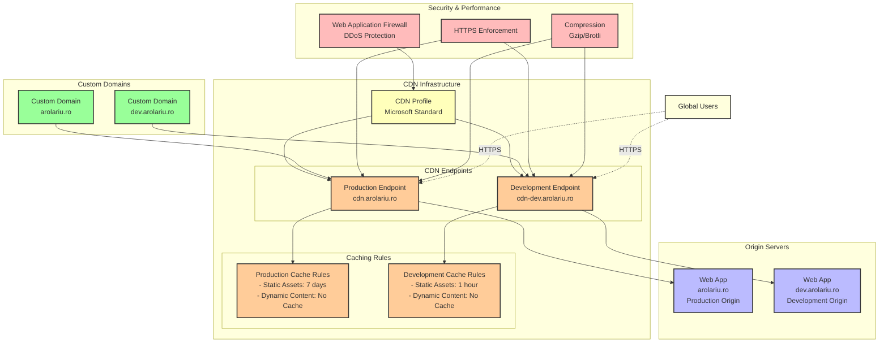

# Network Resources

This diagram shows the network and CDN infrastructure.

```mermaid
graph TB
    subgraph "CDN Infrastructure"
        PROFILE[CDN Profile<br/>Microsoft Standard]
        subgraph "CDN Endpoints"
            EP_PROD[Production Endpoint<br/>cdn.arolariu.ro]
            EP_DEV[Development Endpoint<br/>cdn-dev.arolariu.ro]
        end
        subgraph "Caching Rules"
            CACHE_PROD[Production Cache Rules<br/>- Static Assets: 7 days<br/>- Dynamic Content: No Cache]
            CACHE_DEV[Development Cache Rules<br/>- Static Assets: 1 hour<br/>- Dynamic Content: No Cache]
        end
    end

    subgraph "Origin Servers"
        WA_PROD[Web App<br/>arolariu.ro<br/>Production Origin]
        WA_DEV[Web App<br/>dev.arolariu.ro<br/>Development Origin]
    end

    subgraph "Custom Domains"
        CD_PROD[Custom Domain<br/>arolariu.ro]
        CD_DEV[Custom Domain<br/>dev.arolariu.ro]
    end

    subgraph "Security & Performance"
        HTTPS[HTTPS Enforcement]
        COMP[Compression<br/>Gzip/Brotli]
        WAF[Web Application Firewall<br/>DDoS Protection]
    end

    PROFILE --> EP_PROD
    PROFILE --> EP_DEV
    
    EP_PROD --> WA_PROD
    EP_DEV --> WA_DEV
    
    EP_PROD --> CACHE_PROD
    EP_DEV --> CACHE_DEV
    
    CD_PROD --> EP_PROD
    CD_DEV --> EP_DEV
    
    HTTPS --> EP_PROD
    HTTPS --> EP_DEV
    COMP --> EP_PROD
    COMP --> EP_DEV
    WAF --> PROFILE

    USERS[Global Users] -.->|HTTPS| EP_PROD
    USERS -.->|HTTPS| EP_DEV

    classDef cdn fill:#ffb,stroke:#333,stroke-width:2px
    classDef endpoint fill:#fc9,stroke:#333,stroke-width:2px
    classDef origin fill:#bbf,stroke:#333,stroke-width:2px
    classDef domain fill:#9f9,stroke:#333,stroke-width:2px
    classDef security fill:#fbb,stroke:#333,stroke-width:2px
    classDef external fill:#ffd,stroke:#333,stroke-width:2px

    class PROFILE cdn
    class EP_PROD,EP_DEV,CACHE_PROD,CACHE_DEV endpoint
    class WA_PROD,WA_DEV origin
    class CD_PROD,CD_DEV domain
    class HTTPS,COMP,WAF security
    class USERS external
```
