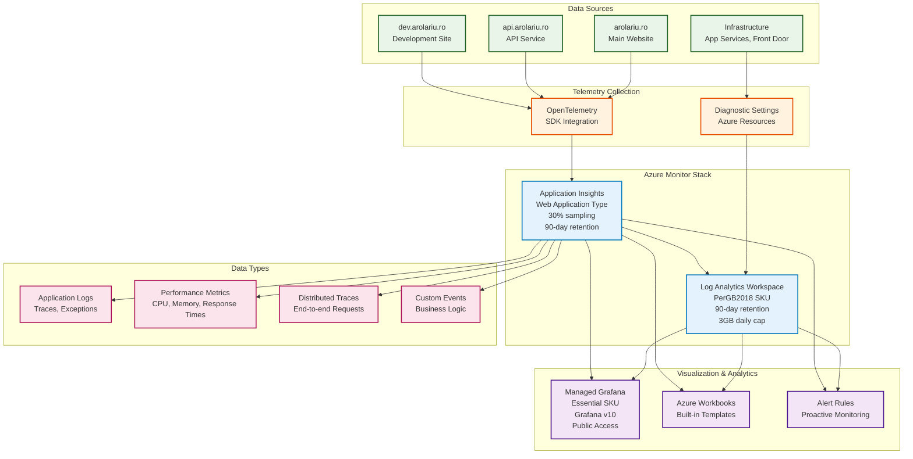

# 📊 Observability Module

This module provisions a comprehensive monitoring and observability stack for the arolariu.ro platform, including Application Insights, Log Analytics, and Managed Grafana for telemetry collection, analysis, and visualization.

## 📋 **Overview**

The observability module creates a complete monitoring solution that:

- **Collects telemetry data** from all applications and infrastructure
- **Provides centralized logging** through Log Analytics workspace
- **Enables application monitoring** with Application Insights
- **Offers advanced visualization** through Managed Grafana
- **Supports OpenTelemetry (OTel)** for modern observability
- **Implements cost controls** with data retention and capping

## 🏗️ **Resources Created**

| Resource Type           | Name Pattern         | Purpose                               |
| ----------------------- | -------------------- | ------------------------------------- |
| Log Analytics Workspace | `{prefix}-workspace` | Centralized log storage and analysis  |
| Application Insights    | `{prefix}-insights`  | Application performance monitoring    |
| Managed Grafana         | `{prefix}-grafana`   | Advanced dashboards and visualization |

## 📊 **Architecture**



## 🔧 **Configuration**

### **Parameters**

| Parameter                  | Type   | Required | Description                                   |
| -------------------------- | ------ | -------- | --------------------------------------------- |
| `resourceConventionPrefix` | string | ✅       | Prefix for resource naming (e.g., "arolariu") |
| `resourceDeploymentDate`   | string | ❌       | Deployment timestamp (defaults to utcNow())   |

### **Example Usage**

```bicep
module observabilityDeployment 'observability/deploymentFile.bicep' = {
  name: 'observabilityDeployment'
  params: {
    resourceConventionPrefix: 'arolariu'
  }
}
```

## 📤 **Outputs**

| Output                       | Type   | Description                            |
| ---------------------------- | ------ | -------------------------------------- |
| `logAnalyticsWorkspaceId`    | string | Resource ID of Log Analytics workspace |
| `managedGrafanaInstanceName` | string | Name of the Managed Grafana instance   |

## 📈 **Component Details**

### **Log Analytics Workspace**

**Configuration:**

- **SKU**: PerGB2018 (pay-per-GB ingestion)
- **Retention**: 90 days
- **Daily cap**: 3GB (cost control)
- **Access**: Public network access enabled
- **Permissions**: Resource-based access control

**Features:**

- **KQL queries**: Advanced log analysis with Kusto Query Language
- **Log correlation**: Cross-service log analysis
- **Custom tables**: Extensible data schema
- **Data export**: Integration with external systems

**Cost Management:**

```bicep
workspaceCapping: {
  dailyQuotaGb: 3  // Prevents unexpected costs
}
```

### **Application Insights**

**Configuration:**

- **Type**: Web application
- **Sampling**: 30% (optimized for cost/visibility balance)
- **Retention**: 90 days
- **Integration**: Log Analytics workspace
- **Ingestion mode**: LogAnalytics (unified logs)

**Telemetry Types:**

- **Requests**: HTTP request tracking
- **Dependencies**: External service calls
- **Exceptions**: Unhandled exceptions and errors
- **Custom events**: Business logic tracking
- **Performance counters**: System metrics
- **Page views**: Client-side analytics (web apps)

**Sampling Strategy:**

- **30% sampling**: Reduces costs while maintaining statistical significance
- **Adaptive sampling**: Automatic adjustment based on traffic
- **Fixed-rate sampling**: Consistent data collection

### **Managed Grafana**

**Configuration:**

- **SKU**: Essential (cost-optimized)
- **Version**: Grafana 10 (latest major version)
- **Zone redundancy**: Disabled (cost optimization)
- **API keys**: Enabled for programmatic access
- **SMTP**: Disabled (using Azure notifications)

**Features:**

- **Azure Monitor integration**: Native data source connectivity
- **Custom dashboards**: Flexible visualization options
- **Alerting**: Advanced alert management
- **Plugin ecosystem**: Extensible with community plugins
- **Role-based access**: Team collaboration features

## 🔍 **Monitoring Capabilities**

### **Application Performance Monitoring (APM)**

```javascript
// Example: Application Insights SDK integration
import { ApplicationInsights } from "@microsoft/applicationinsights-web";

const appInsights = new ApplicationInsights({
  config: {
    instrumentationKey: "your-instrumentation-key",
    enableAutoRouteTracking: true,
    samplingPercentage: 30,
  },
});

appInsights.loadAppInsights();
appInsights.trackPageView();
```

### **Infrastructure Monitoring**

- **App Service metrics**: CPU, memory, response times
- **Front Door performance**: Request latency, error rates
- **Storage metrics**: Blob operations, queue length
- **Database performance**: Query execution, connection pool

### **Custom Metrics**

```csharp
// Example: Custom telemetry in .NET API
using Microsoft.ApplicationInsights;

public class OrderService
{
    private readonly TelemetryClient _telemetryClient;

    public async Task ProcessOrder(Order order)
    {
        using var activity = _telemetryClient.StartOperation<RequestTelemetry>("ProcessOrder");

        try
        {
            // Business logic
            await SaveOrder(order);

            // Custom event
            _telemetryClient.TrackEvent("OrderProcessed",
                new Dictionary<string, string>
                {
                    ["OrderId"] = order.Id,
                    ["CustomerId"] = order.CustomerId
                });
        }
        catch (Exception ex)
        {
            _telemetryClient.TrackException(ex);
            throw;
        }
    }
}
```

## 📊 **Sample Queries & Dashboards**

### **Useful KQL Queries**

```kusto
// Application error rate over time
requests
| where timestamp > ago(1h)
| summarize
    Total = count(),
    Errors = countif(success == false)
    by bin(timestamp, 5m)
| extend ErrorRate = (Errors * 100.0) / Total
| render timechart

// Top exceptions by count
exceptions
| where timestamp > ago(24h)
| summarize Count = count() by type, outerMessage
| order by Count desc
| take 10

// Response time percentiles
requests
| where timestamp > ago(1h)
| summarize
    p50 = percentile(duration, 50),
    p95 = percentile(duration, 95),
    p99 = percentile(duration, 99)
    by bin(timestamp, 5m)
| render timechart

// Dependency call analysis
dependencies
| where timestamp > ago(1h)
| summarize
    CallCount = count(),
    AvgDuration = avg(duration),
    FailureRate = countif(success == false) * 100.0 / count()
    by name, target
| order by CallCount desc
```

### **Grafana Dashboard Examples**

```json
{
  "dashboard": {
    "title": "Application Performance Overview",
    "panels": [
      {
        "title": "Request Rate",
        "type": "stat",
        "targets": [
          {
            "rawSql": "requests | summarize count() by bin(timestamp, 1m)"
          }
        ]
      },
      {
        "title": "Response Time Distribution",
        "type": "histogram",
        "targets": [
          {
            "rawSql": "requests | project duration"
          }
        ]
      }
    ]
  }
}
```

## 🚨 **Alerting & Notifications**

### **Recommended Alert Rules**

```bicep
// Example: High error rate alert
resource errorRateAlert 'Microsoft.Insights/metricAlerts@2018-03-01' = {
  name: 'high-error-rate'
  location: 'Global'
  properties: {
    description: 'Alert when error rate exceeds 5%'
    severity: 2
    enabled: true
    evaluationFrequency: 'PT1M'
    windowSize: 'PT5M'
    criteria: {
      'odata.type': 'Microsoft.Azure.Monitor.SingleResourceMultipleMetricCriteria'
      allOf: [
        {
          name: 'ErrorRate'
          metricName: 'requests/failed'
          operator: 'GreaterThan'
          threshold: 5
          timeAggregation: 'Average'
        }
      ]
    }
  }
}
```

### **Common Alert Scenarios**

- **High error rate**: > 5% failed requests
- **Slow response time**: > 2s average response time
- **High CPU usage**: > 80% for 5 minutes
- **Memory pressure**: > 85% memory usage
- **Dependency failures**: External service unavailable
- **Quota exceeded**: Daily log ingestion cap reached

## 💰 **Cost Considerations**

| Component            | Configuration              | Monthly Cost Estimate\* |
| -------------------- | -------------------------- | ----------------------- |
| Log Analytics        | 3GB/day, 90-day retention  | €15-25                  |
| Application Insights | 30% sampling, web app type | €10-20                  |
| Managed Grafana      | Essential SKU              | €20-30                  |
| **Total**            |                            | **€45-75**              |

\*Estimates based on moderate application traffic. Costs scale with data volume.

### **Cost Optimization Strategies**

- **Sampling**: 30% sampling reduces ingestion costs
- **Data retention**: 90-day retention balances analysis needs with cost
- **Daily cap**: 3GB daily limit prevents cost overruns
- **Query optimization**: Efficient KQL queries reduce compute costs
- **Essential Grafana**: Cost-optimized tier for visualization

### **Cost Monitoring**

```kusto
// Monitor daily ingestion volume
Usage
| where TimeGenerated > ago(30d)
| where IsBillable == true
| summarize BillableDataGB = sum(Quantity) / 1000 by bin(TimeGenerated, 1d)
| render columnchart
```

## 🔧 **Integration Examples**

### **Application Integration**

```yaml
# Docker compose with Application Insights
version: "3.8"
services:
  webapp:
    image: myapp:latest
    environment:
      - APPLICATIONINSIGHTS_CONNECTION_STRING=${APPINSIGHTS_CONNECTION_STRING}
      - APPLICATIONINSIGHTS_SAMPLING_PERCENTAGE=30
```

### **Infrastructure Diagnostics**

```bicep
// Enable diagnostics for App Service
resource appServiceDiagnostics 'Microsoft.Insights/diagnosticSettings@2021-05-01-preview' = {
  scope: appService
  name: 'diagnostics'
  properties: {
    workspaceId: logAnalyticsWorkspace.id
    logs: [
      {
        category: 'AppServiceHTTPLogs'
        enabled: true
      }
      {
        category: 'AppServiceConsoleLogs'
        enabled: true
      }
    ]
  }
}
```

## 🛠️ **Maintenance**

### **Data Retention Management**

- **Automatic cleanup**: 90-day retention automatically purges old data
- **Archive options**: Export historical data to storage accounts
- **Compliance**: Adjust retention for regulatory requirements

### **Performance Tuning**

```kusto
// Identify expensive queries
Usage
| where TimeGenerated > ago(1d)
| where IsBillable == true
| summarize DataVolume = sum(Quantity) by Solution
| order by DataVolume desc
```

## 🔄 **Dependencies**

### **Required Dependencies**

**None** - The observability module can be deployed independently.

### **Integration Points**

- **Sites Module**: Applications integrate with Application Insights
- **Network Module**: Front Door sends diagnostics to Log Analytics
- **Storage Module**: Storage accounts can send logs to workspace
- **Identity Module**: Managed identities can access monitoring data

## 📊 **Deployment Flow**

1. **Log Analytics Workspace**: Deploy first (foundation)
2. **Application Insights**: Deploy with workspace dependency
3. **Managed Grafana**: Deploy last (visualization layer)
4. **Application Integration**: Configure apps to send telemetry
5. **Dashboard Creation**: Build monitoring dashboards
6. **Alert Configuration**: Set up proactive monitoring

## 🚨 **Troubleshooting**

### **Common Issues**

| Issue                    | Symptoms                   | Solution                                       |
| ------------------------ | -------------------------- | ---------------------------------------------- |
| **No telemetry data**    | Empty Application Insights | Verify instrumentation key and SDK integration |
| **High ingestion costs** | Unexpected billing         | Check daily cap and sampling configuration     |
| **Missing logs**         | Incomplete log data        | Verify diagnostic settings on resources        |
| **Grafana connection**   | Cannot query data sources  | Check workspace permissions and connections    |
| **Query performance**    | Slow KQL queries           | Optimize queries and add time filters          |

## 📚 **References**

- [Azure Monitor](https://docs.microsoft.com/en-us/azure/azure-monitor/)
- [Application Insights](https://docs.microsoft.com/en-us/azure/azure-monitor/app/app-insights-overview)
- [Log Analytics](https://docs.microsoft.com/en-us/azure/azure-monitor/logs/)
- [Managed Grafana](https://docs.microsoft.com/en-us/azure/managed-grafana/)
- [KQL Reference](https://docs.microsoft.com/en-us/azure/data-explorer/kusto/query/)
- [OpenTelemetry](https://opentelemetry.io/)

---

**Module Version**: 2.0.0  
**Last Updated**: June 2025  
**Maintainer**: Alexandru-Razvan Olariu
