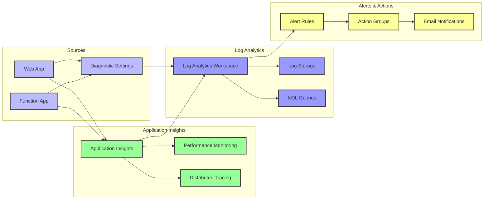

# Monitoring & Logging

This diagram shows the monitoring and logging infrastructure.

```mermaid
graph LR
    subgraph "Application Insights"
        APPI[Application Insights]
        PERF[Performance Monitoring]
        TRACE[Distributed Tracing]
    end

    subgraph "Log Analytics"
        LAW[Log Analytics Workspace]
        LOGS[Log Storage]
        QUERY[KQL Queries]
    end

    subgraph "Sources"
        WA[Web App]
        FA[Function App]
        DIAG[Diagnostic Settings]
    end

    subgraph "Alerts & Actions"
        ALERT[Alert Rules]
        AG[Action Groups]
        EMAIL[Email Notifications]
    end

    WA --> APPI
    FA --> APPI
    
    APPI --> PERF
    APPI --> TRACE
    APPI --> LAW
    
    LAW --> LOGS
    LAW --> QUERY
    
    WA --> DIAG
    FA --> DIAG
    DIAG --> LAW
    
    LAW --> ALERT
    ALERT --> AG
    AG --> EMAIL

    classDef insights fill:#9f9,stroke:#333,stroke-width:2px
    classDef analytics fill:#99f,stroke:#333,stroke-width:2px
    classDef source fill:#bbf,stroke:#333,stroke-width:2px
    classDef alert fill:#ff9,stroke:#333,stroke-width:2px

    class APPI,PERF,TRACE insights
    class LAW,LOGS,QUERY analytics
    class WA,FA,DIAG source
    class ALERT,AG,EMAIL alert
```
