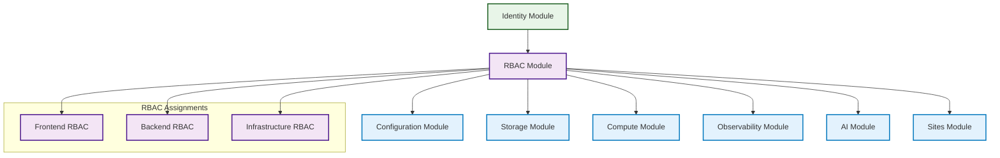

```mermaid
graph TB
    subgraph "Managed Identities"
        FRONTEND[Frontend Identity<br/>arolariu.ro, dev.arolariu.ro]
        BACKEND[Backend Identity<br/>api.arolariu.ro]
        INFRA[Infrastructure Identity<br/>CI/CD, Deployment]
    end

    subgraph "Azure Services"
        STORAGE[Storage Account<br/>Blob, Queue, Table]
        CONFIG[App Configuration<br/>Application Settings]
        VAULT[Key Vault<br/>Secrets & Certificates]
        SQL[SQL Database<br/>Relational Data]
        NOSQL[NoSQL Database<br/>Document Store]
        OPENAI[OpenAI Services<br/>AI & ML]
        ACR[Container Registry<br/>Docker Images]
    end

    subgraph "RBAC Assignments"
        subgraph "Frontend (Read-Only)"
            FR1[Storage Blob Reader]
            FR2[Storage Queue Reader]
            FR3[Storage Table Reader]
            FR4[App Config Reader]
        end

        subgraph "Backend (Contributor)"
            BC1[Storage Blob Contributor]
            BC2[SQL DB Contributor]
            BC3[NoSQL DB Contributor]
            BC4[App Config Contributor]
            BC5[OpenAI Contributor]
            BC6[Key Vault Contributor]
            BC7[Key Vault Secrets Contributor]
        end

        subgraph "Infrastructure (Mixed)"
            IC1[Storage Blob Reader]
            IC2[Storage Queue Reader]
            IC3[Storage Table Reader]
            IC4[App Config Reader]
            IC5[Key Vault Reader]
            IC6[Key Vault Secrets Reader]
            IC7[ACR Pull]
            IC8[ACR Push]
            IC9[ACR Contributor]
        end
    end

    FRONTEND --> FR1
    FRONTEND --> FR2
    FRONTEND --> FR3
    FRONTEND --> FR4

    BACKEND --> BC1
    BACKEND --> BC2
    BACKEND --> BC3
    BACKEND --> BC4
    BACKEND --> BC5
    BACKEND --> BC6
    BACKEND --> BC7

    INFRA --> IC1
    INFRA --> IC2
    INFRA --> IC3
    INFRA --> IC4
    INFRA --> IC5
    INFRA --> IC6
    INFRA --> IC7
    INFRA --> IC8
    INFRA --> IC9

    FR1 --> STORAGE
    FR2 --> STORAGE
    FR3 --> STORAGE
    FR4 --> CONFIG

    BC1 --> STORAGE
    BC2 --> SQL
    BC3 --> NOSQL
    BC4 --> CONFIG
    BC5 --> OPENAI
    BC6 --> VAULT
    BC7 --> VAULT

    IC1 --> STORAGE
    IC2 --> STORAGE
    IC3 --> STORAGE
    IC4 --> CONFIG
    IC5 --> VAULT
    IC6 --> VAULT
    IC7 --> ACR
    IC8 --> ACR
    IC9 --> ACR

    classDef identity fill:#e8f5e8,stroke:#1b5e20,stroke-width:2px
    classDef service fill:#e3f2fd,stroke:#0277bd,stroke-width:2px
    classDef frontend fill:#fff3e0,stroke:#e65100,stroke-width:2px
    classDef backend fill:#f3e5f5,stroke:#4a148c,stroke-width:2px
    classDef infrastructure fill:#e0f2f1,stroke:#00695c,stroke-width:2px

    class FRONTEND,BACKEND,INFRA identity
    class STORAGE,CONFIG,VAULT,SQL,NOSQL,OPENAI,ACR service
    class FR1,FR2,FR3,FR4 frontend
    class BC1,BC2,BC3,BC4,BC5,BC6,BC7 backend
    class IC1,IC2,IC3,IC4,IC5,IC6,IC7,IC8,IC9 infrastructure
```

# 🔐 RBAC Module

This module manages Role-Based Access Control (RBAC) assignments for managed identities across the arolariu.ro platform infrastructure. It implements a comprehensive security model with least-privilege access principles for frontend, backend, and infrastructure identities.

## 📋 Overview

The RBAC module establishes secure access patterns for three distinct managed identities:

- **Frontend Identity**: Read-only access to storage and configuration services
- **Backend Identity**: Full contributor access to data services and AI resources
- **Infrastructure Identity**: Container registry management and read-only infrastructure access

This module ensures secure, passwordless authentication across all Azure services while maintaining strict separation of concerns between application tiers.

## 🏗️ Resources Created

| Resource Type   | Purpose                                      | Count  |
| --------------- | -------------------------------------------- | ------ |
| Role Assignment | Frontend managed identity RBAC (read-only)   | 4      |
| Role Assignment | Backend managed identity RBAC (contributor)  | 8      |
| Role Assignment | Infrastructure managed identity RBAC (mixed) | 9      |
| **Total**       | **Complete RBAC security model**             | **21** |

## 📊 Architecture



## 🔧 Parameters

| Parameter           | Type         | Required | Description                                            |
| ------------------- | ------------ | -------- | ------------------------------------------------------ |
| `managedIdentities` | `identity[]` | ✅       | Array of managed identities requiring RBAC assignments |

### Identity Type Structure

```bicep
type identity = {
  name: string          // Identity resource name
  displayName: string   // Human-readable display name
  resourceId: string    // Azure Resource ID
  principalId: string   // Azure Principal ID (GUID)
}
```

### Expected Identity Array Order

The module expects the `managedIdentities` array in this specific order:

1. **Index 0**: Frontend Identity (arolariu.ro, dev.arolariu.ro)
2. **Index 1**: Backend Identity (api.arolariu.ro)
3. **Index 2**: Infrastructure Identity (CI/CD, deployment)

## 📤 Outputs

This module does not produce outputs as it only configures RBAC assignments.

## 🛡️ Security Model

### Frontend Identity Permissions

**Purpose**: Web applications requiring read-only access to shared resources

| Service                 | Role                          | Role ID                                | Access Level |
| ----------------------- | ----------------------------- | -------------------------------------- | ------------ |
| Storage Account (Blob)  | Storage Blob Data Reader      | `2a2b9908-6ea1-4ae2-8e65-a410df84e7d1` | Read-only    |
| Storage Account (Queue) | Storage Queue Data Reader     | `19e7f393-937e-4f77-808e-94535e297925` | Read-only    |
| Storage Account (Table) | Storage Table Data Reader     | `76199698-9eea-4c19-bc75-cec21354c6b6` | Read-only    |
| App Configuration       | App Configuration Data Reader | `516239f1-63e1-4d78-a4de-a74fb236a071` | Read-only    |

**Use Cases**:

- Reading static assets from blob storage
- Accessing application configuration
- Reading cached data from table storage
- Processing messages from queues

### Backend Identity Permissions

**Purpose**: API services requiring full access to data and AI services

| Service                | Role                           | Role ID                                | Access Level |
| ---------------------- | ------------------------------ | -------------------------------------- | ------------ |
| Storage Account (Blob) | Storage Blob Data Contributor  | `ba92f5b4-2d11-453d-a403-e96b0029c9fe` | Read/Write   |
| SQL Database           | SQL DB Contributor             | `9b7fa17d-e63e-47b0-bb0a-15c516ac86ec` | Full access  |
| NoSQL Database         | DocumentDB Account Contributor | `00000000-0000-0000-0000-000000000002` | Full access  |
| App Configuration      | App Configuration Data Owner   | `fe86443c-f201-4fc4-9d2a-ac61149fbda0` | Full access  |
| OpenAI Services        | Cognitive Services Contributor | `a001fd3d-188f-4b5d-821b-7da978bf7442` | Full access  |
| Key Vault              | Key Vault Contributor          | `f25e0fa2-a7c8-4377-a976-54943a77a395` | Management   |
| Key Vault (Secrets)    | Key Vault Secrets Officer      | `b86a8fe4-44ce-4948-aee5-eccb2c155cd7` | Full secrets |

**Use Cases**:

- Writing user data to storage
- Managing database records
- Updating application configuration
- Accessing AI/ML services
- Managing secrets and certificates

### Infrastructure Identity Permissions

**Purpose**: Deployment and infrastructure management with limited access

| Service                 | Role                          | Role ID                                | Access Level |
| ----------------------- | ----------------------------- | -------------------------------------- | ------------ |
| Storage Account (Blob)  | Storage Blob Data Reader      | `2a2b9908-6ea1-4ae2-8e65-a410df84e7d1` | Read-only    |
| Storage Account (Queue) | Storage Queue Data Reader     | `19e7f393-937e-4f77-808e-94535e297925` | Read-only    |
| Storage Account (Table) | Storage Table Data Reader     | `76199698-9eea-4c19-bc75-cec21354c6b6` | Read-only    |
| App Configuration       | App Configuration Data Reader | `516239f1-63e1-4d78-a4de-a74fb236a071` | Read-only    |
| Key Vault               | Key Vault Reader              | `21090545-7ca7-4776-b22c-e363652d74d2` | Read-only    |
| Key Vault (Secrets)     | Key Vault Secrets User        | `4633458b-17de-408a-b874-0445c86b69e6` | Read-only    |
| Container Registry      | AcrPull                       | `7f951dda-4ed3-4680-a7ca-43fe172d538d` | Pull images  |
| Container Registry      | AcrPush                       | `8311e382-0749-4cb8-b61a-304f252e45ec` | Push images  |
| Container Registry      | AcrContributor                | `2efddaa5-3f1f-4df3-97df-af3f13818f4c` | Full access  |

**Use Cases**:

- CI/CD pipeline deployments
- Container image management
- Infrastructure monitoring
- Configuration validation

## 🛠️ Usage Example

```bicep
module rbacDeployment 'rbac/deploymentFile.bicep' = {
  name: 'rbacDeployment-${resourceDeploymentDate}'
  params: {
    managedIdentities: [
      {
        name: 'frontend-identity'
        displayName: 'Frontend Web Applications'
        resourceId: '/subscriptions/.../providers/Microsoft.ManagedIdentity/userAssignedIdentities/frontend-identity'
        principalId: 'xxxxxxxx-xxxx-xxxx-xxxx-xxxxxxxxxxxx'
      }
      {
        name: 'backend-identity'
        displayName: 'Backend API Services'
        resourceId: '/subscriptions/.../providers/Microsoft.ManagedIdentity/userAssignedIdentities/backend-identity'
        principalId: 'yyyyyyyy-yyyy-yyyy-yyyy-yyyyyyyyyyyy'
      }
      {
        name: 'infrastructure-identity'
        displayName: 'Infrastructure Management'
        resourceId: '/subscriptions/.../providers/Microsoft.ManagedIdentity/userAssignedIdentities/infrastructure-identity'
        principalId: 'zzzzzzzz-zzzz-zzzz-zzzz-zzzzzzzzzzzz'
      }
    ]
  }
}
```

## 🔄 Dependencies

### **Required Dependencies**

- **Identity Module**: Must deploy managed identities before RBAC assignments
- **Resource Group**: Target resource group must exist for role assignments

### **Dependent Modules**

- **All other modules**: Rely on RBAC assignments for secure access

## 📊 Deployment Flow



1. **Identity Module** creates managed identities
2. **RBAC Module** assigns appropriate permissions
3. **All other modules** leverage secure identity-based access

## 🔍 Security Best Practices

### **Least Privilege Access**

- Frontend identities receive only read access to required resources
- Backend identities get contributor access only to data they manage
- Infrastructure identities have mixed permissions based on operational needs

### **Principal ID Usage**

- All role assignments use `principalId` (GUID) for security
- No use of resource IDs or names in role assignments
- Proper principal type specification (`ServicePrincipal`)

### **Resource Scoping**

- Role assignments scoped to resource group level
- No subscription-level permissions granted
- Explicit service-level permissions only

### **Audit and Compliance**

- All role assignments include descriptive names and descriptions
- GUID-based assignment names ensure uniqueness
- Clear documentation of permissions for compliance reviews

## 🚨 Troubleshooting

| Issue                     | Symptoms                          | Solution                                       |
| ------------------------- | --------------------------------- | ---------------------------------------------- |
| **Role assignment fails** | `Principal not found` error       | Verify managed identity exists and principalId |
| **Permission denied**     | `403 Forbidden` errors            | Check role assignment and service permissions  |
| **Duplicate assignment**  | `Assignment already exists` error | GUID-based names should prevent this           |
| **Wrong array order**     | Frontend gets backend permissions | Ensure identity array follows correct order    |
| **Missing principal ID**  | `Invalid principal ID` error      | Verify principalId is GUID, not resource ID    |

### **Validation Commands**

```bash
# Check role assignments for a managed identity
az role assignment list \
  --assignee "xxxxxxxx-xxxx-xxxx-xxxx-xxxxxxxxxxxx" \
  --output table

# Verify managed identity details
az identity show \
  --name "frontend-identity" \
  --resource-group "arolariu-rg" \
  --query "{name:name, principalId:principalId, clientId:clientId}"

# List all role assignments in resource group
az role assignment list \
  --resource-group "arolariu-rg" \
  --output table
```

### **Permission Testing**

```bash
# Test storage access with managed identity
az storage blob list \
  --account-name "storageaccount" \
  --container-name "container" \
  --auth-mode login

# Test Key Vault access
az keyvault secret list \
  --vault-name "keyvault" \
  --output table
```

## 📚 References

- [Azure RBAC Documentation](https://docs.microsoft.com/en-us/azure/role-based-access-control/)
- [Built-in Azure Roles](https://docs.microsoft.com/en-us/azure/role-based-access-control/built-in-roles)
- [Managed Identity Documentation](https://docs.microsoft.com/en-us/azure/active-directory/managed-identities-azure-resources/)
- [Azure Security Best Practices](https://docs.microsoft.com/en-us/azure/security/fundamentals/identity-management-best-practices)

---

**Module Version**: 2.0.0  
**Last Updated**: July 2025  
**Maintainer**: Alexandru-Razvan Olariu
