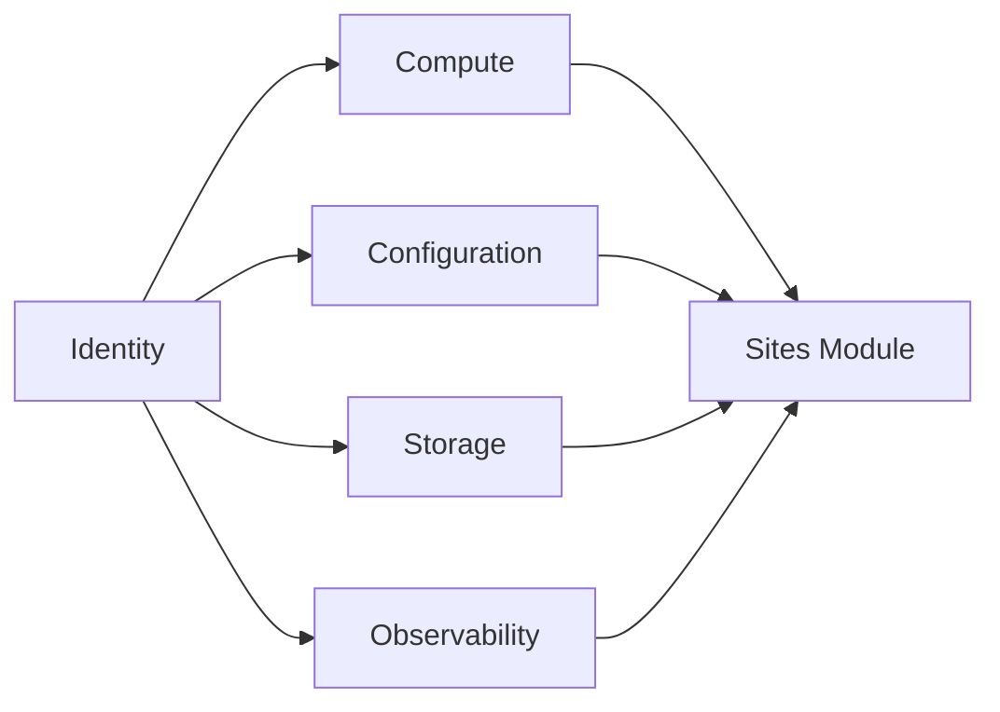

```mermaid
graph TB
    subgraph "Azure Front Door"
        AFD[Azure Front Door<br/>Global Load Balancer]
    end

    subgraph "Production Environment"
        PROD_PLAN[Production App Service Plan<br/>B2 SKU]

        MAIN[www-arolariu-ro<br/>Main Website<br/>Linux Container]
        API[api-arolariu-ro<br/>API Services<br/>.NET Core 8.0]

        PROD_PLAN --> MAIN
        PROD_PLAN --> API
    end

    subgraph "Development Environment"
        DEV_PLAN[Development App Service Plan<br/>B1 SKU]

        DEV[dev-arolariu-ro<br/>Development Site<br/>Linux Container]

        DEV_PLAN --> DEV
    end

    subgraph "Static Content"
        DOCS[docs-arolariu-ro<br/>Static Web App<br/>Free Tier]
    end

    subgraph "Dependencies"
        MI_FE[Frontend Managed Identity]
        MI_BE[Backend Managed Identity]
        CONFIG[App Configuration]
        STORAGE[Storage Account]
        MONITOR[Application Insights]
    end

    AFD --> MAIN
    AFD --> API
    AFD --> DEV
    AFD --> DOCS

    MI_FE --> MAIN
    MI_FE --> DEV
    MI_BE --> API

    CONFIG --> MAIN
    CONFIG --> API
    CONFIG --> DEV

    STORAGE --> MAIN
    STORAGE --> API

    MONITOR --> MAIN
    MONITOR --> API
    MONITOR --> DEV

    classDef production fill:#e1f5fe,stroke:#01579b,stroke-width:2px
    classDef development fill:#f3e5f5,stroke:#4a148c,stroke-width:2px
    classDef static fill:#e8f5e8,stroke:#1b5e20,stroke-width:2px
    classDef dependency fill:#fff3e0,stroke:#e65100,stroke-width:2px

    class PROD_PLAN,MAIN,API production
    class DEV_PLAN,DEV development
    class DOCS static
    class MI_FE,MI_BE,CONFIG,STORAGE,MONITOR dependency
```

# 🌍 Sites Module

This module provisions all web applications and static sites for the arolariu.ro platform, including the main website, API services, development environment, and documentation portal.

## 📋 **Overview**

The sites module creates four distinct web applications and static sites:

- **Main Website**: Production frontend application (arolariu.ro)
- **API Service**: RESTful backend services (api.arolariu.ro)
- **Development Site**: Development environment (dev.arolariu.ro)
- **Documentation Portal**: Static documentation site (docs.arolariu.ro)

## 🏗️ **Resources Created**

| Resource Type  | Name Pattern       | Environment | Purpose                         |
| -------------- | ------------------ | ----------- | ------------------------------- |
| App Service    | `www-arolariu-ro`  | Production  | Main frontend website           |
| App Service    | `api-arolariu-ro`  | Production  | Backend API services            |
| App Service    | `dev-arolariu-ro`  | Development | Development/staging environment |
| Static Web App | `docs-arolariu-ro` | Production  | Documentation portal            |

## 📊 **Architecture**



## 🔧 **Configuration**

### **Parameters**

| Parameter                   | Type   | Required | Description                                 |
| --------------------------- | ------ | -------- | ------------------------------------------- |
| `productionAppPlanId`       | string | ✅       | Resource ID of production App Service Plan  |
| `developmentAppPlanId`      | string | ✅       | Resource ID of development App Service Plan |
| `managedIdentityFrontendId` | string | ✅       | Resource ID of frontend managed identity    |
| `managedIdentityBackendId`  | string | ✅       | Resource ID of backend managed identity     |

### **Example Usage**

```bicep
module websiteDeployment 'sites/deploymentFile.bicep' = {
  name: 'websiteDeployment'
  params: {
    productionAppPlanId: '/subscriptions/.../providers/Microsoft.Web/serverfarms/prod-plan'
    developmentAppPlanId: '/subscriptions/.../providers/Microsoft.Web/serverfarms/dev-plan'
    managedIdentityFrontendId: '/subscriptions/.../providers/Microsoft.ManagedIdentity/userAssignedIdentities/frontend-id'
    managedIdentityBackendId: '/subscriptions/.../providers/Microsoft.ManagedIdentity/userAssignedIdentities/backend-id'
  }
}
```

## 📤 **Outputs**

| Output           | Type   | Description                              |
| ---------------- | ------ | ---------------------------------------- |
| `mainWebsiteUrl` | string | Default hostname of the main website     |
| `devWebsiteUrl`  | string | Default hostname of the development site |

## 🌐 **Application Details**

### **Main Website (www-arolariu-ro)**

**Specifications:**

- **Platform**: Linux containers
- **Runtime**: Node.js 22
- **SSL**: HTTPS only (TLS 1.3 minimum)
- **Scaling**: Elastic with minimum 1 instance
- **Health Check**: `/` endpoint

**Security Features:**

- IP restrictions (Azure Front Door only)
- User-assigned managed identity
- FTPS disabled
- Client certificate support disabled

**Configuration:**

- Always On enabled
- HTTP/2 enabled
- WebSockets enabled
- CORS configured for trusted origins
- Sticky sessions enabled

### **API Service (api-arolariu-ro)**

**Specifications:**

- **Platform**: Linux App Service
- **Runtime**: .NET Core 8.0
- **SSL**: HTTPS only
- **Authentication**: Managed Identity
- **Load Balancing**: Least Requests

**Features:**

- Request tracing enabled
- HTTP logging enabled (35MB limit)
- WebSockets support
- Key Vault integration via managed identity

### **Development Site (dev-arolariu-ro)**

**Specifications:**

- **Platform**: Linux containers
- **Runtime**: Node.js 22
- **SSL**: HTTPS only (TLS 1.1 minimum)
- **Access**: Open (no IP restrictions)

**Development-Specific Settings:**

- Relaxed TLS requirements
- Open network access for testing
- Container-based deployment
- GitHub Actions integration

### **Documentation Portal (docs-arolariu-ro)**

**Specifications:**

- **Type**: Static Web App (Free tier)
- **Source**: GitHub repository
- **Branch**: main
- **CDN**: Disabled (cost optimization)

**Features:**

- Automatic deployment from GitHub
- No staging environments
- Configuration file updates allowed

## 🔒 **Security Features**

### **Network Security**

| Application | Access Control             | IP Restrictions       |
| ----------- | -------------------------- | --------------------- |
| Main Site   | Azure Front Door only      | Service Tag based     |
| API         | Public with authentication | None (app-level auth) |
| Dev Site    | Open access                | None (development)    |
| Docs        | Public static content      | N/A                   |

### **Identity & Authentication**

- **Managed Identities**: Passwordless authentication
- **Frontend Identity**: Used by main and dev sites
- **Backend Identity**: Used by API service
- **Key Vault Integration**: Secure configuration retrieval

### **SSL/TLS Configuration**

- **Production**: TLS 1.3 minimum
- **Development**: TLS 1.1 minimum (for testing)
- **Certificates**: Managed by Azure
- **HTTPS Redirect**: Enforced on all sites

## 💰 **Cost Considerations**

| Application | Hosting Plan     | Estimated Monthly Cost\* |
| ----------- | ---------------- | ------------------------ |
| Main Site   | Production (B2)  | Shared cost (~€12)       |
| API Service | Production (B2)  | Shared cost (~€12)       |
| Dev Site    | Development (B1) | Shared cost (~€11)       |
| Docs Site   | Static Web App   | €0 (Free tier)           |

\*Estimates based on Sweden Central pricing (June 2025). Multiple apps share the same App Service Plan.

### **Cost Optimization**

- **Shared App Service Plans**: Multiple apps on same plan
- **Free Static Web App**: Documentation with no hosting costs
- **Elastic Scaling**: Pay only for used instances
- **Development Auto-Shutdown**: Can be configured for cost savings

## 🔧 **Customization Options**

### **Scaling Configuration**

```bicep
// Example: Configure auto-scaling
siteConfig: {
  minimumElasticInstanceCount: 1    // Minimum instances
  functionAppScaleLimit: 10         // Maximum instances
  autoHealEnabled: true             // Auto-recovery
}
```

### **Custom Domains**

Each application supports custom domain configuration:

```bash
# Add custom domain
az webapp config hostname add \
  --webapp-name "www-arolariu-ro" \
  --resource-group "arolariu-rg" \
  --hostname "arolariu.ro"
```

### **Environment Variables**

Applications can be configured with environment-specific settings through App Configuration service.

## 🛠️ **Maintenance**

### **Deployment**

All applications support:

- **GitHub Actions**: Automated CI/CD
- **Deployment Slots**: Blue-green deployments (Standard+ plans)
- **Configuration Management**: Centralized via App Configuration

### **Monitoring**

Applications integrate with:

- **Application Insights**: Performance monitoring
- **Log Analytics**: Centralized logging
- **Health Checks**: Automatic endpoint monitoring

### **Backup & Recovery**

- **Configuration**: Stored in App Configuration service
- **Code**: Source control in GitHub
- **Data**: Database backups via storage module

## 🔄 **Dependencies**

### **Required Dependencies**

1. **Compute Module**: App Service Plans must exist
2. **Identity Module**: Managed identities for authentication
3. **Configuration Module**: App Configuration service
4. **Storage Module**: Storage accounts for application data
5. **Observability Module**: Application Insights for monitoring

### **Deployment Order**



## 📊 **Deployment Flow**

1. **Prerequisites**: Ensure all dependent modules are deployed
2. **API Service**: Deploy backend services first
3. **Main Website**: Deploy production frontend
4. **Development Site**: Deploy development environment
5. **Documentation**: Deploy static documentation site
6. **Configuration**: Apply application settings
7. **DNS**: Configure custom domains (if required)

## 🚨 **Troubleshooting**

### **Common Issues**

| Issue                           | Symptoms                                 | Solution                                                 |
| ------------------------------- | ---------------------------------------- | -------------------------------------------------------- |
| **App Service Plan not found**  | Deployment fails with resource not found | Ensure compute module deployed successfully              |
| **Managed Identity errors**     | Authentication failures                  | Verify identity module and RBAC permissions              |
| **Custom domain issues**        | SSL certificate errors                   | Check DNS configuration and certificate binding          |
| **Static Web App not updating** | Old content served                       | Verify GitHub Actions workflow and repository connection |
| **CORS errors**                 | Frontend cannot connect to API           | Check CORS configuration in App Service settings         |

### **Validation Commands**

```bash
# Check App Service status
az webapp show \
  --name "www-arolariu-ro" \
  --resource-group "arolariu-rg" \
  --query "state"

# Test application endpoints
curl -I https://www-arolariu-ro.azurewebsites.net
curl -I https://api-arolariu-ro.azurewebsites.net/health

# Check managed identity assignment
az webapp identity show \
  --name "www-arolariu-ro" \
  --resource-group "arolariu-rg"

# View application logs
az webapp log tail \
  --name "api-arolariu-ro" \
  --resource-group "arolariu-rg"
```

### **Performance Troubleshooting**

```bash
# Check application performance metrics
az monitor metrics list \
  --resource "/subscriptions/{sub}/resourceGroups/{rg}/providers/Microsoft.Web/sites/www-arolariu-ro" \
  --metric "CpuPercentage,MemoryPercentage,HttpResponseTime" \
  --start-time "2024-01-01T00:00:00Z"

# Scale application manually
az webapp update \
  --name "www-arolariu-ro" \
  --resource-group "arolariu-rg" \
  --instance-count 3
```

## 📚 **References**

- [Azure App Service](https://docs.microsoft.com/en-us/azure/app-service/)
- [Azure Static Web Apps](https://docs.microsoft.com/en-us/azure/static-web-apps/)
- [App Service Linux](https://docs.microsoft.com/en-us/azure/app-service/overview#app-service-on-linux)
- [Managed Identity](https://docs.microsoft.com/en-us/azure/active-directory/managed-identities-azure-resources/)
- [GitHub Actions for Azure](https://docs.microsoft.com/en-us/azure/developer/github/github-actions)

---

**Module Version**: 2.0.0  
**Last Updated**: June 2025  
**Maintainer**: Alexandru-Razvan Olariu
