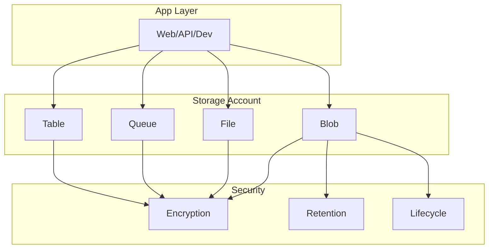

```mermaid
graph TB
    subgraph "Application Layer"
        WEB_MAIN[arolariu.ro<br/>Main Website]
        WEB_API[api.arolariu.ro<br/>API Service]
        WEB_DEV[dev.arolariu.ro<br/>Development Site]
    end

    subgraph "Storage Infrastructure"
        subgraph "Blob & File Storage"
            SA[Storage Account<br/>Standard_LRS<br/>Hot Tier]

            subgraph "Storage Services"
                BLOB[Blob Storage<br/>Static Assets, Files]
                TABLE[Table Storage<br/>NoSQL Key-Value]
                QUEUE[Queue Storage<br/>Message Queuing]
                FILE[File Storage<br/>Shared Files]
            end
        end

        subgraph "Container Storage"
            ACR[Container Registry<br/>Docker Images<br/>Premium SKU]
        end

        subgraph "Structured Data"
            SQL_SERVER[SQL Server<br/>Serverless Compute<br/>Azure AD Auth]

            subgraph "SQL Databases"
                DB_MAIN[Primary Database<br/>Application Data]
                DB_ANALYTICS[Analytics Database<br/>Reporting Data]
            end
        end

        subgraph "Document Storage"
            COSMOS_ACCOUNT[Cosmos DB Account<br/>SQL API<br/>Serverless Mode]

            subgraph "Cosmos Databases"
                DB_DOCUMENTS[Documents Database<br/>CMS Content]
                DB_EVENTS[Events Database<br/>Audit & Telemetry]
            end
        end
    end

    subgraph "Security & Access"
        RBAC[Role-Based Access<br/>Azure AD Integration]
        ENCRYPTION[Encryption<br/>At Rest & In Transit]
        NETWORK[Network Security<br/>Private Endpoints]
    end

    WEB_MAIN --> SA
    WEB_MAIN --> SQL_SERVER
    WEB_MAIN --> COSMOS_ACCOUNT

    WEB_API --> SA
    WEB_API --> SQL_SERVER
    WEB_API --> COSMOS_ACCOUNT
    WEB_API --> ACR

    WEB_DEV --> SA
    WEB_DEV --> SQL_SERVER
    WEB_DEV --> COSMOS_ACCOUNT

    SA --> BLOB
    SA --> TABLE
    SA --> QUEUE
    SA --> FILE

    SQL_SERVER --> DB_MAIN
    SQL_SERVER --> DB_ANALYTICS

    COSMOS_ACCOUNT --> DB_DOCUMENTS
    COSMOS_ACCOUNT --> DB_EVENTS

    RBAC --> SA
    RBAC --> SQL_SERVER
    RBAC --> COSMOS_ACCOUNT
    RBAC --> ACR

    ENCRYPTION --> SA
    ENCRYPTION --> SQL_SERVER
    ENCRYPTION --> COSMOS_ACCOUNT
    ENCRYPTION --> ACR

    NETWORK --> SA
    NETWORK --> SQL_SERVER
    NETWORK --> COSMOS_ACCOUNT
    NETWORK --> ACR

    classDef app fill:#e8f5e8,stroke:#1b5e20,stroke-width:2px
    classDef storage fill:#e3f2fd,stroke:#0277bd,stroke-width:2px
    classDef container fill:#fff3e0,stroke:#e65100,stroke-width:2px
    classDef sql fill:#f3e5f5,stroke:#4a148c,stroke-width:2px
    classDef nosql fill:#fce4ec,stroke:#ad1457,stroke-width:2px
    classDef security fill:#e0f2f1,stroke:#00695c,stroke-width:2px

    class WEB_MAIN,WEB_API,WEB_DEV app
    class SA,BLOB,TABLE,QUEUE,FILE storage
    class ACR container
    class SQL_SERVER,DB_MAIN,DB_ANALYTICS sql
    class COSMOS_ACCOUNT,DB_DOCUMENTS,DB_EVENTS nosql
    class RBAC,ENCRYPTION,NETWORK security
```

# 💾 Storage Module

This module provisions secure, enterprise-grade storage resources for the arolariu.ro platform, including Azure Storage Account, SQL Database, Cosmos DB (NoSQL), and Container Registry.

## 📋 Overview

This module provides:

- **Azure Storage Account**: Blob, file, queue, and table storage with advanced security
- **Azure SQL Database**: Relational database for structured data
- **Azure Cosmos DB**: NoSQL database for document storage
- **Azure Container Registry**: Docker image storage and management
- **Lifecycle management** for cost optimization
- **Comprehensive encryption** (at rest, in transit, infrastructure)

## 🏗️ Resources Created

| Resource Type      | Name Pattern      | Purpose                           |
| ------------------ | ----------------- | --------------------------------- |
| Storage Account    | Customizable      | Blob, file, queue, table storage  |
| SQL Server         | `{prefix}-sql`    | Azure SQL Server                  |
| SQL Database       | `{prefix}-db`     | SQL Database                      |
| Cosmos DB Account  | `{prefix}-nosql`  | NoSQL document database           |
| Container Registry | `{prefix}acr`     | Docker container images           |
| ManagementPolicy   | default           | Lifecycle/cost optimization       |

## 📁 Module Files

| File                     | Purpose                              |
| ------------------------ | ------------------------------------ |
| `deploymentFile.bicep`   | Orchestrates all storage deployments |
| `storageAccount.bicep`   | Azure Storage Account                |
| `sqlServer.bicep`        | Azure SQL Server & Database          |
| `noSqlServer.bicep`      | Azure Cosmos DB (NoSQL)              |
| `containerRegistry.bicep`| Azure Container Registry             |

## 📊 Architecture



## 🔧 Configuration

### Parameters

| Parameter                      | Type   | Required | Description                               |
| ------------------------------ | ------ | -------- | ----------------------------------------- |
| `storageAccountName`           | string | ✅       | Storage account name (3-24 chars, unique) |
| `storageAccountLocation`       | string | ✅       | Azure region                              |
| `storageAccountDeploymentDate` | string | ✅       | Deployment timestamp                      |

### Example Usage

```bicep
module storage 'storage/storageAccount.bicep' = {
  name: 'storageDeployment'
  params: {
    storageAccountName: 'arolariusa'
    storageAccountLocation: 'westeurope'
    storageAccountDeploymentDate: '2025-07-03'
  }
}
```

## 📤 Outputs

| Output                        | Type   | Description                        |
| ----------------------------- | ------ | ---------------------------------- |
| `storageAccountName`          | string | Name of the storage account        |
| `storageAccountId`            | string | Resource ID of the storage account |
| `storageAccountBlobEndpoint`  | string | Blob endpoint URL                  |
| `storageAccountFileEndpoint`  | string | File endpoint URL                  |
| `storageAccountQueueEndpoint` | string | Queue endpoint URL                 |
| `storageAccountTableEndpoint` | string | Table endpoint URL                 |

## 💾 Storage Account Features

**General:**

- SKU: Standard_LRS (Locally Redundant)
- Kind: StorageV2
- Access Tier: Hot
- Public Network Access: Enabled (can restrict)
- Allow Cross-Tenant Replication: Disabled
- Minimum TLS: 1.2
- HTTPS Only: Yes
- Tags: Environment, deployment, cost center, etc.

**Security & Encryption:**

- Encryption at rest: Microsoft-managed keys
- Infrastructure encryption: Enabled
- Network ACLs: AzureServices, Logging, Metrics bypassed; default allow

**Blob Service:**

- Change feed: Enabled (90 days)
- Restore policy: Enabled (30 days)
- Container delete retention: 7 days
- Blob delete retention: 90 days (no permanent delete)
- CORS: Configured for prod/dev
- Versioning: Enabled
- Last access time tracking: Enabled (1 day)

**File Service:**

- Share delete retention: 7 days (no permanent delete)
- SMB: 3.0/3.1.1, Kerberos, AES encryption

**Queue/Table Service:**

- Enabled

**Lifecycle Management:**

- Move blobs to cool after 30 days, archive after 90 days, delete after 365 days
- Delete snapshots after 90 days, versions after 365 days

## 🛡️ Security Practices

- All endpoints require HTTPS
- Infrastructure encryption is enabled
- Public access is enabled at the account level but can be restricted at the container level
- Shared key access is enabled (can be restricted)

## 🛠️ Maintenance & Operations

- Automated lifecycle policies for cost optimization
- Retention and restore policies for data recovery
- CORS rules for both production and local development

## 🚨 Troubleshooting

| Issue                 | Symptoms           | Solution                                |
| --------------------- | ------------------ | --------------------------------------- |
| Storage access denied | 403 errors         | Check RBAC and network access           |
| Blob not found        | 404 errors         | Check container and blob name           |
| CORS errors           | Browser errors     | Check CORS rules in blobServices        |
| High storage costs    | Unexpected billing | Review lifecycle and retention policies |

## 📚 References

- [Azure Storage Documentation](https://docs.microsoft.com/en-us/azure/storage/)
- [Storage Security Guide](https://docs.microsoft.com/en-us/azure/storage/common/storage-security-guide)

---

**Module Version**: 2.0.0  
**Last Updated**: July 2025  
**Maintainer**: Alexandru-Razvan Olariu

## 📊 **Architecture**



## 🔧 **Configuration**

### **Parameters**

| Parameter                   | Type   | Required | Description                                    |
| --------------------------- | ------ | -------- | ---------------------------------------------- |
| `resourceConventionPrefix`  | string | ✅       | Prefix for resource naming (1-20 chars)        |
| `storageDeploymentLocation` | string | ✅       | Azure region (swedencentral, norwayeast, etc.) |
| `resourceDeploymentDate`    | string | ❌       | Deployment timestamp (defaults to utcNow())    |

### **Example Usage**

```bicep
module storageDeployment 'storage/deploymentFile.bicep' = {
  name: 'storageDeployment'
  params: {
    resourceConventionPrefix: 'arolariu'
    storageDeploymentLocation: 'swedencentral'
  }
}
```

## 📤 **Outputs**

| Output                       | Type   | Description                         |
| ---------------------------- | ------ | ----------------------------------- |
| `storageAccountName`         | string | Name of the created storage account |
| `storageAccountId`           | string | Resource ID of the storage account  |
| `storageAccountBlobEndpoint` | string | Blob storage endpoint URL           |
| `sqlServerName`              | string | Name of the SQL Server instance     |
| `cosmosAccountName`          | string | Name of the Cosmos DB account       |

## 💾 **Storage Components**

### **Azure Storage Account**

**Configuration:**

- **SKU**: Standard_LRS (Locally Redundant Storage)
- **Performance**: Standard tier
- **Access Tier**: Hot (optimized for frequent access)
- **Replication**: LRS for cost optimization
- **Security**: HTTPS only, TLS 1.2 minimum

**Security Features:**

- **Public access**: Disabled for blob containers
- **Shared key access**: Disabled (Azure AD only)
- **Network access**: Public (can be restricted)
- **Encryption**: Microsoft-managed keys

**Storage Services:**

#### **Blob Storage**

- **Static websites**: CSS, JavaScript, images
- **User uploads**: Profile pictures, documents
- **Application data**: Logs, backups, exports
- **CDN integration**: Azure Front Door for global delivery

#### **Table Storage**

- **Session data**: User sessions and temporary data
- **Application cache**: Frequently accessed data
- **Metrics storage**: Custom application metrics
- **Configuration**: Feature flags and settings

#### **Queue Storage**

- **Email processing**: Asynchronous email delivery
- **Background jobs**: Long-running task processing
- **Event handling**: Decoupled event processing
- **Integration**: Webhook processing

#### **File Storage**

- **Shared configuration**: Application config files
- **Certificates**: SSL certificates and keys
- **Reports**: Generated reports and documents
- **Backup storage**: File-based backup archives

### **Azure Container Registry**

**Configuration:**

- **SKU**: Premium (supports private endpoints, geo-replication)
- **Admin user**: Disabled (managed identity authentication)
- **Public access**: Enabled (with network restrictions)
- **Content trust**: Available for image signing

**Features:**

- **Multi-architecture images**: Support for ARM64 and x86
- **Vulnerability scanning**: Automatic security scanning
- **Geo-replication**: Available for global distribution
- **Webhook integration**: CI/CD pipeline triggers

**Container Images:**

- **Frontend applications**: React/Next.js production builds
- **Backend APIs**: .NET Core application containers
- **Supporting services**: Redis, utility containers
- **Development tools**: Custom development containers

### **Azure SQL Database**

**SQL Server Configuration:**

- **Edition**: Standard Edition
- **Compute model**: Serverless (auto-pause enabled)
- **Authentication**: Azure AD integration
- **TLS**: Minimum version 1.2
- **Firewall**: Azure services allowed

### **Access Control**

**Storage Account:**

- **Authentication**: Azure AD and managed identities
- **Authorization**: RBAC and fine-grained permissions
- **Network**: Private endpoints for production
- **SAS tokens**: Time-limited for specific operations

**SQL Database:**

- **Authentication**: Azure AD (primary), SQL Auth (fallback)
- **Authorization**: Database-level and schema-level permissions
- **Network**: Firewall rules and VNet integration
- **Always Encrypted**: Sensitive data protection

**Cosmos DB:**

- **Authentication**: Azure AD and resource tokens
- **Authorization**: Database and collection-level permissions
- **Network**: Private endpoints and IP filtering
- **Encryption**: Automatic encryption at rest

### **Encryption Standards**

- **At rest**: All data encrypted with Microsoft-managed keys
- **In transit**: TLS 1.2+ for all connections
- **Application-level**: Additional encryption for sensitive fields
- **Key management**: Integration with Azure Key Vault

## 📊 **Data Patterns & Use Cases**

### **Storage Account Usage Patterns**

```csharp
// Example: Blob storage usage
public class FileService
{
    private readonly BlobServiceClient _blobClient;

    public async Task<string> UploadFileAsync(Stream fileStream, string fileName, string containerName)
    {
        var containerClient = _blobClient.GetBlobContainerClient(containerName);
        var blobClient = containerClient.GetBlobClient(fileName);

        await blobClient.UploadAsync(fileStream, overwrite: true);
        return blobClient.Uri.ToString();
    }

    public async Task<Stream> DownloadFileAsync(string fileName, string containerName)
    {
        var containerClient = _blobClient.GetBlobContainerClient(containerName);
        var blobClient = containerClient.GetBlobClient(fileName);

        var response = await blobClient.DownloadStreamingAsync();
        return response.Value.Content;
    }
}
```

### **SQL Database Patterns**

```sql
-- Example: Efficient queries with indexing
CREATE NONCLUSTERED INDEX IX_Products_Category_Price
ON Products (CategoryId, Price)
INCLUDE (Name, Description);

-- Partition function for large tables
CREATE PARTITION FUNCTION DateRangePartition (datetime2)
AS RANGE RIGHT FOR VALUES
('2024-01-01', '2024-02-01', '2024-03-01');
```

### **Cosmos DB Document Patterns**

```javascript
// Example: Product document structure
{
  "id": "product-12345",
  "type": "product",
  "category": "electronics", // Partition key
  "name": "Smartphone XYZ",
  "price": 599.99,
  "inventory": {
    "quantity": 100,
    "warehouse": "EU-Central"
  },
  "metadata": {
    "createdAt": "2024-01-15T10:30:00Z",
    "lastModified": "2024-01-20T14:45:00Z",
    "version": 2
  },
  "searchTags": ["phone", "mobile", "electronics"],
  "_ts": 1705837800 // Cosmos DB timestamp
}
```

## 💰 **Cost Considerations**

| Component          | Configuration          | Monthly Cost Estimate\* |
| ------------------ | ---------------------- | ----------------------- |
| Storage Account    | Standard_LRS, Hot tier | €5-15                   |
| Container Registry | Premium SKU            | €15-25                  |
| SQL Database       | Serverless, 2-4 vCores | €20-40                  |
| Cosmos DB          | Serverless mode        | €10-30                  |
| **Data Transfer**  | Egress costs           | €2-10                   |
| **Total**          |                        | **€52-120**             |

\*Estimates based on moderate usage. Costs scale with data volume and operations.

### **Cost Optimization Strategies**

**Storage Account:**

- **Lifecycle policies**: Automatically move old data to cool/archive tiers
- **Reserved capacity**: Pre-purchase storage for predictable workloads
- **Compression**: Enable compression for blob storage

**SQL Database:**

- **Serverless tier**: Automatic scaling and pause for development
- **Query optimization**: Regular performance tuning
- **Backup retention**: Optimize backup retention periods

**Cosmos DB:**

- **Partition design**: Efficient partitioning reduces cross-partition queries
- **TTL policies**: Automatic document expiration
- **Indexing**: Custom indexing policies to reduce RU consumption

**Container Registry:**

- **Image cleanup**: Regular cleanup of unused images
- **Efficient tagging**: Proper image tagging strategy
- **Multi-stage builds**: Optimize Docker image sizes

## 🔧 **Development & Integration**

### **Connection String Management**

```bicep
// Store connection strings in Key Vault
resource storageConnectionSecret 'Microsoft.KeyVault/vaults/secrets@2023-07-01' = {
  parent: keyVault
  name: 'storage-connection-string'
  properties: {
    value: 'DefaultEndpointsProtocol=https;AccountName=${storageAccount.name};AccountKey=${storageAccount.listKeys().keys[0].value};EndpointSuffix=core.windows.net'
  }
}
```

### **Application Configuration**

```json
{
  "ConnectionStrings": {
    "DefaultConnection": "Server=${sqlServerName}.database.windows.net;Authentication=Active Directory Default;Database=${databaseName};",
    "CosmosConnection": "AccountEndpoint=https://${cosmosAccountName}.documents.azure.com:443/;",
    "StorageConnection": "DefaultEndpointsProtocol=https;AccountName=${storageAccountName};"
  },
  "Storage": {
    "ContainerNames": {
      "StaticAssets": "static-assets",
      "UserUploads": "user-uploads",
      "Backups": "backups"
    }
  }
}
```

### **Managed Identity Integration**

```csharp
// Example: Accessing storage with managed identity
public class StorageService
{
    private readonly BlobServiceClient _blobClient;

    public StorageService()
    {
        var credential = new DefaultAzureCredential();
        _blobClient = new BlobServiceClient(
            new Uri("https://arolariusa.blob.core.windows.net/"),
            credential
        );
    }
}
```

## 🛠️ **Maintenance & Operations**

### **Backup Strategies**

**Storage Account:**

- **Blob snapshots**: Point-in-time recovery for critical data
- **Cross-region replication**: Geo-redundant storage for critical data
- **Export jobs**: Regular exports to archive storage

**SQL Database:**

- **Automated backups**: 7-day retention with point-in-time restore
- **Long-term retention**: Monthly/yearly backups for compliance
- **Geo-restore**: Cross-region backup availability

**Cosmos DB:**

- **Continuous backup**: Point-in-time restore capability
- **Periodic backup**: Regular snapshots for disaster recovery
- **Cross-region backup**: Multi-region backup availability

### **Monitoring & Alerting**

```bash
# Monitor storage account metrics
az monitor metrics list \
  --resource "/subscriptions/{sub}/resourceGroups/{rg}/providers/Microsoft.Storage/storageAccounts/arolariusa" \
  --metric "UsedCapacity,Transactions,Ingress,Egress"

# Check SQL database performance
az sql db show-usage \
  --name "arolariu-sqlserver-db-main" \
  --server "arolariu-sqlserver" \
  --resource-group "arolariu-rg"

# Monitor Cosmos DB RU consumption
az cosmosdb sql database throughput show \
  --account-name "arolariu-nosqlserver" \
  --name "documents" \
  --resource-group "arolariu-rg"
```

### **Performance Optimization**

**Storage Account:**

- **Hot tier**: Frequently accessed data
- **CDN integration**: Static content delivery
- **Parallel uploads**: Multi-part upload for large files

**SQL Database:**

- **Index optimization**: Regular index maintenance
- **Query store**: Query performance monitoring
- **Auto-tuning**: Automatic performance improvements

**Cosmos DB:**

- **Partition key design**: Optimal data distribution
- **Query optimization**: Efficient document queries
- **Indexing policies**: Custom indexing for performance

## 🔄 **Dependencies**

### **Required Dependencies**

- **Identity Module**: Managed identities for secure access
- **Configuration Module**: Key Vault for connection strings

### **Optional Dependencies**

- **Network Module**: Private endpoints and VNet integration
- **Observability Module**: Monitoring and diagnostics

## 📊 **Deployment Flow**

1. **Storage Account**: Deploy first (foundation for other services)
2. **Container Registry**: Deploy for container image storage
3. **SQL Server**: Deploy database server infrastructure
4. **SQL Databases**: Create application databases
5. **Cosmos DB Account**: Deploy NoSQL infrastructure
6. **Cosmos Databases**: Create document collections
7. **Security Configuration**: Apply access policies and RBAC
8. **Integration**: Configure application connections

## 🚨 **Troubleshooting**

### **Common Issues**

| Issue                       | Symptoms                     | Solution                                     |
| --------------------------- | ---------------------------- | -------------------------------------------- |
| **Storage access denied**   | 403 Forbidden errors         | Check RBAC assignments and network access    |
| **SQL connection timeout**  | Database connection failures | Verify firewall rules and connection strings |
| **Cosmos DB throttling**    | 429 Too Many Requests        | Optimize queries and partition key design    |
| **Container registry auth** | Docker push/pull failures    | Verify managed identity and registry access  |
| **High storage costs**      | Unexpected billing           | Review lifecycle policies and data retention |

### **Validation Commands**

```bash
# Test storage account access
az storage blob list \
  --account-name "arolariusa" \
  --container-name "static-assets" \
  --auth-mode login

# Test SQL connectivity
sqlcmd -S "arolariu-sqlserver.database.windows.net" \
  -d "arolariu-sqlserver-db-main" \
  -G \
  -Q "SELECT @@VERSION"

# Test Cosmos DB access
az cosmosdb sql database list \
  --account-name "arolariu-nosqlserver" \
  --resource-group "arolariu-rg"

# Test container registry
az acr repository list \
  --name "arolariu-acr"
```

### **Performance Diagnostics**

```sql
-- SQL Database: Check expensive queries
SELECT TOP 10
    st.text,
    qs.execution_count,
    qs.total_worker_time / qs.execution_count AS avg_cpu_time,
    qs.total_elapsed_time / qs.execution_count AS avg_elapsed_time
FROM sys.dm_exec_query_stats qs
CROSS APPLY sys.dm_exec_sql_text(qs.sql_handle) st
ORDER BY avg_cpu_time DESC;
```

```bash
# Storage: Monitor transaction metrics
az monitor metrics list \
  --resource "/subscriptions/{sub}/resourceGroups/{rg}/providers/Microsoft.Storage/storageAccounts/arolariusa" \
  --metric "Transactions" \
  --dimension "ResponseType" \
  --start-time "2024-01-01T00:00:00Z"
```

## 📚 **References**

- [Azure Storage Documentation](https://docs.microsoft.com/en-us/azure/storage/)
- [Azure SQL Database](https://docs.microsoft.com/en-us/azure/azure-sql/database/)
- [Azure Cosmos DB](https://docs.microsoft.com/en-us/azure/cosmos-db/)
- [Azure Container Registry](https://docs.microsoft.com/en-us/azure/container-registry/)
- [Storage Security Guide](https://docs.microsoft.com/en-us/azure/storage/common/storage-security-guide)
- [SQL Database Security](https://docs.microsoft.com/en-us/azure/azure-sql/database/security-overview)

---

**Module Version**: 2.0.0  
**Last Updated**: June 2025  
**Maintainer**: Alexandru-Razvan Olariu
