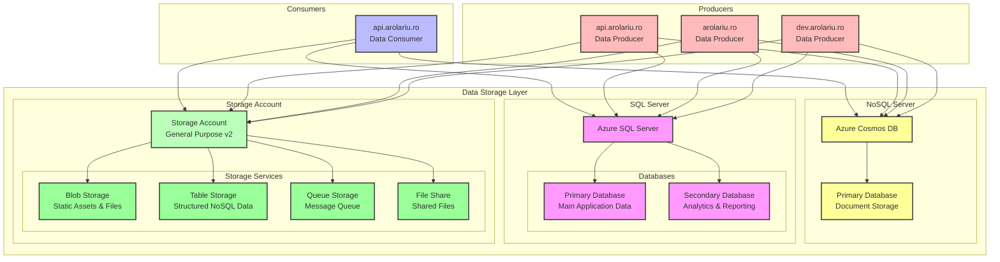

# Storage Resources

This module deploys the storage infrastructure for the arolariu.ro platform, including Azure Storage Account, SQL Database, and Cosmos DB for comprehensive data management.

## Overview

The storage infrastructure implements a multi-tier data architecture:
- **Storage Account**: For unstructured data, files, and message queuing
- **SQL Database**: For structured relational data and analytics
- **Cosmos DB**: For NoSQL document storage and global distribution

## Architecture Diagram

## Components

### Azure Storage Account

The Storage Account provides multiple storage services for different use cases.

#### Specifications
- **Type**: General Purpose v2
- **Replication**: LRS (Locally Redundant Storage)
- **Performance**: Standard
- **Access Tier**: Hot

#### Storage Services

##### Blob Storage
- **Purpose**: Store unstructured data like images, documents, and static assets
- **Containers**:
  - `static-assets`: CSS, JavaScript, images for websites
  - `user-uploads`: User-generated content
  - `backups`: Application and database backups
  - `logs`: Archived application logs
- **Access**: Public read for static assets, private for user data

##### Table Storage
- **Purpose**: NoSQL key-value store for structured data
- **Tables**:
  - `Sessions`: User session data
  - `Cache`: Application cache entries
  - `Metrics`: Custom application metrics
- **Use Cases**: High-speed lookups, session management

##### Queue Storage
- **Purpose**: Message queuing for asynchronous processing
- **Queues**:
  - `email-queue`: Email notifications
  - `processing-queue`: Background job processing
  - `import-queue`: Data import tasks
- **Features**: At-least-once delivery, 7-day retention

##### File Share
- **Purpose**: Shared file storage for applications
- **Shares**:
  - `app-config`: Shared configuration files
  - `certificates`: SSL certificates and keys
  - `reports`: Generated reports
- **Access**: SMB 3.0 protocol, Azure File Sync capable

### Azure SQL Database

The SQL Database provides relational data storage with high availability and performance.

#### SQL Server Specifications
- **Edition**: Standard
- **Compute**: Serverless (auto-pause enabled)
- **Location**: Same region as other resources
- **Backup**: Automated with point-in-time restore

#### Databases

##### Primary Database
- **Purpose**: Main transactional database for application data
- **Schema**:
  - User management tables
  - Content management system
  - Order and transaction data
  - Application metadata
- **Performance**: 2-4 vCores, 5-10 GB
- **Features**: Automatic tuning, threat detection

##### Secondary Database
- **Purpose**: Analytics and reporting workload isolation
- **Schema**:
  - Data warehouse facts and dimensions
  - Aggregated reporting tables
  - Historical data archives
  - ETL staging tables
- **Performance**: 2 vCores, 10-20 GB
- **Features**: Columnstore indexes, read-only replicas

### Azure Cosmos DB

Cosmos DB provides globally distributed NoSQL document storage.

#### Specifications
- **API**: Core (SQL) API
- **Consistency**: Session consistency
- **Throughput**: Serverless mode
- **Regions**: Single region (with option to expand)

#### Primary Database
- **Purpose**: Document storage for semi-structured data
- **Collections**:
  - `products`: Product catalog with flexible schema
  - `profiles`: User profiles and preferences
  - `content`: CMS content with metadata
  - `events`: Event sourcing and audit logs
- **Partitioning**: 
  - Products: by category
  - Profiles: by userId
  - Content: by contentType
  - Events: by timestamp
- **Indexing**: Automatic with custom policies

## Data Flow Patterns

### Consumer Pattern (api.arolariu.ro as Consumer)
1. **Read Operations**:
   - Query SQL for structured data
   - Retrieve documents from Cosmos DB
   - Download blobs from Storage Account
   - Dequeue messages for processing

2. **Aggregation**:
   - Combine data from multiple sources
   - Transform and enrich data
   - Cache results in Table Storage

### Producer Pattern (All Web Applications)

#### api.arolariu.ro (Primary Producer)
- **Creates**: User data, transactions, system events
- **Updates**: Product information, user profiles
- **Uploads**: Files and media content
- **Queues**: Background processing tasks

#### arolariu.ro (Content Producer)
- **Creates**: User-generated content, comments
- **Updates**: User preferences, session data
- **Uploads**: Media files, profile pictures
- **Logs**: User activity and analytics

#### dev.arolariu.ro (Development Producer)
- **Creates**: Test data, development content
- **Updates**: Configuration and test scenarios
- **Uploads**: Development assets
- **Logs**: Debug information

## Access Patterns

### Storage Account Access
- **Blob Storage**: 
  - Read: All applications
  - Write: Authenticated users only
  - Delete: API service only
- **Queue Storage**:
  - Enqueue: All producers
  - Dequeue: API consumer only
- **Table Storage**:
  - Read/Write: All applications
  - Batch operations: API only

### SQL Database Access
- **Primary Database**:
  - Full CRUD: API service
  - Read-only: Websites (for specific tables)
- **Secondary Database**:
  - Write: ETL processes only
  - Read: All applications

### Cosmos DB Access
- **Document Operations**:
  - Create/Update: All producers
  - Delete: API service only
  - Query: All applications
- **Bulk Operations**: API service only

## Security Considerations

1. **Connection Security**:
   - All connections use SSL/TLS
   - Connection strings stored in Key Vault
   - Managed Identity authentication where supported

2. **Access Control**:
   - Storage Account: Azure AD and SAS tokens
   - SQL Database: Azure AD authentication
   - Cosmos DB: Resource tokens for granular access

3. **Data Protection**:
   - Encryption at rest (all services)
   - Encryption in transit
   - Soft delete enabled where applicable

4. **Network Security**:
   - Private endpoints for production
   - Firewall rules for IP restrictions
   - Virtual network service endpoints

## Performance Optimization

1. **Caching Strategy**:
   - Table Storage for hot data
   - Redis Cache for session data (future)
   - CDN for static blob content

2. **Indexing**:
   - SQL: Covering indexes for common queries
   - Cosmos DB: Custom indexing policies
   - Blob: Metadata indexing for search

3. **Partitioning**:
   - Cosmos DB: Logical partitioning by entity type
   - Table Storage: Partition by date/category
   - SQL: Table partitioning for large tables

## Monitoring and Maintenance

1. **Metrics**:
   - Storage capacity and transactions
   - SQL DTU usage and query performance
   - Cosmos DB RU consumption

2. **Alerts**:
   - Storage quota warnings
   - SQL performance degradation
   - Cosmos DB throttling

3. **Backup Strategy**:
   - Storage Account: Blob snapshots
   - SQL: Automated backups with geo-redundancy
   - Cosmos DB: Continuous backup mode

## Cost Optimization

1. **Storage Account**:
   - Lifecycle policies for blob aging
   - Cool tier for archived content
   - Reserved capacity for predictable workloads

2. **SQL Database**:
   - Serverless tier with auto-pause
   - Elastic pools for multi-database scenarios
   - Query optimization to reduce DTU usage

3. **Cosmos DB**:
   - Serverless for variable workloads
   - TTL policies for automatic cleanup
   - Optimize partition strategy to reduce cross-partition queries
