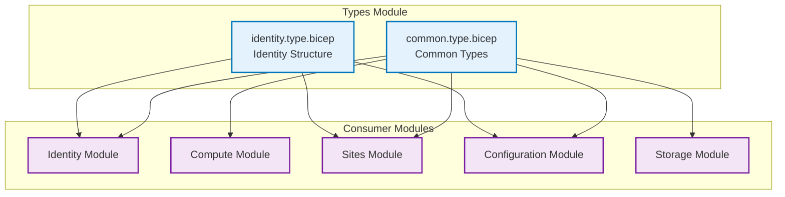

# 🔧 Types Module

This module provides centralized user-defined types for standardized and type-safe Azure Bicep deployments across the entire infrastructure codebase.

## 📋 **Overview**

The types module defines reusable type definitions that:

- **Enforce consistency** across all infrastructure modules
- **Provide type safety** and IntelliSense support
- **Standardize configurations** for common Azure resources
- **Reduce deployment errors** through compile-time validation
- **Improve maintainability** with centralized type definitions

## 🏗️ **Type Definitions**

| Type File             | Exported Types      | Purpose                             |
| --------------------- | ------------------- | ----------------------------------- |
| `identity.type.bicep` | `identity`          | Managed identity resource structure |
| `common.type.bicep`   | `appServicePlanSku` | App Service Plan SKU configurations |
|                       | `resourceTags`      | Standardized resource tagging       |

## 📊 **Architecture**



## 🔧 **Type Definitions**

### **Identity Type (`identity.type.bicep`)**

Defines the structure for managed identity resources used across modules.

```bicep
@metadata({ type: 'identity', name: 'identity' })
@export()
type identity = {
  name: string
  displayName: string
  id: string
}
```

**Properties:**

- `name`: Resource name of the managed identity
- `displayName`: Human-readable display name
- `id`: Full Azure resource ID

**Usage Example:**

```bicep
import { identity } from '../types/identity.type.bicep'

param managedIdentities identity[]

output identityList identity[] = [
  {
    name: 'frontend-identity'
    displayName: 'Frontend Application Identity'
    id: '/subscriptions/.../providers/Microsoft.ManagedIdentity/userAssignedIdentities/frontend-identity'
  }
]
```

### **App Service Plan SKU Type (`common.type.bicep`)**

Standardizes App Service Plan SKU configurations with allowed values.

```bicep
@export()
@metadata({ description: 'App Service Plan SKU configuration' })
type appServicePlanSku = {
  @description('SKU name (e.g., B1, B2, S1, P1v2)')
  name: 'B1' | 'B2' | 'S1' | 'S2' | 'S3' | 'P1v2' | 'P2v2' | 'P3v2'

  @description('SKU tier')
  tier: 'Basic' | 'Standard' | 'Premium' | 'PremiumV2'
}
```

**Allowed SKUs:**

| SKU       | Tier      | Use Case                     |
| --------- | --------- | ---------------------------- |
| B1, B2    | Basic     | Development, small workloads |
| S1-S3     | Standard  | Production with auto-scaling |
| P1v2-P3v2 | PremiumV2 | High-performance workloads   |

**Usage Example:**

```bicep
import { appServicePlanSku } from '../types/common.type.bicep'

param planSku appServicePlanSku = {
  name: 'B2'
  tier: 'Basic'
}
```

### **Resource Tags Type (`common.type.bicep`)**

Enforces consistent tagging across all Azure resources.

```bicep
@export()
@metadata({ description: 'Resource tagging configuration' })
type resourceTags = {
  @description('Environment tag')
  environment: 'dev' | 'staging' | 'prod'

  @description('Deployment method')
  deployment: 'Bicep' | 'ARM' | 'Terraform'

  @description('Project or application name')
  project: string

  @description('Cost center for billing')
  costCenter: string

  @description('Owner or responsible team')
  owner: string
}
```

**Usage Example:**

```bicep
import { resourceTags } from '../types/common.type.bicep'

param tags resourceTags = {
  environment: 'prod'
  deployment: 'Bicep'
  project: 'arolariu.ro'
  costCenter: 'infrastructure'
  owner: 'Alexandru-Razvan Olariu'
}
```

## 💡 **Benefits**

### **Type Safety**

- **Compile-time validation** prevents invalid configurations
- **IntelliSense support** in VS Code and other editors
- **Reduced deployment errors** through early detection

### **Consistency**

- **Standardized structures** across all modules
- **Uniform naming conventions** for resources
- **Consistent tagging** for governance and billing

### **Maintainability**

- **Centralized definitions** reduce code duplication
- **Easy updates** propagate across all consumers
- **Clear documentation** of expected structures

### **Developer Experience**

- **Auto-completion** for type properties
- **Validation feedback** during development
- **Clear error messages** for type mismatches

## 🔄 **Usage Patterns**

### **Importing Types**

```bicep
// Import specific types
import { identity } from '../types/identity.type.bicep'
import { appServicePlanSku, resourceTags } from '../types/common.type.bicep'

// Use imported types in parameters
param identities identity[]
param planConfiguration appServicePlanSku
param resourceTags resourceTags
```

### **Type Validation**

The Bicep compiler automatically validates:

- **Required properties** are present
- **Property types** match the definition
- **Allowed values** are within the defined constraints
- **Structure consistency** across the deployment

### **Output Typing**

```bicep
import { identity } from '../types/identity.type.bicep'

// Strongly typed outputs
output managedIdentitiesList identity[] = [
  for i in range(0, 3): {
    name: managedIdentities[i].name
    displayName: managedIdentities[i].properties.displayName
    id: managedIdentities[i].id
  }
]
```

## 🛠️ **Development Guidelines**

### **Creating New Types**

1. **Identify common patterns** across multiple modules
2. **Define clear property names** and descriptions
3. **Use constraints** (`@allowed`, `@minLength`, etc.) where appropriate
4. **Add comprehensive metadata** for documentation
5. **Test with real-world scenarios**

### **Type Evolution**

- **Backward compatibility**: Avoid breaking changes to existing types
- **Versioning**: Consider versioned type files for major changes
- **Documentation**: Update README when adding new types
- **Testing**: Validate types with all consuming modules

### **Best Practices**

```bicep
// Good: Clear, descriptive type definition
@export()
@metadata({ description: 'Database configuration with validation' })
type databaseConfig = {
  @description('Database name (3-64 characters)')
  @minLength(3)
  @maxLength(64)
  name: string

  @description('Database tier')
  tier: 'Basic' | 'Standard' | 'Premium'

  @description('Enable backup (recommended for production)')
  backupEnabled: bool
}

// Avoid: Vague or overly complex definitions
type config = {
  data: object  // Too generic
  settings: {   // Too nested
    deep: {
      nested: {
        value: string
      }
    }
  }
}
```

## 📊 **Usage Statistics**

### **Type Consumption by Module**

| Module        | identity | appServicePlanSku | resourceTags |
| ------------- | -------- | ----------------- | ------------ |
| Identity      | ✅       | ❌                | ✅           |
| Compute       | ❌       | ✅                | ✅           |
| Sites         | ✅       | ❌                | ✅           |
| Configuration | ✅       | ❌                | ✅           |
| Storage       | ❌       | ❌                | ✅           |
| Network       | ❌       | ❌                | ✅           |
| Observability | ❌       | ❌                | ✅           |

## 🚨 **Troubleshooting**

### **Common Issues**

| Issue                           | Symptoms                            | Solution                                     |
| ------------------------------- | ----------------------------------- | -------------------------------------------- |
| **Import path errors**          | `Cannot resolve module` errors      | Verify relative path to type files           |
| **Type mismatch errors**        | `Type 'X' is not assignable to 'Y'` | Check property names and types match exactly |
| **Missing required properties** | `Property 'name' is missing`        | Ensure all required properties are provided  |
| **Invalid allowed values**      | `Value 'X' is not allowed`          | Use only values defined in type constraints  |

### **Validation Commands**

```bash
# Validate type definitions
az bicep build --file types/identity.type.bicep
az bicep build --file types/common.type.bicep

# Validate consumer modules
az bicep build --file identity/deploymentFile.bicep
az bicep build --file compute/deploymentFile.bicep

# Check for type usage across modules
grep -r "import.*types" ../
```

### **Debugging Type Issues**

```bicep
// Use explicit typing to debug issues
param debugIdentity identity = {
  name: 'test-identity'        // string ✅
  displayName: 'Test Identity' // string ✅
  id: 'resource-id'            // string ✅
  // extraProperty: 'value'    // ❌ Not defined in type
}

// Check output types
output debugOutput identity[] = debugIdentity // Type validation
```

## 🔮 **Future Enhancements**

### **Planned Type Additions**

- **Storage Account Configuration**: Standardize storage account settings
- **Network Security Group Rules**: Type-safe security rule definitions
- **Key Vault Access Policies**: Structured access policy definitions
- **Application Insights Configuration**: Monitoring and alerting types

### **Advanced Features**

- **Union Types**: Support for multiple valid configurations
- **Conditional Properties**: Properties based on other property values
- **Generic Types**: Reusable types with parameters
- **Validation Functions**: Custom validation logic

## 📚 **References**

- [Bicep User-Defined Types](https://docs.microsoft.com/en-us/azure/azure-resource-manager/bicep/user-defined-data-types)
- [Bicep Type System](https://docs.microsoft.com/en-us/azure/azure-resource-manager/bicep/data-types)
- [Bicep Best Practices](https://docs.microsoft.com/en-us/azure/azure-resource-manager/bicep/best-practices)
- [Type Safety in Bicep](https://docs.microsoft.com/en-us/azure/azure-resource-manager/bicep/type-safety)

---

**Module Version**: 2.0.0  
**Last Updated**: June 2025  
**Maintainer**: Alexandru-Razvan Olariu
