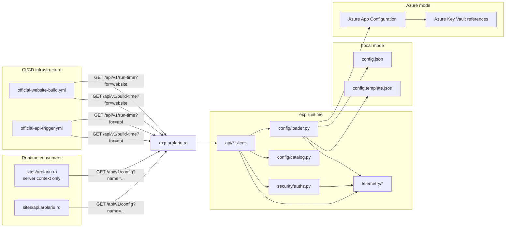
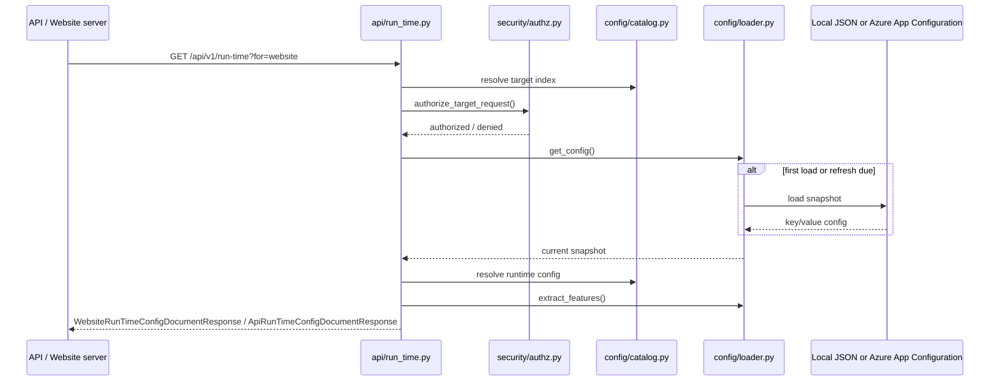
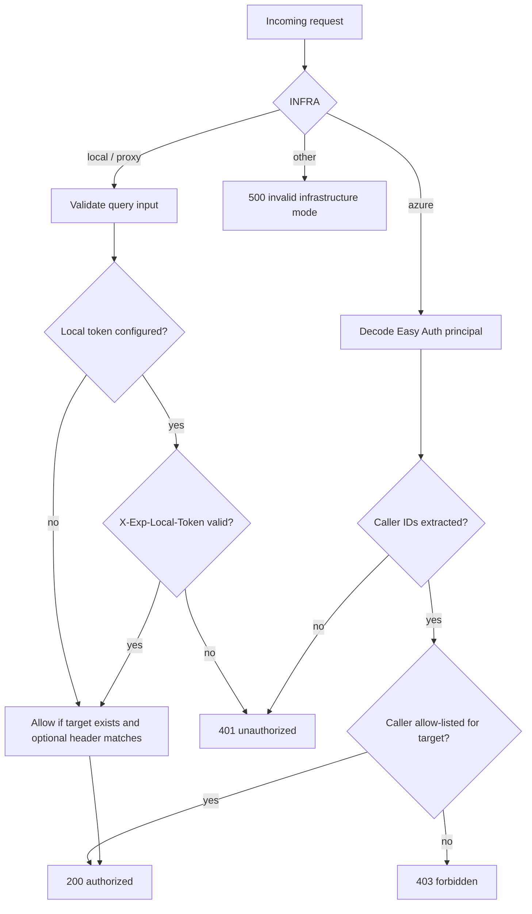
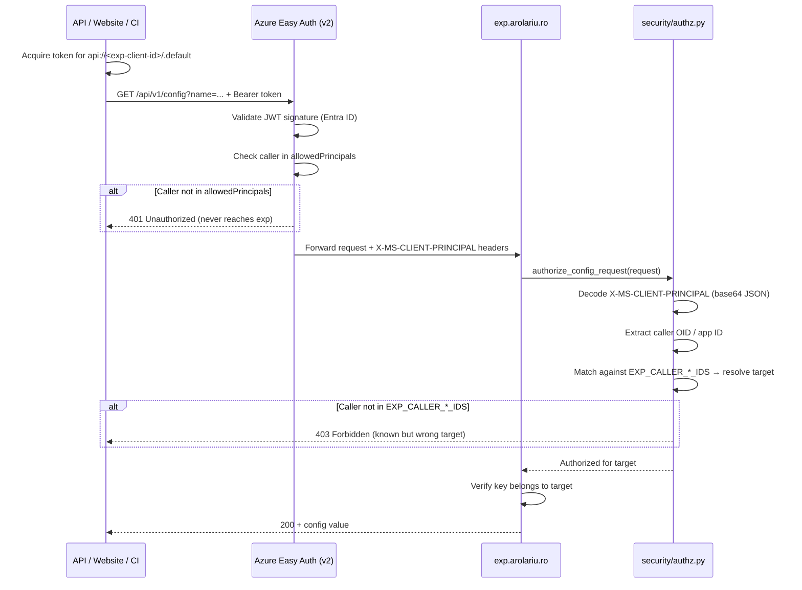
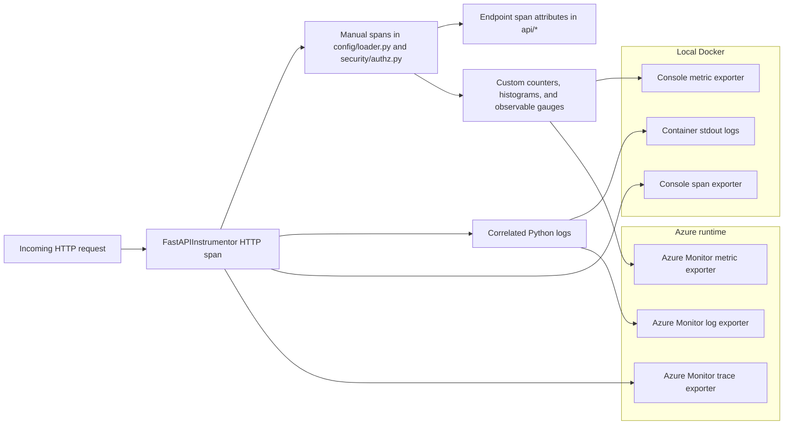

# exp.arolariu.ro

Configuration and experimentation service for the arolariu.ro platform.

## Purpose

`exp.arolariu.ro` is the server-to-server source of truth for target-scoped configuration
documents and feature-flag state consumed by:

- `sites/api.arolariu.ro`
- `sites/arolariu.ro` (**server context only**)

> **Server-only boundary**: `exp` must never be called from browser JavaScript or any
> other client-side code. Website integration is limited to Server Components,
> Server Actions, route handlers with server responsibilities, and `server-only`
> utilities.

## Runtime model

- Platform: Python FastAPI (ASGI)
- Entrypoint: `main.py`
- Versioned route prefix: `/api/v1`
- Unversioned probes: `/api/health`, `/api/ready`
- Container base: `python:3.12-slim` + `uvicorn`

## Architecture overview



## Vertical slice shape

The service keeps source and tests side-by-side directly under the service root:

```text
api/
  build_time.py
  build_time.test.py
  common.py
  config.py
  config.test.py
  health.py
  run_time.py
  run_time.test.py
config/
  catalog.py
  catalog.test.py
  loader.py
  loader.test.py
  settings.py
security/
  authz.py
  authz.test.py
runtime/
  metrics.py
telemetry/
  bootstrap.py
  bootstrap.test.py
  settings.py
  settings.test.py
models.py
main.py
main.test.py
conftest.py
```

- `api/*` owns the public HTTP slices (`health`, `build-time`, `run-time`, `config`)
- `config/*` owns target indexes, configuration loading, and shared env-driven runtime settings
- `security/*` owns caller authorization
- `runtime/*` owns process-local diagnostics that are useful for probes but never persisted across restarts
- `telemetry/*` owns OpenTelemetry resource settings, exporter bootstrap, manual spans, and custom metrics
- `models.py` holds the dedicated API/website build-time and run-time contracts plus the single-key config response
- `main.py` is the FastAPI / ASGI composition root
- Slice directories intentionally avoid `__init__.py` so sibling `*.test.py` files stay importable under pytest's importlib mode.

## Contract models

`models.py` intentionally defines separate configuration payloads for each consumer and lifecycle stage:

| Model | Purpose |
| --- | --- |
| `ApiBuildTimeConfig` | API startup configuration and dependency endpoints |
| `ApiRunTimeConfig` | API refresh-time configuration contract |
| `WebsiteBuildTimeConfig` | Website build/startup server configuration |
| `WebsiteRunTimeConfig` | Website server-request configuration including secrets |
| `ConfigValueResponse` | Single-key metadata-rich response for `/api/v1/config` |

The per-key `/config` endpoint is backed by a registry dictionary in `config/catalog.py`. That
registry documents:

- which targets can request a key,
- which documents include the key,
- whether the key is required or optional in each document,
- and how the key should be used safely.

## API contract

### `GET /api/health`

Liveness endpoint used by container and platform probes. The response also
includes process-local diagnostics that help explain what the current worker has
done since startup.

```json
{
  "status": "Healthy",
  "environment": "local",
  "timestamp": "2025-01-01T00:00:05+00:00",
  "startedAt": "2025-01-01T00:00:00+00:00",
  "uptimeSeconds": 5.0,
  "hostname": "exp-7f6d5c4b9f",
  "processId": 1,
  "requestsServed": 12,
  "requestsByPath": {
    "/api/health": 3,
    "/api/v1/build-time": 2,
    "/api/v1/run-time": 4,
    "/api/v1/config": 3
  },
  "configKeysLoaded": 17,
  "configLoadCount": 1,
  "lastConfigLoadedAt": "2025-01-01T00:00:00+00:00",
  "configResponsesServed": 9,
  "configValuesServed": 41,
  "configResponsesByEndpoint": {
    "build-time": 2,
    "run-time": 4,
    "config": 3
  },
  "configResponsesByTarget": {
    "api": 3,
    "website": 6
  },
  "configResponsesByCaller": {
    "api-managed-identity-object-id": 3,
    "local:website": 6
  },
  "configValuesByTarget": {
    "api": 11,
    "website": 30
  },
  "configValuesByCaller": {
    "api-managed-identity-object-id": 11,
    "local:website": 30
  },
  "configValuesByName": {
    "Endpoints:Service:Api": 5,
    "Auth:JWT:Issuer": 6
  },
  "lastConfigServedAt": "2025-01-01T00:00:04+00:00"
}
```

These counters are intentionally **process-local and ephemeral**. They reset
when the worker restarts, which keeps the microservice stateless while still
providing useful live diagnostics. In Azure, `configResponsesByCaller` and
`configValuesByCaller` are keyed by the Easy Auth principal ID; in local/proxy
mode they fall back to labels such as `local:website`.

### `GET /api/ready`

Readiness endpoint. Returns `503` when the service cannot read its current configuration
snapshot.

### `GET /api/v1/build-time?for=api|website`

Returns the build-time configuration document for the requested target.

```json
{
  "target": "website",
  "contractVersion": "1",
  "version": "<12-char hash>",
  "config": {
    "Endpoints:Storage:Blob": "https://...",
    "Auth:JWT:Issuer": "https://...",
    "Auth:JWT:Audience": "https://...",
    "Endpoints:Service:Api": "https://..."
  },
  "refreshIntervalSeconds": 300,
  "fetchedAt": "2025-01-01T00:00:00+00:00"
}
```

The build-time document contains only the keys indexed for startup/build-sensitive
behavior. For the website target, server-only secrets such as `Auth:JWT:Secret` are
excluded from this slice.

### `GET /api/v1/run-time?for=api|website`

Returns the runtime configuration document plus feature flags for the requested target.

```json
{
  "target": "website",
  "contractVersion": "1",
  "version": "<12-char hash>",
  "config": {
    "Endpoints:Storage:Blob": "https://...",
    "Auth:JWT:Issuer": "https://...",
    "Auth:JWT:Audience": "https://...",
    "Auth:JWT:Secret": "...",
    "Endpoints:Service:Api": "https://...",
    "Communication:Email:ApiKey": ""
  },
  "features": {
    "website.commander.enabled": false,
    "website.web-vitals.enabled": true
  },
  "refreshIntervalSeconds": 300,
  "fetchedAt": "2025-01-01T00:00:00+00:00"
}
```

This is the single runtime bootstrap call for both consumers.



### `GET /api/v1/config?name=<config-key>`

Returns exactly one indexed configuration value plus its ownership and usage metadata.

```json
{
  "name": "Endpoints:Service:Api",
  "value": "https://api.arolariu.ro",
  "availableForTargets": ["website"],
  "availableInDocuments": ["website.build-time", "website.run-time"],
  "requiredInDocuments": ["website.build-time", "website.run-time"],
  "description": "Base URL of the backend API that the website calls from server-only code.",
  "usage": "Website-only. Use this value for server-to-server fetches instead of hard-coding environment-specific API URLs.",
  "refreshIntervalSeconds": 300,
  "fetchedAt": "2025-01-01T00:00:00+00:00"
}
```

`name` is always a configuration key such as `Endpoints:Service:Api` or `Auth:JWT:Secret`.
When a key is shared by multiple targets, callers must also send `X-Exp-Target` so
authorization remains explicit.

## Endpoint access patterns

### Runtime consumers (API + Website)

Both the API and website services consume exp exclusively through the single-key
`/api/v1/config?name=<key>` endpoint at runtime. They do NOT call `/build-time`
or `/run-time` — those are infrastructure endpoints.

| Consumer | Identity | Endpoint | Authentication |
|----------|----------|----------|---------------|
| API (.NET) | Backend UAMI | `/api/v1/config?name=...` | Bearer token via Managed Identity |
| Website (Next.js) | Frontend UAMI | `/api/v1/config?name=...` | Bearer token via Managed Identity |

**API whitelisted keys** (fetched at startup + refreshed every 5 min):
- `Auth:JWT:Secret`, `Auth:JWT:Issuer`, `Auth:JWT:Audience`
- `Identity:Tenant:Id`
- `Endpoints:AI:OpenAI`, `Endpoints:AI:OCR`, `Endpoints:AI:OCR:Key`
- `Endpoints:Database:SQL`, `Endpoints:Database:NoSQL`
- `Endpoints:Storage:Blob`, `Endpoints:Observability:Telemetry`

**Website whitelisted keys** (fetched on demand with TTL cache):
- `Endpoints:Service:Api` — backend API base URL
- `Auth:JWT:Secret` — JWT signing secret
- `Communication:Email:ApiKey` — Resend email key (optional)
- `Endpoints:Storage:Blob` — blob storage endpoint
- `website.commander.enabled` — feature flag
- `website.web-vitals.enabled` — feature flag

### Infrastructure consumers (CI/CD)

The `/api/v1/build-time` and `/api/v1/run-time` endpoints are designed for
infrastructure tooling — CI/CD pipelines that need to inject configuration
values into container images during the build phase.

| Consumer | Identity | Endpoint | Authentication |
|----------|----------|----------|---------------|
| `official-api-trigger.yml` | Infrastructure UAMI | `/api/v1/build-time?for=api` | Bearer token via OIDC |
| `official-api-trigger.yml` | Infrastructure UAMI | `/api/v1/run-time?for=api` | Bearer token via OIDC |
| `official-website-build.yml` | Infrastructure UAMI | `/api/v1/build-time?for=website` | Bearer token via OIDC |

The Infrastructure UAMI is the CI/CD orchestrator — it handles Azure login,
ACR push, and config fetching. It is whitelisted in exp's Easy Auth allow-list
and granted access to both `api` and `website` targets via `EXP_CALLER_INFRA_IDS`.

The `npm run generate /e` script (called during website container builds) will
fetch build-time environment variables from exp instead of directly accessing
Azure App Configuration. This keeps the Infrastructure UAMI as the single
identity responsible for all CI/CD operations.

### Local Docker consumers

In local Docker mode (`INFRA=local`), exp runs without Easy Auth. Authorization
falls back to query-parameter validation and optional shared-token auth via
`EXP_LOCAL_SHARED_TOKEN` / `X-Exp-Local-Token`.

| Consumer | Endpoint | Authentication |
|----------|----------|---------------|
| API container | `/api/v1/config?name=...` | `X-Exp-Target: api` header |
| Website container | `/api/v1/config?name=...` | `X-Exp-Target: website` header |

## Indexed target ownership

### `api`

- Build-time keys
  - `Auth:JWT:Secret`
  - `Auth:JWT:Issuer`
  - `Auth:JWT:Audience`
  - `Identity:Tenant:Id`
  - `Endpoints:AI:OpenAI`
  - `Endpoints:Database:SQL`
  - `Endpoints:Database:NoSQL`
  - `Endpoints:Storage:Blob`
  - `Endpoints:Observability:Telemetry`
  - `Endpoints:AI:OCR`
  - `Endpoints:AI:OCR:Key`
- Runtime keys
  - same as build-time
- Feature IDs
  - none

### `website`

- Build-time keys
  - `Endpoints:Storage:Blob`
  - `Auth:JWT:Issuer`
  - `Auth:JWT:Audience`
  - `Endpoints:Service:Api`
- Runtime keys
  - `Endpoints:Storage:Blob`
  - `Auth:JWT:Issuer`
  - `Auth:JWT:Audience`
  - `Auth:JWT:Secret`
  - `Endpoints:Service:Api`
- Runtime optional keys
  - `Communication:Email:ApiKey`
- Feature IDs
  - `website.commander.enabled`
  - `website.web-vitals.enabled`

## Feature flag conventions

Feature flags are extracted from the loaded config snapshot using:

1. `FeatureManagement:<id>` with string boolean values (`true`, `false`, `1`, `0`, `yes`, `no`, `on`, `off`)
2. `.appconfig.featureflag/<id>` with JSON containing an `enabled` boolean

Convention 1 wins when both forms are present.

## Error contract

All errors use the same JSON shape:

```json
{
  "error": "message",
  "deniedKeys": [],
  "invalidKeys": [],
  "missingRequiredKeys": []
}
```

Only relevant arrays are included.

## Security model

### Azure mode (`INFRA=azure`)

- Caller identity is read from Easy Auth headers
  - `X-MS-CLIENT-PRINCIPAL-ID`
  - `X-MS-CLIENT-PRINCIPAL`
- Allowed callers are configured with:
  - `EXP_CALLER_API_IDS`
  - `EXP_CALLER_WEBSITE_IDS`
- Access is deny-by-default
  - unknown caller -> `401`
  - caller not allowed for requested target -> `403`

### Local and proxy mode (`INFRA=local|proxy`)

- Query inputs are required
  - `for=api|website` for build-time and run-time
  - `name=<config-key>` for config
- `X-Exp-Target` is optional, but when present it must match the requested target
- Optional shared token support
  - configure `EXP_LOCAL_SHARED_TOKEN`
  - send `X-Exp-Local-Token`



## Azure Easy Auth deployment guide

Easy Auth v2 (Microsoft Entra ID) protects exp in Azure. This section explains
how to set it up from scratch and how the authorization flow works end-to-end.

### Prerequisites

| Resource | Purpose |
|----------|---------|
| **Entra ID App Registration** | Represents exp as a protected resource |
| **3 User-Assigned Managed Identities** | Frontend, Backend, Infrastructure callers |
| **Azure App Service** | Hosts the exp container |
| **Azure App Configuration** | Stores config key/value pairs |
| **Azure Key Vault** | Stores secret values (referenced by App Configuration) |

### Step 1 — Create the Entra ID App Registration

1. Go to **Azure Portal → Entra ID → App registrations → New registration**
2. Name: `exp.arolariu.ro`
3. Supported account types: **Single tenant**
4. Redirect URI: leave empty (server-to-server only)
5. After creation, note the **Application (client) ID** — this is `expEntraAppClientId`

6. Go to **Expose an API**:
   - Set Application ID URI: `api://<client-id>` (e.g., `api://950ac239-5c2c-4759-bd83-911e68f6a8c9`)
   - Add a scope: `api://<client-id>/.default` (admin consent required)

### Step 2 — Deploy infrastructure (Bicep)

The Bicep template at `infra/Azure/Bicep/sites/exp-arolariu-ro.bicep` creates:

```
App Service (exp-arolariu-ro)
  ├── Easy Auth v2 (authsettingsV2)
  │   ├── globalValidation:
  │   │   ├── requireAuthentication: true
  │   │   ├── unauthenticatedClientAction: Return401
  │   │   └── excludedPaths: [/api/health, /api/ready]
  │   └── identityProviders.azureActiveDirectory:
  │       ├── clientId: <expEntraAppClientId>
  │       ├── openIdIssuer: https://login.microsoftonline.com/<tenant>/v2.0
  │       └── allowedPrincipals.identities:
  │           ├── Frontend UAMI principal ID
  │           ├── Backend UAMI principal ID
  │           └── Infrastructure UAMI principal ID
  ├── App Settings:
  │   ├── AZURE_CLIENT_ID = <backend UAMI client ID>
  │   ├── AZURE_APPCONFIG_ENDPOINT = https://<name>.azconfig.io
  │   ├── EXP_CALLER_API_IDS = <backend principal ID>
  │   ├── EXP_CALLER_WEBSITE_IDS = <frontend principal ID>
  │   ├── EXP_CALLER_INFRA_IDS = <infrastructure principal ID>
  │   └── INFRA = azure
  └── IP Restrictions: AzureCloud service tag only
```

Deploy with:

```bash
# Set the App Registration client ID in parameters
az deployment sub create \
  --location swedencentral \
  --template-file infra/Azure/Bicep/main.bicep \
  --parameters expEntraAppClientId=<your-app-registration-client-id>
```

### Step 3 — Deploy the exp container

Use the GitHub Actions workflow (manual dispatch):

1. Go to **Actions → official-exp-trigger → Run workflow**
2. Select branch: `preview` or `main`
3. Environment: `production`
4. Infrastructure: `azure`

Or via CLI:

```bash
gh workflow run official-exp-trigger.yml --ref main \
  -f environment=production -f infrastructure=azure
```

### Step 4 — Verify

```bash
# Health probe (excluded from auth)
curl https://exp.arolariu.ro/api/health

# Authenticated request (requires bearer token)
TOKEN=$(az account get-access-token \
  --resource api://950ac239-5c2c-4759-bd83-911e68f6a8c9 \
  --query accessToken -o tsv)
curl -H "Authorization: Bearer $TOKEN" \
  "https://exp.arolariu.ro/api/v1/config?name=Endpoints:Service:Api"
```

### How the authorization flow works



### Two layers of authorization

| Layer | Enforces | Rejects with |
|-------|----------|-------------|
| **Easy Auth (Azure)** | JWT validity + caller in `allowedPrincipals` list | `401` — request never reaches exp code |
| **security/authz.py** | Caller-to-target mapping via `EXP_CALLER_*_IDS` env vars | `403` — caller known but not authorized for this target |

This double gate means even if a UAMI is in the `allowedPrincipals` Bicep list,
it still needs to be in the correct `EXP_CALLER_*_IDS` env var to access
target-scoped config. The Infrastructure UAMI is merged into both `api` and
`website` targets so CI/CD pipelines can fetch config for any target.

### Excluded paths

`/api/health`, `/api/ready`, and `/admin/*` are excluded from Easy Auth so:
- Container orchestrators can probe liveness without authentication
- The admin UI handles its own MSAL popup login for human operators

## Entra ID App Registration cheatsheet

The exp service uses an Entra ID App Registration for Easy Auth v2. Here are
common operations for troubleshooting and maintenance.

### Token version (critical)

Easy Auth v2 with `/v2.0` issuer requires **v2 tokens** where `aud` equals the
client ID. If `accessTokenAcceptedVersion` is `null` (v1 default), tokens will
have `aud = api://...` which Easy Auth rejects with 401.

```bash
# Check current token version
az ad app show --id 950ac239-5c2c-4759-bd83-911e68f6a8c9 \
  --query "api.requestedAccessTokenVersion"

# Set to v2 (required for Easy Auth v2)
az rest --method PATCH \
  --url "https://graph.microsoft.com/v1.0/applications/<OBJECT-ID>" \
  --headers "Content-Type=application/json" \
  --body '{"api":{"requestedAccessTokenVersion":2}}'
```

### Common az ad commands

```bash
# Show App Registration details
az ad app show --id 950ac239-5c2c-4759-bd83-911e68f6a8c9 \
  --query "{appId:appId, identifierUris:identifierUris, tokenVersion:api.requestedAccessTokenVersion}"

# Show service principal (for principal/object ID)
az ad sp show --id 950ac239-5c2c-4759-bd83-911e68f6a8c9 \
  --query "{appId:appId, objectId:id, displayName:displayName}"

# Show UAMI details (client ID + principal ID)
az identity show --name <uami-name> --resource-group arolariu-rg \
  --query "{clientId:clientId, principalId:principalId}"

# Grant admin consent for API permissions
az ad app permission admin-consent --id 950ac239-5c2c-4759-bd83-911e68f6a8c9

# List redirect URIs
az ad app show --id 950ac239-5c2c-4759-bd83-911e68f6a8c9 \
  --query "spa.redirectUris"

# Add SPA redirect URI
az ad app update --id 950ac239-5c2c-4759-bd83-911e68f6a8c9 \
  --spa-redirect-uris "https://exp.arolariu.ro/admin"
```

### Easy Auth management

```bash
# Read current Easy Auth config
az rest --method GET --url "https://management.azure.com/subscriptions/<SUB>/resourceGroups/arolariu-rg/providers/Microsoft.Web/sites/exp-arolariu-ro/config/authsettingsV2?api-version=2024-04-01"

# Update Easy Auth (PUT replaces entire config — include ALL fields)
# Save current config to file, edit, then PUT back:
az rest --method GET --url "..." -o json > auth.json
# Edit auth.json
az rest --method PUT --headers "Content-Type=application/json" --url "..." --body @auth.json
```

### Troubleshooting 401 errors

| Symptom | Cause | Fix |
|---------|-------|-----|
| 401 with valid token | `accessTokenAcceptedVersion` is null (v1) | Set to `2` via Graph API |
| 401 after Easy Auth PUT | PUT replaced `allowedPrincipals` | Re-apply full config with all principal IDs |
| 401 for specific UAMI | Principal ID not in `allowedPrincipals` | Add the UAMI's **principal/object ID** (not client ID) |
| 401 in CI but not runtime | CI uses different identity than runtime | Check which `AZURE_CLIENT_ID` the workflow sets |

## Configuration sources

### Local

- Source: `config.json`
- Override path: `EXP_LOCAL_CONFIG_PATH`
- Fallback: `config.template.json`
- Docker Compose uses `config.docker.json` so containerized callers resolve Docker DNS
  names like `http://exp`

### Azure

- Source: Azure App Configuration plus Key Vault references
- Required setting: `AZURE_APPCONFIG_ENDPOINT`
- Identity: `DefaultAzureCredential` with optional `AZURE_CLIENT_ID`
- Optional selector: `EXP_ENVIRONMENT`

## Snapshot lifecycle

```mermaid
flowchart TD
    Startup[App startup] --> Prime[main.py lifespan calls load_config()]
    Prime --> Snapshot[(In-memory snapshot)]
    Snapshot --> Request[Request needs config]
    Request --> Refresh{Loaded and refresh due?}
    Refresh -->|no| Serve[Serve detached copy]
    Refresh -->|yes| Reload[Reload from local JSON or Azure App Configuration]
    Reload --> Snapshot
    Serve --> Consumer[Endpoint builds typed response]
```

## OpenTelemetry runtime

- Local Docker mode exports traces and metrics to the container console.
- Azure mode exports traces, metrics, and logs directly to Azure Monitor /
  Application Insights.
- Azure exporters use `APPLICATIONINSIGHTS_CONNECTION_STRING` plus
  `DefaultAzureCredential`, honoring `AZURE_CLIENT_ID` when a user-assigned
  managed identity is configured.
- Python logs stay correlated with the active trace/span IDs.
- Azure Monitor offline storage is disabled so telemetry export does not create
  retry files on disk and the microservice remains stateless.
- `traceparent` remains the primary cross-service correlation mechanism.
- `X-Request-Id` is preserved when supplied by upstream callers and generated only when missing.
- Logs and span attributes expose both trace-level identifiers and the supplemental request ID so operators can pivot cleanly between website, API, and exp traffic.



## Environment variables

### Application settings (set by exp code)

| Name | Required | Description |
| --- | --- | --- |
| `INFRA` | Yes | `azure`, `local`, or `proxy` |
| `AZURE_APPCONFIG_ENDPOINT` | Azure only | Azure App Configuration endpoint (e.g., `https://<name>.azconfig.io`) |
| `AZURE_CLIENT_ID` | Azure only | User-assigned managed identity client ID for App Config + Key Vault access |
| `EXP_CALLER_API_IDS` | Azure only | Comma-separated principal IDs allowed as `api` target |
| `EXP_CALLER_WEBSITE_IDS` | Azure only | Comma-separated principal IDs allowed as `website` target |
| `EXP_CALLER_INFRA_IDS` | Azure only | Comma-separated principal IDs for Infrastructure UAMI (merged into both targets). Alternative: append the infra ID to both `API_IDS` and `WEBSITE_IDS` |
| `EXP_CONFIG_REFRESH_INTERVAL_SECONDS` | Optional | Snapshot refresh interval in seconds (default: 300, minimum: 60) |
| `EXP_LOCAL_SHARED_TOKEN` | Optional | Shared token for local/proxy mode |
| `EXP_LOCAL_CONFIG_PATH` | Optional | Absolute path to alternate local config JSON |
| `EXP_ENVIRONMENT` | Optional | Azure App Configuration label selector (`DEVELOPMENT` or `PRODUCTION`) |

### Telemetry settings

| Name | Required | Description |
| --- | --- | --- |
| `APPLICATIONINSIGHTS_CONNECTION_STRING` | Azure telemetry | Application Insights connection string for Azure Monitor OTel exporters |
| `EXP_OTEL_ENABLED` | Optional | Enables or disables OpenTelemetry bootstrap (defaults to `true`) |
| `EXP_OTEL_EXCLUDED_URLS` | Optional | Comma-delimited request-path regexes excluded from FastAPI tracing |
| `EXP_OTEL_TRACE_SAMPLE_RATIO` | Optional | Trace sampling ratio between `0.0` and `1.0` |
| `EXP_OTEL_METRIC_EXPORT_INTERVAL_SECONDS` | Optional | Export cadence for console/Azure metric readers |
| `EXP_OTEL_LOG_LEVEL` | Optional | Root Python log level used when telemetry bootstraps logging correlation |
| `EXP_OTEL_CONSOLE_TRACE_EXPORT_ENABLED` | Optional | Enables local console trace export; defaults to `true` outside Azure |
| `EXP_OTEL_CONSOLE_METRIC_EXPORT_ENABLED` | Optional | Enables local console metric export; defaults to `true` outside Azure |
| `EXP_OTEL_CONSOLE_LOG_EXPORT_ENABLED` | Optional | Enables OTel log export to the local console; defaults to `false` to avoid duplicate local log lines |

### Azure platform settings (managed by App Service / Easy Auth)

These are set automatically by the Azure platform or via portal configuration — **not** consumed by exp code directly:

| Name | Purpose |
| --- | --- |
| `DOCKER_REGISTRY_SERVER_URL` | ACR endpoint for container image pull (e.g., `https://<acr>.azurecr.io`) |
| `DOCKER_REGISTRY_SERVER_USERNAME` | ACR pull credential username |
| `DOCKER_REGISTRY_SERVER_PASSWORD` | ACR pull credential password |
| `MICROSOFT_PROVIDER_AUTHENTICATION_SECRET` | Easy Auth v2 app registration client secret |
| `WEBSITE_AUTH_AAD_ALLOWED_TENANTS` | Entra ID tenant restriction for Easy Auth |
| `WEBSITES_ENABLE_APP_SERVICE_STORAGE` | Persistent storage mount (`false` — exp is stateless) |
| `ApplicationInsightsAgent_EXTENSION_VERSION` | App Insights agent version (`~3`) |
| `XDT_MicrosoftApplicationInsights_Mode` | App Insights instrumentation mode (`Recommended`) |

## Local development

### Run with Docker Compose

```powershell
docker network create arolariu-network
docker compose -f infra/Local/Storage/docker-compose.yml up -d exp
```

Smoke checks:

```powershell
Invoke-WebRequest -Uri "http://localhost:5002/api/health"
Invoke-WebRequest -Uri "http://localhost:5002/api/v1/build-time?for=website" -Headers @{ "X-Exp-Target" = "website" }
Invoke-WebRequest -Uri "http://localhost:5002/api/v1/config?name=Endpoints:Service:Api" -Headers @{ "X-Exp-Target" = "website" }
Invoke-WebRequest -Uri "http://localhost:5002/api/v1/config?name=Auth:JWT:Secret" -Headers @{ "X-Exp-Target" = "website" }
Invoke-WebRequest -Uri "http://localhost:5002/api/v1/run-time?for=website" -Headers @{ "X-Exp-Target" = "website" }
```

### Run tests

```powershell
python -m pytest -q
python -m ruff check .
```

### Run directly

```powershell
cd sites/exp.arolariu.ro
python -m uvicorn main:app --host 0.0.0.0 --port 5002
```

Local console exporters are enabled by default for traces and metrics. If you
also want OpenTelemetry log records printed in addition to the normal container
logs, set `EXP_OTEL_CONSOLE_LOG_EXPORT_ENABLED=true`.

## Design notes

- The service is stateless: no caller session state is stored.
- Telemetry export also respects statelessness: Azure Monitor retry-file storage is disabled.
- `exp` is the only supported runtime configuration surface for API and website server
  consumers.
- `v1` is the only supported versioned API surface; the old `v2` contract is removed.
- Build-time and run-time response documents are target-scoped, typed, and versioned so
  downstream services can safely refresh cached snapshots.
- The `/config` endpoint is intentionally single-key and metadata-rich so consumers can fetch
  only the values they need without downloading entire target documents.
